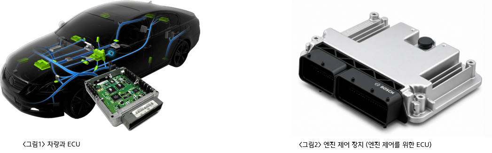
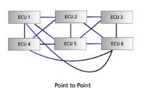
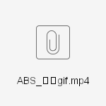
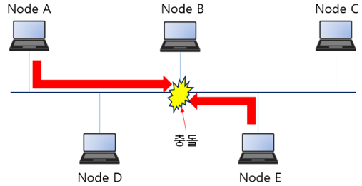
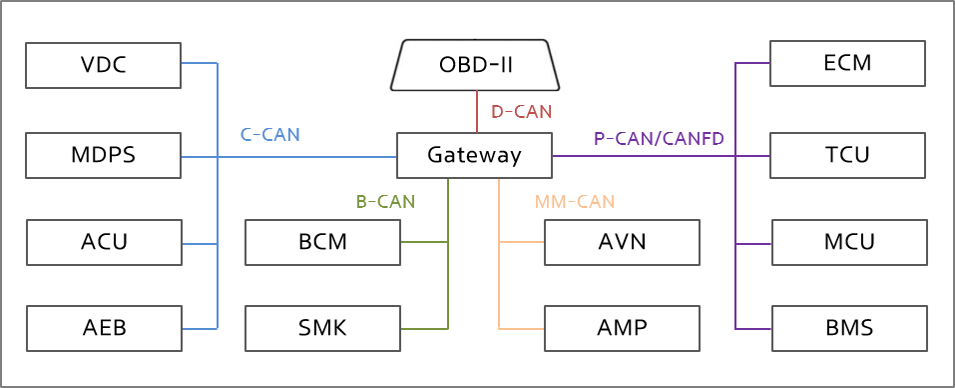
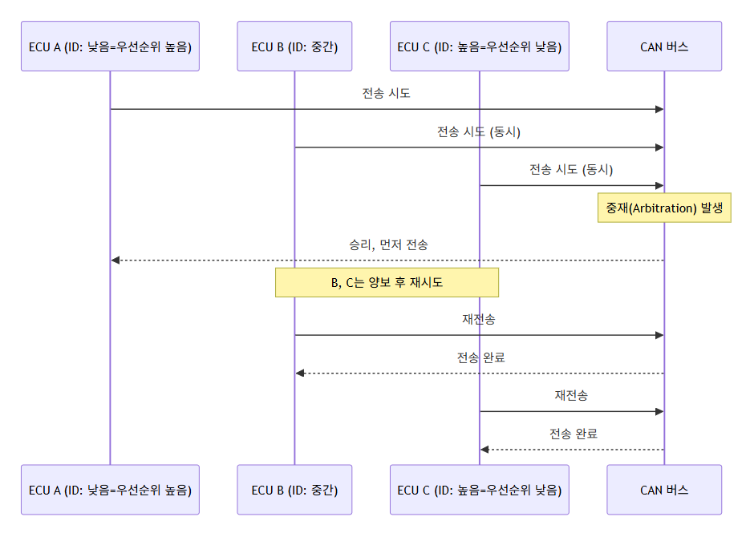
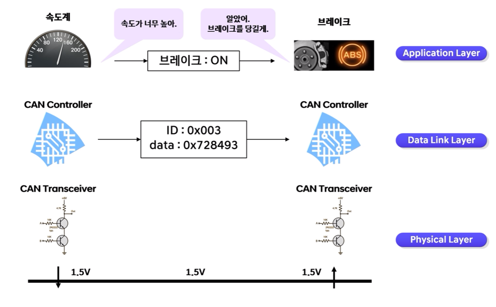
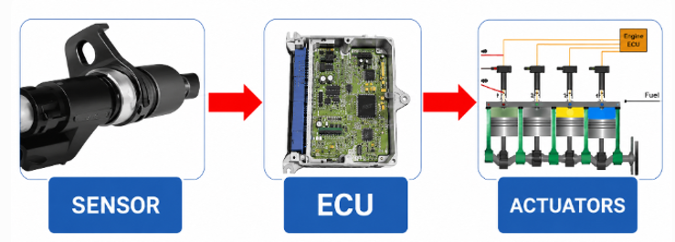
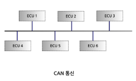

# [1] CAN 통신 (기초)

# **CAN 통신 기초 교육자료**

### **비전공자를 위한 차량용 통신의 이해**

---

## **👀 들어가기 전에**

**✔ 이 문서를 읽고 나면 알 수 있는 것**

- **자동차 안의 수많은 컴퓨터(ECU)들이 어떻게 서로 "대화"하는지**
- **CAN이라는 통신 방식이 왜 자동차에 널리 쓰이게 되었는지**
- **사내 회의나 문서에서 자주 나오는 CAN, ECU, 버스, 우선순위, DBC 같은 용어의 의미**
- **CAN이 왜 "신뢰성 있는 통신 방식"으로 평가받는지**

**✔ 이 문서에서 다루지 않는 것**

- **실제 비트 단위 신호 값, 전압 수치, 회로 설계**
- **CAN 컨트롤러/트랜시버의 내부 동작 구현**
- **통신 프로토콜 스택 코드 및 개발 실무**

**통신 자체의 기초 개념(bps, 진법 등)은 별도 자료에서 다룹니다. 이 문서는 "그 통신 기술이 자동차 안에서 어떻게 쓰이는가"에 집중합니다.**

---

## **1. ECU가 뭔가요?**

**자동차 안에는 우리가 흔히 생각하는 "엔진"만 있는 게 아니라, 각 기능을 담당하는 작은 컴퓨터들이 수십 개 들어 있습니다. 이 작은 컴퓨터를 ECU(Electronic Control Unit, 전자 제어 장치)라고 부릅니다.**  
  
****

**ECU는 크게 세 단계로 일합니다.**

1. **센서(Sensor)로부터 정보를 받는다 (예: 바퀴 속도, 온도)**
2. **미리 정해진 기준에 따라 판단한다**
3. **액추에이터(Actuator)에게 명령을 내려 실제로 동작하게 한다**  
     
   ****  
     
   ****

> **예시 - ABS(Anti-Lock Brake System) 브레이크를 밟았을 때 바퀴가 잠기지 않도록, 휠 속도 센서가 바퀴 회전 속도를 ECU에 전달하면 ECU가 잠김 여부를 판단해서 유압장치를 제어합니다.**

**요즘 자동차 한 대에는 이런 ECU가 70개 이상, 최신 차량은 100개 이상 들어 있습니다.**

| **시기** | **차량 1대당 ECU 수** | **참고** |
| --- | --- | --- |
| **1990년대** | **5~10개** | **엔진 제어 위주** |
| **2010년대** | **50~70개** | **편의장치 확대** |
| **현재** | **100개 이상** | **자율주행·인포테인먼트 추가** |

> **오늘날 자동차는 "바퀴 달린 컴퓨터 네트워크"에 가깝습니다.**

> **💡 업무 연결 포인트 — ECU 개수와 통신량이 계속 늘어난다는 것은, 우리가 다루는 통신 방식(CAN, CAN FD, 이더넷 등)의 선택이 원가·개발기간·품질에 직접 영향을 준다는 뜻입니다. 구매/기획 부서에서 "왜 이 부품에 이런 통신 사양이 필요한가"를 검토할 때 이 배경이 근거가 됩니다.**

---

## **2. ECU가 100개나 있다면, 서로 어떻게 연결할까?**

**ECU 숫자가 늘어나면서 한 가지 큰 문제가 생겼습니다. "이 ECU들을 어떻게 연결할 것인가?"**

### **방법 1: Point-to-Point (예전 방식)**

**신호 하나마다 전용 케이블을 하나씩 연결하는 방식입니다.**

- **문제점: ECU가 늘어날수록 케이블 뭉치가 기하급수적으로 커지고 무거워짐**
- **커넥터 비용 증가, 나중에 기능을 추가하기도 매우 어려움**  
    
  ****

### **방법 2: Bus Networking (현재 방식)**

**여러 ECU가 하나의 공용 통신선(버스)을 함께 사용하는 방식입니다. 마치 여러 사람이 각자 전화선을 하나씩 놓는 대신, 하나의 공용 게시판에 글을 올리고 필요한 사람이 읽어가는 것과 비슷합니다.**

- **배선이 훨씬 가볍고 관리가 쉬움**
- **에러 진단이 가능하고, 새 기능을 추가하기도 쉬움**
- **"Bus"라는 이름은 라틴어 "omnibus(모두를 위한)"에서 유래했습니다**  
    
  ****

**CAN(Controller Area Network)은 이 "Bus Networking" 방식을 사용하는 대표적인 차량용 통신 규격입니다.**

---

## **3. CAN, 한 줄로 정리하면?**

> **CAN이란, 여러 개의 ECU가 하나의 통신선을 공유하면서 서로 데이터를 주고받을 수 있게 해주는 표준 통신 규격입니다.**

****

**핵심 아이디어는 딱 두 가지입니다.**

1. **공용 버스 : 모든 ECU가 같은 선을 함께 쓴다**
2. **필요할 때만 말한다(이벤트 기반) : 특정 상황(이벤트)이 발생했을 때만 메시지를 버스에 실어 보낸다**  
     
   ****

> **참고로 차량 안에는 CAN 외에도 LIN, FlexRay, Ethernet 등 여러 통신 방식이 목적에 따라 함께 쓰입니다. CAN은 그중에서도 "적당한 속도 + 높은 신뢰성"이 필요한 구간(엔진, 브레이크 등)에 많이 사용됩니다.**

---

## **4. 여러 ECU가 동시에 말하면 어떻게 될까? (우선순위 이야기)**

**버스는 하나의 선을 여러 ECU가 함께 쓰는 구조이기 때문에, 두 ECU가 동시에 말을 하려고 하면 충돌이 생길 수 있습니다.**

**CAN은 이 문제를 아주 똑똑하게 해결합니다. 바로 "먼저 자기 순서(ID)를 이야기하고, 그중 가장 급한 것부터 순서대로 보낸다"는 규칙입니다.**

- **모든 메시지에는 ID(식별자)가 붙어 있고, 이 ID는 우선순위 역할도 합니다.**
- **숫자가 작을수록 우선순위가 높습니다. (마치 대기번호 1번이 가장 먼저 처리되는 것과 비슷합니다)**
- **여러 ECU가 동시에 전송을 시도하면, 우선순위가 낮은 ECU는 스스로 양보하고 잠시 후 다시 시도합니다. 이 과정을 중재(Arbitration)라고 부릅니다.**  
    
    
  ****

****

```

```

> **중요한 점은, 우선순위에서 밀린 ECU가 데이터를 잃어버리는 게 아니라, 버스가 다시 비면 자동으로 재시도한다는 것입니다. 급한 정보(예: 브레이크, 엔진 관련)에는 낮은 ID를, 상대적으로 덜 급한 정보(예: 실내등)에는 높은 ID를 부여하는 방식으로 설계됩니다.**

> **💡 업무 연결 포인트 — ID를 어떻게 배정하느냐는 단순한 기술 세부사항이 아니라, "이 신호가 차량 안전에 얼마나 중요한가"를 설계 단계에서 결정하는 일입니다. 이 때문에 통신 매트릭스(어떤 신호에 어떤 ID를 줄지 정리한 문서)는 여러 부서(개발/품질/구매)가 함께 검토하는 중요한 산출물입니다.**

---

## **5. 통신 중에 문제가 생기면 어떻게 될까? (신뢰성 이야기)**

**CAN이 자동차용 통신으로 널리 채택된 이유 중 하나는 "이상이 생기면 스스로 알아채고 대응하는 장치"가 갖춰져 있기 때문입니다.**

- **모두가 같이 확인한다: 메시지를 보낼 때마다, 받는 쪽 ECU들이 데이터가 제대로 왔는지 함께 확인합니다. 하나라도 이상이 있으면 즉시 "이 메시지는 무효"라고 버스 전체에 알립니다.**
- **문제를 일으키는 노드는 스스로 조용해진다: 특정 ECU가 계속 이상한 메시지를 보내면, 그 ECU는 점점 더 "신뢰도 낮음" 상태로 분류되다가 결국 일시적으로 버스에서 스스로 물러납니다. 고장 난 부품 하나가 버스 전체를 마비 시키는 것을 막기 위한 안전장치입니다.**  
    
  > **💡 업무 연결 포인트 — 이런 자체 보호 기능 덕분에 CAN은 "안전이 중요한 구간(브레이크, 엔진)"에 신뢰받고 사용되어 왔습니다. 반대로 이 신뢰성 메커니즘이 없다면, 부품 하나의 고장이 차량 전체의 통신 마비로 이어질 수 있어 품질/AS 비용에 큰 영향을 줄 수 있습니다.**

---

## **6. 숫자만 오가는데, 의미는 어떻게 알까? (신호와 DBC)**

**CAN을 통해 실제로 전송되는 것은 그냥 숫자(비트 값)입니다. CAN 자체는 "이 숫자가 무엇을 의미하는지"는 전혀 알려주지 않습니다.**

**예를 들어 버스에 이런 데이터가 흘러갔다고 해봅시다.**

**ID: 0x0C8**   
**Data: 09 C4 3C 00 6E 32 00 00**

**이 자체로는 그냥 의미 없는 숫자 나열일 뿐입니다. 하지만 미리 약속된 규칙(설계 문서)이 있다면 이렇게 해석할 수 있습니다.**

| **위치(Byte)** | **값** | **의미** |
| --- | --- | --- |
| **0~1** | **09 C4** | **엔진 회전수(RPM) = 2500** |
| **2~3** | **3C 00** | **차량 속도 = 60 km/h** |
| **4** | **6E** | **냉각수 온도 = 110°C** |
| **5** | **32** | **스로틀 개도 = 50%** |

**이렇게 "이 위치의 숫자는 이런 뜻이다"라고 정의해 놓은 문서(데이터베이스)를 DBC라고 부릅니다.**

> **💡 업무 연결 포인트 — DBC는 "숫자로 오가는 통신에 의미를 부여하는 유일한 문서"입니다. 이 문서를 협력사와 정확히 공유하지 못하면 부품 간 오해석이 발생할 수 있고, 반대로 외부에 유출되면 차량 제어 정보가 노출되는 보안 이슈로 이어질 수 있습니다. 문서 관리·보안 담당자에게는 중요한 관리 대상입니다.**

---

## **7. 실제로는 이렇게 흘러갑니다 (시나리오로 보기)**

### **시나리오: 속도계가 브레이크에게 "속도가 너무 높아"라고 말하는 순간**

**이것을 바라보는 세 가지 관점(계층)이 있습니다. 사람은 "말"로 이해하지만, 실제 통신은 "숫자"로, 그리고 그 숫자는 결국 "전압"으로 전달됩니다.**

#### **① Application Layer (응용 계층) - 사람이 이해하는 대화**

#### **속도계 : "속도가 너무 높아."** **브레이크 : "알았어. 브레이크를 당길게."**

- **이 계층은 우리가 상황을 이해하기 쉽게 "대화"로 표현한 것입니다.**
- **실제로 ECU끼리 이렇게 말로 대화하는 것은 아니지만, "어떤 목적으로 통신하는가"를 보여주는 계층입니다.**
- **이 대화의 결과, "브레이크 : ON"이라는 하나의 판단(명령)이 만들어집니다.**

#### **② Data Link Layer (데이터 링크 계층) - CAN 컨트롤러가 주고받는 것**

#### **ID : 0x003** **data : 0x728493**

- **속도계 ECU의 CAN 컨트롤러는 "브레이크 : ON"이라는 의미를, 약속된 형식의 숫자(ID + data)로 바꿔서 버스에 실어 보냅니다.**
- **ID(0x003): 이 메시지가 무엇에 관한 것인지, 그리고 우선순위가 얼마나 높은지를 나타냅니다. (4번에서 배운 중재의 기준이 되는 값)**
- **data(0x728493): 실제 내용이 담긴 숫자입니다. 이 숫자 자체는 의미가 없고, 6번에서 배운 DBC를 통해서만 "브레이크 ON"이라는 의미로 해석될 수 있습니다.**
- **브레이크 쪽 ECU의 CAN 컨트롤러가 이 숫자를 그대로 받아서, 자신의 DBC로 해석한 뒤 ①의 응용 계층으로 의미를 전달합니다.**

#### **③ Physical Layer (물리 계층) - 전선 위의 전압**

#### **1.5V ↓ ────────── 1.5V ────────── ↑ 1.5V**

- **CAN 트랜시버는 ②에서 만들어진 숫자(0과 1로 이루어진 비트열)를, 실제 전선 위의 전압 차이로 바꿔서 내보냅니다.**
- **받는 쪽 트랜시버는 이 전압을 다시 읽어서 0과 1로 바꾸고, 이를 CAN 컨트롤러에게 전달합니다.**
- **사람 눈에는 보이지 않지만, 이 전압 변화가 실제로 케이블을 타고 흐르는 "진짜 신호"입니다.**

---

### **세 계층을 한 번에 보면**

| **계층** | **담당** | **실제로 오가는 것** |
| --- | --- | --- |
| **Application Layer** | **ECU의 판단 로직** | **"속도가 높으니 브레이크를 당긴다"는 의미** |
| **Data Link Layer** | **CAN 컨트롤러** | **ID(우선순위) + data(숫자로 된 내용)** |
| **Physical Layer** | **CAN 트랜시버** | **전선 위의 전압 변화** |

> **핵심: 우리가 "브레이크가 작동했다"고 느끼는 그 짧은 순간, 실제로는 의미 → 숫자 → 전압의 3단 변환이 이루어지고 있습니다. CAN은 이 중에서 ②번(Data Link)과 ③번(Physical) 두 계층만 정의하는 통신 규격이며, ①번(Application, "무엇을 위해 통신하는가")은 각 ECU를 만드는 회사/개발팀이 별도로 설계하는 영역입니다.**

> **💡 업무 연결 포인트 — "CAN이 통신 규격이다"라고 할 때, 이는 ②③번 계층(어떻게 안전하게 전달할 것인가)까지만 표준으로 정해져 있다는 뜻입니다. "무엇을 위해 통신하는가"(①번, 예: 이 차의 브레이크 로직을 어떻게 설계할 것인가)는 각 완성차/부품사의 고유 기술과 노하우 영역입니다. 이 구분을 알면, "CAN을 안다"는 것과 "차량 제어 로직을 안다"는 것이 서로 다른 이야기라는 점을 이해하기 쉬워집니다.**

#### **이 전체 과정은 사람이 느끼기에는 거의 순간적으로 이루어집니다. 하지만 그 짧은 순간에도 "누가 먼저 말할 것인가"를 정하는 규칙(중재)과 "여러 ECU가 동시에 같은 메시지를 알아듣는 구조(브로드캐스트)"가 함께 작동하고 있는 것입니다.**

---

## **8. (참고) CAN보다 더 빠른 버전도 있어요**

**최근 차량에는 처리해야 할 데이터가 점점 많아지면서, 기존 CAN보다 더 많은 데이터를 더 빠르게 보낼 수 있는 방식들도 함께 사용되고 있습니다.**

| **통신 방식** | **대략적인 속도** | **특징** |
| --- | --- | --- |
| **CAN** | **최대 1 Mbit/s** | **가장 널리 쓰이는 기본 방식** |
| **CAN FD** | **그 이상 (수 Mbit/s)** | **한 번에 더 많은 데이터 전송, CAN의 개선판** |
| **이더넷 (Ethernet)** | **100 Mbit/s 이상** | **자율주행, 인포테인먼트 등 대용량 데이터용** |

**CAN FD와 이더넷 모두 기본 개념(공용 버스, 우선순위 기반 전송 등)은 CAN과 크게 다르지 않지만, 처리할 수 있는 데이터의 양과 속도가 다릅니다.**

> **💡 업무 연결 포인트 — 왜 최신 차량이 CAN에서 CAN FD, 이더넷으로 옮겨가고 있을까요? 자율주행 카메라, 대형 인포테인먼트 화면 등 처리해야 할 데이터량이 폭발적으로 늘었기 때문입니다. "어떤 통신 방식을 채택할 것인가"는 원가뿐 아니라 향후 기능 확장성과도 직결되는 의사결정입니다.**

**지금 단계에서는 "CAN에는 더 빠른 진화 버전들이 있고, 처리할 데이터량에 따라 선택된다" 정도만 알아두시면 충분합니다.**

---

## **9. 한 장 요약**

**ECU가 너무 많아졌다 (100개 이상)**  
**↓**  
**전용선으로 다 연결하기엔 배선이 너무 복잡하다**  
**↓**  
**하나의 공용선(버스)을 함께 쓰는 방식(CAN)을 쓴다**  
**↓**  
**동시에 여러 ECU가 말하려 하면 충돌이 날 수 있다**  
**↓**  
**우선순위(ID)로 순서를 정하는 규칙(중재)이 있다**  
**↓**  
**문제가 생기면 스스로 감지하고 격리하는 장치도 있다**  
**↓**  
**오가는 데이터는 숫자일 뿐, 의미는 DBC로 해석한다**  
**↓**  
**데이터가 많아지며 더 빠른 CAN FD·이더넷으로 진화 중**

---

## **10. [부록] 용어 정리**

| **용어** | **의미** |
| --- | --- |
| **ECU** | **자동차 부품에 붙은 소형 컴퓨터 (Electronic Control Unit)** |
| **CAN** | **여러 ECU가 하나의 통신선을 공유하는 표준 통신 규격** |
| **버스(Bus)** | **여러 ECU가 함께 사용하는 공용 통신선** |
| **노드(Node)** | **버스에 연결된 각각의 ECU** |
| **ID(식별자)** | **메시지마다 붙는 고유 번호. 우선순위 역할도 함** |
| **중재(Arbitration)** | **여러 ECU가 동시에 전송을 시도할 때, 우선순위에 따라 순서를 정하는 과정** |
| **브로드캐스트** | **하나의 메시지를 버스에 연결된 모든 ECU가 동시에 받을 수 있는 방식** |
| **DBC** | **CAN으로 오가는 숫자 데이터의 의미를 정의해 놓은 문서(데이터베이스)** |
| **신호(Signal)** | **메시지 안에 담긴, 실제 의미 있는 하나하나의 정보 단위 (예: 엔진 RPM)** |
| **CAN FD** | **기존 CAN보다 더 빠르고 더 많은 데이터를 보낼 수 있는 개선된 방식** |

---

## **11. [부록] 관련 국제 표준**

| **표준** | **내용** | **알아둘 점** |
| --- | --- | --- |
| **ISO 11898** | **CAN 프로토콜 규격 본체** | **CAN 통신의 기술적 근거가 되는 국제 표준** |

> **법무·품질 담당자 참고 — CAN은 국제 표준(ISO 11898)에 기반한 통신 방식이기 때문에, 제조사와 협력사가 서로 다른 회사여도 동일한 규칙으로 통신이 가능합니다. 표준을 지키지 않는 부품은 다른 ECU와 정상적으로 통신하지 못할 수 있어, 부품 검증 및 협력사 계약 시 표준 준수 여부가 중요한 확인 항목이 됩니다.**

---

## **12. 더 알고 싶다면**

| **관심 방향** | **참고 문서** |
| --- | --- |
| **CAN 통신의 기술적 세부 내용 (프레임 구조, 물리 계층 수치 등)** | **CAN 통신 (심화)** |
| **자동차와 진단기가 "대화"하는 방법** | **UDS 진단 통신 (기초)** |
| **통신 자체의 기초 개념 (bps, 진법 등)** | **통신 기초 (별도 자료)** |

---

***본 자료는 사내 CAN 통신 심화 교육자료를 기반으로, 비전공자를 위해 개념 중심으로 재구성한 기초 자료입니다.***
