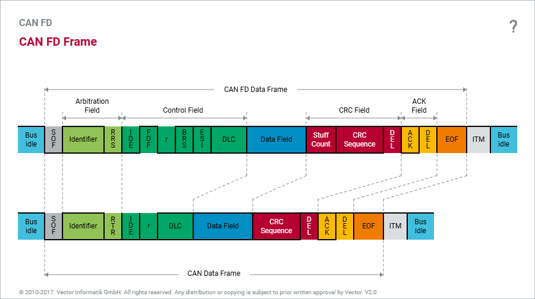
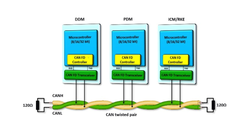

# (6) CAN FD

## **6. CAN with Flexible Datarate (CAN FD)**

### **6.1 등장 배경**

1. **차량 ECU 증가로 인한 통신량 증가**
2. **한정된 시간에 전송해야 할 데이터 증가**

### **6.2 데이터 구간 속도 증가 (BRS)**

- **BRS(Bit Rate Switch): 구간별 속도 전환 기능**
  - **BRS = 0 (dominant): 속도 유지**
  - **BRS = 1 (recessive): 데이터 구간 속도로 전환**

### **6.3 CAN vs CAN FD 전송 시간 비교**

- **64바이트 전송 시:**
  - **CAN: 1Mbps 기준, 8바이트씩 8개 프레임 필요 → 총 약 0.000848초**
  - **CAN FD: 8Mbps 기준, 1개 프레임으로 64바이트 전송 가능 → 총 약 0.000099초**
- **결론: CAN FD는 같은 페이로드를 훨씬 적은 프레임/시간으로 전송 가능**

> **CAN FD 도입의 이점과 대가**
>
> - **전송률 향상 → 버스 부하 감소, 여러 버스를 하나로 통합 가능**
> - **Data Field 확장(최대 64바이트) → 데이터 대비 프로토콜 오버헤드 비율 개선, 패킷 분할/멀티플렉싱 감소**
> - **새로운 CAN 컨트롤러 필요 (가격은 기존 CAN과 유사한 수준), 기존 하이스피드 트랜시버도 사용 가능하나 더 높은 성능을 위해선 신형 트랜시버 권장**
> - **CAN 및 상위 프로토콜(AUTOSAR, CANopen, J1939 등)에도 확장된 Data Field에 맞춘 소규모 프로토콜 변경 필요**

### **6.4 6가지 프레임 유형 (Classic CAN + CAN FD)**

| **구분** | **Standard(11bit)** | **Extended(29bit)** |
| --- | --- | --- |
| **CAN Remote Frame** | **Data Field 없음** | **Data Field 없음** |
| **CAN Data Frame** | **0~8 Byte** | **0~8 Byte** |
| **CAN FD Data Frame** | **0~64 Byte** | **0~64 Byte** |

- **구분 기준 3가지: (1) ID 길이(11/29bit) (2) Data Field 유무(Data/Remote) (3) Data Field 길이(0~8B / 0~64B)**
- **CAN FD에는 Remote Frame이 존재하지 않는다 (Data Field가 없으면 bit rate switch도 필요 없기 때문)**

### **6.5 CAN FD Data Frame 구조 (Standard Format)**

****

| **신규/변경 필드** | **의미** |
| --- | --- |
| **RRS(Remote Request Substitution)** | **기존 RTR 자리를 대체. CAN FD에는 Remote Frame이 없으므로 항상 dominant** |
| **FDF(FD Format)** | **기존 reserve bit 자리 사용. Recessive이면 CAN FD 프레임임을 표시** |
| **BRS(Bit Rate Switch)** | **Data 구간 전송속도 전환 여부** |
| **ESI(Error State Indicator)** | **송신 노드의 에러 상태를 알림** |

### **6.6 Bit Rate Switch (BRS) 상세**

- **Dominant: 단일 bit-rate 유지**
- **Recessive: 설정된 2번째(더 높은) bit-rate로 임시 전환**
- **중재가 끝난 후에는 송신자가 하나뿐이므로 더 높은 속도로 전환 가능**
  - **Baud Rate 1(Arbitration, 예: 500kBaud): SOF ~ BRS, CRC Delimiter 이후 ~ EOF**
  - **Baud Rate 2(Data, 예: 4MBaud): BRS 샘플 포인트 이후 ~ CRC Delimiter 직전까지**
- **모든 CAN FD 노드는 두 개의 baud rate를 설정해 둔다.**
- **트랜시버 성능이 상위 baud rate의 제한 요인이 되며, 기존 CAN High Speed 트랜시버도 사용 가능하지만 최신 트랜시버일수록 더 높은 속도 달성 가능**

### **6.7 Error State Indicator (ESI)**

- **Classic CAN에는 송신 노드가 자신의 에러 상태를 알릴 방법이 없었음**
- **CAN FD의 ESI 비트로 모든 노드가 현재 송신자의 에러 상태를 인지 가능**
  - **Recessive: 송신 노드가 Error Passive 상태**
  - **Dominant: 송신 노드가 Error Active 상태**

### **6.8 DLC와 Data Field 크기 (CAN FD)**

| **DLC** | **CAN(Byte)** | **CAN FD(Byte)** |
| --- | --- | --- |
| **0~8** | **0~8** | **0~8 (동일)** |
| **9** | **8** | **12** |
| **10** | **8** | **16** |
| **11** | **8** | **20** |
| **12** | **8** | **24** |
| **13** | **8** | **32** |
| **14** | **8** | **48** |
| **15** | **8** | **64** |

### **6.9 CAN FD의 2단계 Bit Stuffing과 CRC**

- **CAN FD도 Data Field 끝까지는 Classic CAN과 동일한 방식으로 비트 스터핑 적용**
- **CAN FD에서는 CRC Field 자체에도 별도의 스터핑 규칙이 적용됨(CRC Bit Stuffing)**
  - **CRC 앞에 스터핑된 비트 개수(Stuff Bit Counter)를 Gray Code + Parity Bit로 인코딩하여 삽입**
  - **CRC Field 크기는 Data Field 크기에 따라 결정:**
    - **Data Field ≤ 16 Byte → 17bit CRC, 6개 stuff bit 삽입**
    - **Data Field > 16 Byte → 21bit CRC, 7개 stuff bit 삽입**
  - **CRC Field는 고정된 비트 위치(첫 CRC 비트 앞, 이후 4비트마다)에서 스터핑되며, 스터핑 비트 값은 바로 앞 비트의 반전값**
  - **생성 다항식: CRC17 = 0x3685B, CRC21 = 0x302899**
- **수신자 관점: 어떤 CRC 버전(15/17/21bit)이 맞는지 미리 알 수 없으므로 3가지 CRC 계산을 병렬로 동시에 시작하고, EDL(FDF) 비트 값으로 CRC15 vs (17/21) 여부를 결정, CAN FD인 경우 DLC로 CRC17/CRC21 중 최종 선택**
- **주의: CAN FD 프레임이 전송되는 동안에는 기존 Classic CAN 노드가 버스에 활성 상태이면 안 됨. Classic CAN 노드는 CAN FD 프레임을 규칙 위반으로 오인해 에러 플래그로 중단 시킬 수 있다(하위 호환은 되지만 상위 호환은 안 됨). 이를 위한 대안으로 ISO 11898-6 "Selective Wake-up Transceivers" 표준이 있다.**
