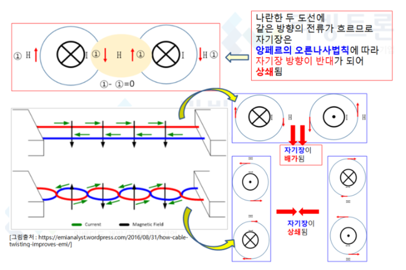
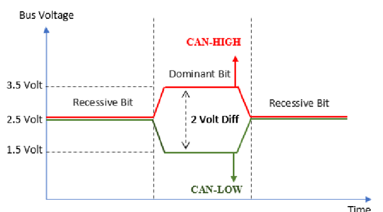
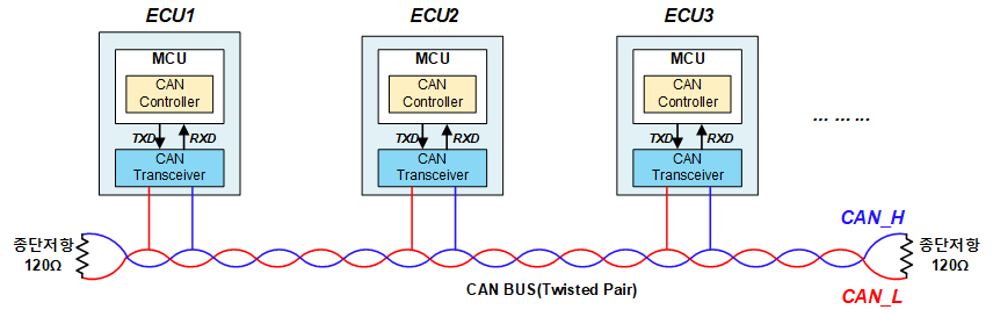

# (5) CAN 물리 계층

**5. CAN 물리 계층**

**5.1 물리계층 개요**

- **신호 변환: 전압 차이의 유무로 0과 1을 구분**
- **차동 신호(Differential Signal): CAN\_High, CAN\_Low 두 선의 전압 차이로 비트 판별**

## **5.2 비트 → 전압 변환 (송신, Tx)**

- **논리값: 0 = dominant(우성), 1 = recessive(열성)**
- **High Speed CAN(ISO 11898-2) 기준 전압:**
  - **Recessive: CAN\_H = CAN\_L ≈ 2.5V (전압차 0V)**
  - **Dominant: CAN\_H ≈ 3.5V, CAN\_L ≈ 1.5V (전압차 2V)**

## **5.3 차동전압 → 비트 해석 (수신, Rx)**

| **차동전압(Vdiff = CAN\_H - CAN\_L)** | **해석** |
| --- | --- |
| **-1.0V ~ 0.5V** | **1 (Recessive)** |
| **0.9V ~ 5.0V** | **0 (Dominant)** |
| **그 외** | **에러** |

> **비트가 시작된 후, 수신자는 설정된 시간(샘플 포인트)만큼 기다린 뒤 비트 값을 판단한다.**   
> **전송 시점과 수신 시점 사이에는 항상 시간 지연이 존재하며, 송신자 본인도 자신이 보낸 비트를 지연을 두고서만 읽을 수 있다.**   
> **수신 ECU가 송신자로부터 멀수록 지연은 커진다.**

## **5.4 CAN 메시지를 보는 세 가지 관점**

| **관점** | **내용** |
| --- | --- |
| **Structure** | **Header | Data | Tail** |
| **Series of Bits** | **논리 비트열(0/1 나열)** |
| **Voltages** | **오실로스코프 상의 CAN\_H/CAN\_L 전압 파형** |

- **수신 노드는 전압 레벨을 비트로 변환 → CAN 컨트롤러가 이를 CAN 표준에 따라 해석(Header/Tail) → 마이크로컨트롤러의 애플리케이션이 Data Field를 해석**

## **5.5 물리적 에러 유형 (High-Speed CAN 예시) - PDF**

| **No.** | **라인** | **에러 설명** |
| --- | --- | --- |
| **1** | **CAN\_H** | **단선(Circuit break)** |
| **2** | **CAN\_L** | **단선** |
| **3** | **CAN\_H** | **배터리 전압(U\_bat)과 단락** |
| **4** | **CAN\_L** | **GND와 단락** |
| **5** | **CAN\_H** | **GND와 단락** |
| **6** | **CAN\_L** | **배터리 전압(U\_bat)과 단락** |
| **7** | **CAN\_H & CAN\_L** | **두 선 간 단락** |
| **8** | **CAN\_H & CAN\_L** | **두 선 모두 단선** |
| **9** | **CAN\_H & CAN\_L** | **종단저항 누락(Missing Termination)** |

## **5.6 꼬임선(Twisted Pair)과 종단저항**

- **데이터 전송 시 케이블 주위에 자기장 발생 → 노이즈 영향 → 꼬임선(twisted pair)은 신호 잡음/간섭을 줄이는 데 도움**
- **우성/열성 + AND 논리: 우성(0)이 논리 우세, 여러 노드가 동시 송신 시 AND 결과는 0(우성)이 유리하게 작용**
- **종단 저항(Termination Resistor): 신호 반사(reflection) 방지가 목적. 종단저항이 없으면 신호 반사로 인해 통신 오류 발생**

## **5.7 차동 전송(Differential Transmission)의 원리**

- **EMC(전자파 적합성) 개선을 위해 전압 레벨을 1~2V로 낮추면, 작은 외란(disturbance)에도 신호가 왜곡될 수 있다는 단점이 있다.**
- **이를 해결하기 위해 신호를 한 선이 아닌 두 선으로 전송하되, 서로 반전된 신호를 각각 전달한다.**
- **수신 측은 절대 전압이 아니라 상대적 차동 전압을 측정 → 두 선에 동일하게(대칭으로) 걸리는 외란은 뺄셈 과정에서 상쇄됨**
- **대표 전압 스텝: CAN High Speed 약 1V, CAN Low Speed 약 2.5V, FlexRay 약 2V**

## **5.8 데이터 전송 방지를 위한 물리적 대책 (Preventing Bit Errors)**

| **대책** | **설명** |
| --- | --- |
| **Fiber Optics / Shielding** | **광케이블 또는 차폐 (비용이 비쌈)** |
| **Twisted Pair** | **꼬임선 사용** |
| **Ground Connection** | **접지** |
| **대칭 차동 신호** | **Differential Signal** |
| **완만한 에지(Less steep edges)** | **급격한 전압 변화 억제** |
| **Synchronization** | **동기화** |
| **Lower Baud Rate** | **낮은 통신 속도** |
| **짧은 버스 길이** | **Shorter bus length** |
| **반사 저감** | **Reduction of reflections** |

> **실제로는 광통신 등 비용이 비싼 방법은 예외적으로만 사용되며, 재정적 이유나 필요 대역폭 부족 등으로 일부 대책만 선택적으로 적용된다.**

## **5.9 동기화(Synchronization) 원리**

**왜 필요한가?**

- - **수신 노드는 프레임을 올바르게 수신하려면 프레임의 시작 시점과 비트 지속 시간을 알아야 한다.**
  - **Baud rate는 모든 노드에 동일하게 설정되어 있으므로 이론적으로 비트 지속시간은 알려져 있다.**
  - **다만 클록 오차(clock inaccuracy)로 인해 송신 노드와 수신 노드의 타이밍이 점차 어긋난다(drift). → 재동기화(Re-synchronization) 필요**

**Bit-Time-Interval 구조**

- - **하나의 비트 구간(Bit-Time-Interval)은 SYNC, TSEG\_1, TSEG\_2 세 구간으로 나뉜다.**
    - **SYNC: 이 구간 내에 신호 에지(1→0 전환)가 들어오면 수신자가 송신자와 동기화된 상태**
    - **TSEG\_1(Time Segment 1): 버스 길이가 길수록 길게 설정. 수신자 클록이 너무 빠를 경우 이 구간을 늘려 보정**
    - **TSEG\_2(Time Segment 2): 재동기화용. 수신자 클록이 느릴 경우 이 구간을 줄이거나 생략하여 보정**
  - **비트 값을 0/1로 판단하는 샘플 포인트(Sample Point)는 TSEG\_1과 TSEG\_2 사이의 경계에서 이루어진다.**

**동기화 검사**

- - **에지가 SYNC 구간 안에 들어오면 → 동기 상태 정상**
  - **에지가 너무 이르거나 늦게 들어오면 → 재동기화 필요**
    - **에지가 예상보다 일찍 도착(수신자 클록이 느림) → TSEG\_2를 줄여서 보정**
    - **에지가 예상보다 늦게 도착(수신자 클록이 빠름) → TSEG\_1을 늘려서 보정**
  - **보정 가능한 최대 위상 오차는 SJW(Synchronization Jump Width)로 제한된다.**

**데이터 전송률과 버스 길이의 관계**

- - **다중 송신자가 관여하는 중재(Arbitration)/ACK 구간에서는 비트 타이밍이 모든 지연 시간의 2배를 보상해야 한다.**
  - **지연 = 전자 장치의 응답 시간 + 버스 전파 지연(구리선 기준 약 5ns/m)**
  - **예: 1Mbit/s(High Speed CAN) 데이터레이트에서 최대 버스 길이는 약 40m로 제한된다. (버스가 길수록 최대 데이터레이트는 감소)**
