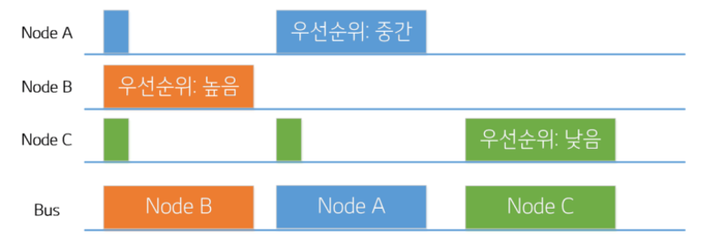
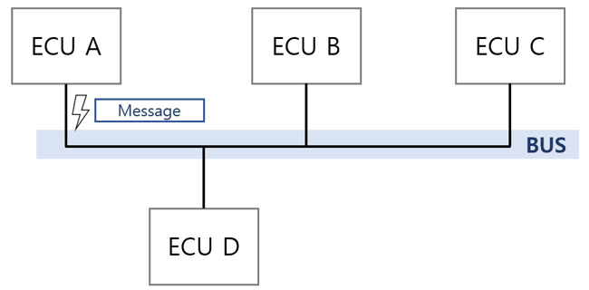

# (3) CAN 통신 원리

## **3. CAN 통신 원리**

### **3.1 멀티마스터 프로토콜**

- **버스가 사용되지 않을 때(idle)는 어느 노드든 데이터를 네트워크에 송신 가능**

### **3.2 이벤트 기반**

- **ECU에서 특정 이벤트가 발생했을 때만 메시지를 전송**

> **차량 내 버스 접근 방식 비교 (PDF) 버스 접근 방식은 크게 4가지로 분류된다.**
>
> | **방식** | **사용 예** | **특징** |
> | --- | --- | --- |
> | **이벤트 기반(Event-driven)** | **CAN** | **어느 ECU든 버스 사용 가능 시점에 접근 가능. 우선순위로 트래픽 제어. 송신자에 동기화** |
> | **마스터-슬레이브** | **LIN** | **마스터가 전송 제어, 슬레이브는 요청에만 응답. 마스터에 동기화** |
> | **시간 동기 방식** | **FlexRay** | **주기적 타임윈도우 방식(TDMA), 글로벌 클록에 동기화** |
> | **토큰 패싱** | **OSEK NM** | **송신 권한(Token)을 순차적으로 전달** |
>
> **이벤트 기반 방식 중 대표적으로 CSMA/CD(Ethernet, 충돌 감지)와 CSMA/CA(CAN, 충돌 회피)가 있다.**

### **3.3 CSMA / CSMA-CA**

- **CS(Carrier Sense): 버스 상태를 먼저 감지**
- **MA(Multiple Access): 여러 ECU가 하나의 버스를 사용**
- **CA(Collision Avoidance): 충돌 회피 — 충돌 상황 해결을 위해 우선순위를 정할 수 있는 ID 부여**

### **3.4 버스 접근 규칙 (Bus Access Rules)**

- **각 네트워크 노드는 버스가 idle일 때 언제든 전송을 시작할 수 있다.**
- **버스는 정의상 11개의 recessive(열성) 비트가 연속으로 관측되면 idle 상태로 간주된다.**
- **두 개 이상의 전송 요청이 동시에 발생하면, 모든 노드가 동시에 첫 identifier 비트부터 송신을 시작하고 비트 단위 중재(bit-synchronous arbitration)가 일어난다.**
- **만약 전송 요청 시점이 다르면, 나중에 요청한 노드는 우선순위와 상관없이 버스가 idle이 될 때까지 기다려야 한다(즉 "먼저 시작한 프레임이 이긴다").**

### **3.5 동시 전송(Simultaneous Transmission) 예시**

**Node A: 0x1A Data**  
**Node B: 0x2B1 (중재 패배) → 재시도 → 0x2B1 Data**  
**Node C: 0x3FF (중재 패배) → 재시도 → (중재 패배) → 0x3FF Data**

**Bus: 0x1A Data | 0x2B1 Data | 0x3FF Data**

- **세 노드가 동시에 버스 접근을 시도할 때, 식별자(ID)를 전송하는 구간을 중재 구간(Arbitration Phase)이라 한다.**
- **식별자의 숫자 값이 낮을수록 우선순위가 높다. (Node A가 가장 낮은 값 → 승리)**
- **우선순위가 낮은 노드(B, C)는 전송 요청을 취소하지 않고, 버스가 다시 idle이 되면 재시도한다.**

### **3.6 비트 단위 중재 로직 (Arbitration Bit-by-Bit)**

**중재 중인 모든 노드는 자신이 보낸 비트값과 버스에서 읽은 값을 비교한다.**

**Arbitration Logic (송신자 관점)**

| **Sender(보낸 값)** | **Bus(읽은 값)** | **의미** |
| --- | --- | --- |
| **0** | **0** | **계속 진행(Continue)** |
| **0** | **1** | **전송 오류(Transmission Error)** |
| **1** | **0** | **중단하고 수신 모드로 전환 (중재 패배)** |
| **1** | **1** | **계속 진행(Continue)** |

**Bus Logic (AND 결선 방식)**

| **Sender A** | **Sender B** | **Bus** |
| --- | --- | --- |
| **0** | **0** | **0** |
| **0** | **1** | **0** |
| **1** | **0** | **0** |
| **1** | **1** | **1** |

> **즉, 1(recessive, 열성)을 보냈는데 버스에서 0(dominant, 우성)이 읽히면 → 다른 노드가 우성 비트를 보내고 있다는 뜻 → 해당 노드는 즉시 송신을 멈추고 수신 모드로 전환한다.**   
> **이 메커니즘 덕분에 중재에서 이긴 노드는 지연 없이(collision 없이) 전송을 이어갈 수 있다.**

### **3.7 우선순위(Priority)**

- **버스 접근은 메시지 우선순위로 제어된다.**
- **ID 값의 역수 관계가 우선순위를 나타낸다.**
  - **최고 우선순위: ID = 0 (0x0)**
  - **최저 우선순위: ID = 2047 (0x7FF, 11bit 표준 포맷 기준)**
