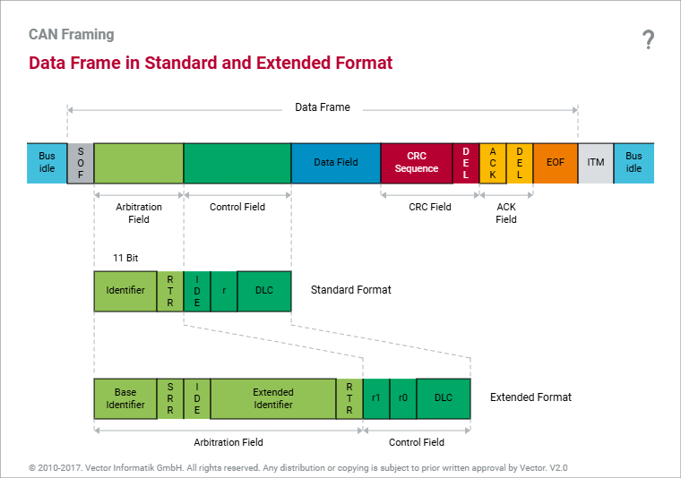

# (4) CAN 프레임

**4. CAN 프레임**

**4.1 프레임 구조 (ID / DLC / Data)**

| **필드** | **설명** |
| --- | --- |
| **ID** | **메시지 식별자 및 우선순위 (표준 CAN: 11bit / 확장 CAN: 29bit)** |
| **DLC** | **데이터 길이 (0~8)** |
| **Data** | **제어정보, 상태정보, 센서데이터, 명령어 등 실제 전송 데이터** |

- **송신: 우선순위가 가장 낮은 데이터부터가 아니라, 우선순위와 무관하게 버스에 연결된 모든 제어기에 브로드캐스트된다.**
- **수신: CAN 컨트롤러가 특정 ID를 가진 메시지만 수신하도록 ID 필터링 수행**

## **4.2 CAN Data Frame 구조 (Standard Format, 11bit)**

****

| **약어** | **의미** |
| --- | --- |
| **SOF** | **Start Of Frame** |
| **RTR** | **Remote Transmission Request** |
| **IDE** | **Identifier Extension** |
| **r** | **Reserve Bit** |
| **DLC** | **Data Length Code** |
| **CRC** | **Cyclic Redundancy Check** |
| **DEL** | **Delimiter** |
| **ACK** | **Acknowledgement** |
| **EOF** | **End Of Frame** |
| **ITM** | **Intermission** |

## **4.3 Start of Frame (SOF)**

- **Bus idle(1) → 0으로 상태가 바뀌는 것에 해당**
- **메시지의 시작을 알림**
- **수신자가 송신자와 동기화(synchronize)할 수 있는 수단 제공**
- **최소 11개의 논리 1(recessive)이 관측된 후에만 SOF(논리 0)를 보낼 수 있음**
- **모든 ECU는 baud rate 설정에 따라 비트 지속시간을 미리 알고 있음 (예: 500kBaud → 1bit = 2µs)**
- **1(recessive)→0(dominant) 에지가 감지되는 순간, 모든 노드는 비트 타이밍 타이머를 시작한다.**

## **4.4 Identifier**

- **송신 시: 중재를 위한 메시지 우선순위 역할**
- **수신 시: 메시지의 Data Field 내용을 나타냄(어떤 신호인지 식별)**
- **11bit → 0x0 ~ 0x7FF (0~2047, decimal)**
- **msb(최상위 비트)부터 lsb(최하위 비트) 순서로 전송**

## **4.5 Remote Transmission Request (RTR)**

- **RTR = Dominant(0) → Data Frame**
- **RTR = Recessive(1) → Remote Frame**

> **Remote Frame: 특정 ID의 데이터를 요청하는 프레임. Data Field가 없지만, 요청하려는 데이터 크기만큼 DLC는 설정된다. Remote Frame의 ID와 대응하는 Data Frame의 ID가 같을 경우, 중재 시 RTR 비트도 중재 대상에 포함되며 Data Frame(RTR=0, dominant)이 항상 승리한다.**
>
> - **주로 건물 자동화(Building Services), 자동화 엔지니어링(Automation Engineering) 등 버스 길이가 매우 길어 주기적 전송 방식이 어려운 영역에서 사용된다.**

## **4.6 Identifier Extension (IDE) - 확장 포맷**

- **IDE = Dominant(0) → Standard Format(11bit)**
- **IDE = Recessive(1) → Extended Format(29bit)**

**Extended Format 구조**

****

- **확장 포맷은 최대 약 5억 3천 6백만 개의 식별자를 제공하며, SAE J1939(상용차용), NMEA 2000(선박), ISO 11783(농기계) 등의 기반 규격이다.**
- **J1939 ID 구조: `Priority(3bit) + EDP(1bit) + DP(1bit) + PDU Format(8bit) + PDU Specific(8bit) + Source Address(8bit)`**
- **표준 포맷과 확장 포맷은 같은 버스에 공존 가능하며, 중재는 비트 단위로 이루어진다(동일한 앞부분 ID를 가질 경우 Extended Format이 우선순위에서 밀림 - SRR 비트가 recessive이므로).**

## **4.7 Data Length Code(DLC)와 Data Field**

- **DLC 값 0~8: Data Field의 바이트 수**
- **DLC 값 9~15: 모두 8바이트로 처리됨 (Classic CAN 기준)**

## **4.8 Cyclic Redundancy Check (CRC)**

- **수신자를 위한 에러 검출 기능 제공**
- **송신자는 생성 다항식(Generator-polynomial)을 이용해 CRC 계산 → 메시지에 포함(CRC\_Tx)**
- **수신자는 동일 알고리즘으로 CRC 계산(CRC\_Rx) 후 비교**
  - **동일 → 정상(Correct) / 다름 → 에러(Error)**
- **Classical CAN: 15bit CRC, 생성 다항식 0xC599(1100 0101 1001 1001)**
- **CAN-CRC로 프레임 내 최대 5비트 에러까지 검출 가능**

## **4.9 Acknowledgement (ACK)**

- **송신자는 ACK 슬롯에 recessive(1) 비트를 보내며, 모든 수신자로부터 dominant 응답을 기대한다.**
- **CRC 검사를 통과한 수신자는 dominant ACK(0) 전송 → 최소 1개 이상의 수신자가 정상 수신했음을 의미**
- **모든 수신자가 에러를 검출했거나 수신자가 없으면 ACK 비트는 recessive로 유지 → 송신 실패로 간주, 이후 비트에서 에러 플래그 발생**

## **4.10 End of Frame (EOF) & Intermission (ITM)**

- **EOF(7bit): 프레임의 끝을 나타냄**
- **Intermission(3bit) 이후 → 버스 idle**
- **11개의 연속된 1(recessive)이 관측되면 버스가 idle로 간주되며 자유롭게 접근 가능**
- **ITM은 IFS(Inter Frame Space)라고도 불림**

## **4.11 Bit Stuffing (비트 스터핑)**

- **동일한 값의 비트가 5개 연속되면 송신자는 반전된 비트(stuff bit)를 삽입**
- **수신자는 5개 연속 비트 이후 나오는 반전 비트를 제거(discard)**
- **6번째 같은 값의 비트가 나오면 에러로 처리**
- **적용 구간: SOF ~ CRC Field까지 (ACK/EOF/ITM 구간은 제외)**

**비트 스터핑의 목적**

1. 1. **스터핑이 없으면 Data Field 등에서 우연히 11개의 recessive 비트가 연속되어 bus idle로 오인될 수 있음**
   2. **긴 동일값 비트열을 끊어줌으로써, 최소 10비트마다 하강 에지(falling edge)가 발생하도록 보장 → 수신자의 재동기화(re-synchronization)에 필요**
   3. **노드가 로컬에서 검출한 에러를 알리기 위해 의도적으로 스터핑 규칙을 위반할 수도 있음(→ 에러 플래그) → 버스 전체의 데이터 일관성 보장**
