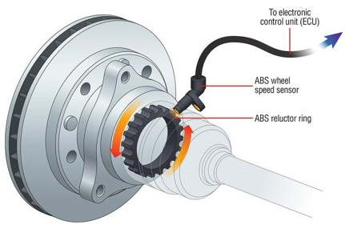

# (1) ECU 소개

**1. ECU 소개**

**1.1 ECU란?**

- **ECU(Electronic Control Unit, 전자 제어 장치): 차량의 엔진을 비롯한 다양한 전자 시스템을 제어하는 장치**
- **ECU는 센서에서 정보를 받아 미리 설계된 기준으로 판단하고, 액추에이터로 명령을 전송한다.**

  - **흐름: `센서 입력 → ECU 처리(판단) → 액추에이터 응답`**

  **``**

> **왜 ECU가 이렇게 많아졌나?**  
>   
> **1980년대 후반부터 차량 내 전자 기능이 폭발적으로 늘면서 초기에는 각 기능이 독립적(isolated)으로 구현되었다.**   
> **1990년대 들어 전자장치들을 통합하는 개념이 등장했고, 전자 시스템은 "문제"가 아니라 신차의 트렌드를 이끄는 핵심 경쟁력으로 인식이 바뀌었다.**   
> **초기 차량에는 ECU 3개 수준의 버스 시스템만 있었지만, 현재는 차량 한 대에 70개 이상의 ECU가 탑재된다.**

## **1.2 예시 - ABS (Anti-Lock Brake System)**

- **브레이크 페달을 밟았을 때 바퀴 잠김을 방지하기 위해 브레이크 캘리퍼 압력을 제어하는 시스템**
- **ECU 역할: 휠 속도 센서로 바퀴 회전 속도를 전달받아 잠김 여부를 판단 → 유압장치 제어**

  - **흐름: `휠 센서 → ECU → 유압장치`**

## **1.3 ECU 간 연결 방식의 진화**

**차량 내 여러 ECU를 서로 연결하는 방법에는 두 가지 큰 흐름이 있다.**

| **방식** | **설명** | **문제점/장점** |
| --- | --- | --- |
| **Point-to-Point (구 방식)** | **신호 하나마다 전용 배선(dedicated wire) 사용** | **배선 뭉치(harness)가 크고 무거워짐, 커넥터 비용 증가, 네트워크 확장이 복잡함** |
| **Bus Networking (현재 방식)** | **여러 ECU가 하나의 공용 버스(bus)를 공유(time-share)** | **배선이 가볍고 관리 용이, 에러 진단 가능, 네트워크 확장 용이. Latin어 "omnibus(모두를 위한)"에서 유래** |

**차량 내 물리적 토폴로지 종류**

- **Ring(링): MOST**
- **Bus(버스): CAN, LIN, FlexRay**
- **Star(스타): FlexRay**
- **Arbitrary(임의 구조/메시): Ethernet**

> **차량 네트워크는 통신 네트워크에 비해 규모가 작아 메시(mesh) 구조를 쓸 필요가 없다. 즉, 프레임 안에 라우팅을 위한 프로토콜 제어 정보가 필요 없다.**

## **1.4 ISO-OSI 참조 모델과 CAN의 위치**

| **Layer** | **이름** | **역할** |
| --- | --- | --- |
| **7** | **Application** | **응용 서비스** |
| **4** | **Transport** | **세그멘테이션/조립, 흐름 제어** |
| **3** | **Network** | **라우팅, 확장 주소 할당** |
| **2** | **Data Link** | **프레이밍, 주소 지정, 버스 접근, 동기화, 데이터 보호** |
| **1** | **Physical** | **전송 매체, 신호 전달, 토폴로지** |

- **CAN은 OSI 1계층(Physical)과 2계층(Data Link)만 정의한다.**
- **Bosch가 발표한 CAN 사양서는 이 2개 계층을 다시 3개 레이어로 세분화한다.**

| **Layer** | **이름** | **담당 기능** |
| --- | --- | --- |
| **3** | **Object Layer** | **메시지 필터링(Message Filtering), 메시지/상태 처리** |
| **2** | **Transfer Layer** | **Fault Confinement, 에러 검출/신호화, 메시지 검증, 응답(ACK), 중재(Arbitration), 프레이밍, 전송률/타이밍** |
| **1** | **Physical Layer** | **신호 레벨/비트 표현, 전송 매체** |

**ISO 표준 및 실제 구현**

| **ISO OSI** | **서브레이어** | **ISO 표준** | **구현체** |
| --- | --- | --- | --- |
| **Data Link(2)** | **LLC, MAC** | **ISO 11898-1 (CAN Protocol, CAN/CAN FD)** | **CAN-Controller / CAN-FD-Controller** |
| **Physical(1)** | **PCS, PMA, MDI** | **ISO 11898-2 (High Speed, ~1Mbit/s 이상 CAN FD) / ISO 11898-3 (Low Speed, ~125kbit/s)** | **CAN-Transceiver** |

- **LLC(Logical Link Control): 전송 신뢰성을 보장하는 기능**
- **MAC(Medium Access Control): 버스 접근을 담당하는 기능**
- **PCS(Physical Coding Sublayer): 비트 인코딩/디코딩, 비트 타이밍, 동기화**
- **PMA(Physical Medium Attachment): 트랜시버 특성**
- **MDI(Medium Dependent Interface): 전송 매체, 커넥터**

**대표 트랜시버**

- **CAN High-Speed(최대 1Mbit/s): PCA82C250, TJA1050, TJA1040/1041**
- **CAN Low-Speed(최대 125kbit/s): TJA1054**
- **Single-Wire-CAN(SAE J2411, 최대 33/41.6 kBit/s): AU5790**

## **1.5 차량 내 버스 시스템 분류**

| **Class** | **버스** | **최대 전송률** |
| --- | --- | --- |
| **Class A** | **LIN** | **20 kBit/s** |
| **Class B** | **CAN (Low Speed)** | **125 kBit/s** |
| **Class C** | **CAN (High Speed)** | **1 MBit/s** |
| **미정의** | **CAN FD (High Speed)** | **정의되지 않음(더 높음)** |
| **Class C+** | **FlexRay** | **10 MBit/s** |
| **Infotainment** | **MOST / Ethernet** | **150 / 400 MBit/s** |

- **CAN(Powertrain & Chassis), CAN Low Speed(Body), LIN(Sensor/Actuator) 등은 상대적으로 대역폭은 낮지만 신뢰성이 요구되는 영역에 사용된다.**
- **FlexRay/Ethernet/MOST 등은 대역폭이 큰 인포테인먼트, X-by-wire 영역에 사용된다.**
