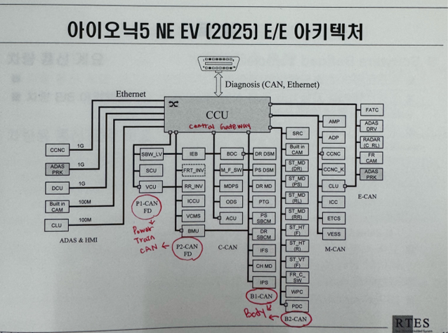
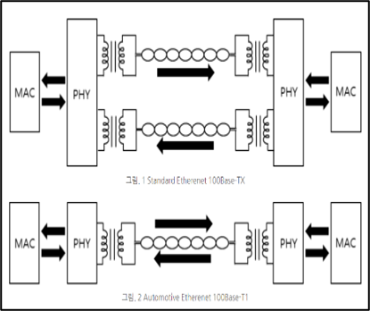
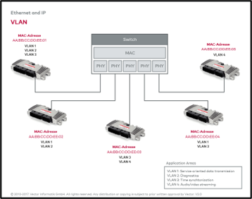
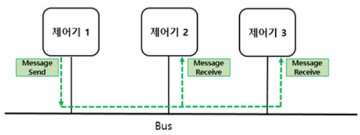

# [3] 차량용 이더넷 (기초)

**차량용 이더넷 기초 교육자료**

**비전공자를 위한 차세대 차량 통신의 이해**

---

## **👀 들어가기 전에**

**✔ 이 문서를 읽고 나면 알 수 있는 것**

- **CAN 통신만으로는 부족해진 이유가 무엇인지**
- **차량용 이더넷이 무엇이고, 일반적으로 알고 있는 이더넷(인터넷 공유기 등)과 어떻게 다른지**
- **CAN과 이더넷이 왜 한 차량 안에 함께 쓰이는지**
- **사내에서 자주 들리는 100BASE-T1, ADAS, 도메인 같은 용어의 의미**

**✔ 이 문서에서 다루지 않는 것**

- **OSI 7계층, MAC/IP 주소 체계 등 네트워크 이론 전반**
- **이더넷 프레임 구조, EMC 보호회로 등 하드웨어 설계 세부사항**
- **TSN, SOME/IP 등 이더넷 위에서 동작하는 응용 기술의 구현 방식**

> **이 자료는 [CAN 통신 기초 교육자료]의 후속편입니다. CAN에 대한 기본 개념(버스, ECU, 우선순위 등)을 먼저 보고 오시면 이해가 더 쉽습니다.**

---

## **1. CAN만으로는 부족해진 순간**

**CAN 기초자료에서 살펴봤듯, CAN은 자동차 통신에서 오랫동안 신뢰받아온 방식입니다. 하지만 최근 자동차에 새로운 기능들이 늘어나면서, CAN만으로는 감당하기 어려운 상황이 생기기 시작했습니다.**

****

| **영역** | **어떤 데이터를 다루나** | **왜 CAN으로는 부족한가** |
| --- | --- | --- |
| **인포테인먼트** | **고화질 영상, 음악 스트리밍, 내비게이션 지도** | **데이터 용량이 훨씬 큼** |
| **ADAS (첨단 운전자 보조)** | **카메라·레이더·라이다 데이터를 종합해서 즉시 판단** | **대용량 데이터를 지연 없이 처리해야 함** |
| **카메라** | **서라운드 뷰, 후방 카메라 영상** | **영상 데이터 자체가 큼** |
| **진단** | **로그, 결함코드, 소프트웨어 업데이트 파일** | **빠르게 큰 파일을 주고받아야 함** |

**CAN 기초자료에서 봤던 속도 비교표를 다시 가져와 보겠습니다.**

| **통신 방식** | **최대 전송 속도** |
| --- | --- |
| **LIN** | **20 kBit/s** |
| **CAN (Low Speed)** | **125 kBit/s** |
| **CAN (High Speed)** | **1 Mbit/s** |
| **CAN FD** | **8 Mbit/s** |
| **FlexRay** | **10 Mbit/s** |
| **이더넷** | **150~400 Mbit/s 이상** |

> **비유: CAN은 동네 골목길과 같습니다. 오랫동안 잘 써왔지만, 하루아침에 대형 화물차(고화질 영상, 대용량 진단 파일)가 지나다녀야 하는 상황이 되면 길이 막힐 수밖에 없습니다. 그래서 옆에 새로운 고속도로(이더넷)를 놓게 된 것입니다.**

---

## **2. 그래서 이더넷이 들어왔다**

**여기서 말하는 "이더넷"은 여러분이 사무실이나 집에서 쓰는 인터넷 공유기, 랜선과 같은 기술입니다. 다만 자동차 안에 들어가기 위해서는 몇 가지가 달라져야 했습니다.**

****

| **구분** | **일반 이더넷** | **차량용 이더넷** |
| --- | --- | --- |
| **선 개수** | **4가닥** | **2가닥(1쌍)** |
| **특징** | **가정·사무실 환경에 최적화** | **가볍고 저렴하게, 차량 환경에 최적화** |

**자동차는 무게와 비용에 민감하기 때문에, 일반 이더넷의 두꺼운 케이블을 그대로 쓸 수 없었습니다. 그래서 선을 2가닥으로 줄인 차량용 이더넷이 별도로 개발되었습니다.**

> **재미있는 공통점 하나: CAN이 전압 차이로 0과 1을 표현했던 것처럼, 이더넷도 결국은 전압 신호로 0과 1을 표현합니다. "무엇을 실어 나르는가"의 방식이 다를 뿐, "결국 전기 신호를 주고받는다"는 근본 원리는 같습니다.**

---

## **3. 이더넷은 CAN과 무엇이 다를까?**

**CAN 기초자료에서 배운 핵심 개념 하나를 다시 떠올려봅시다.**  
  
****

> **CAN의 방식: 버스에 메시지를 실으면, 연결된 모든 ECU가 그 메시지를 함께 받습니다. (브로드캐스트)**

**이더넷은 이 부분에서 CAN과 다르게 동작합니다.**  
****

> **이더넷의 방식: 각 장치마다 고유한 "주소"가 있어서, 필요한 상대방에게만 데이터를 정확히 전달할 수 있습니다.**

> **비유: CAN이 "동네 방송으로 온 마을에 알리는 것"이라면, 이더넷은 "정확한 집 주소를 써서 편지를 보내는 것"과 비슷합니다. 데이터가 많아질수록, 모두에게 다 뿌리는 방식보다는 필요한 곳에만 정확히 보내는 방식이 훨씬 효율적입니다.**

> **💡 업무 연결 포인트 — 이런 차이 때문에 카메라 영상처럼 특정 장치(예: 화면 표시 장치)만 필요로 하는 대용량 데이터는 이더넷으로 보내고, 모든 ECU가 함께 알아야 하는 간단한 상태 정보(예: 문 열림 여부)는 여전히 CAN으로 보내는 식으로 역할을 나누어 쓰고 있습니다.**

---

## **4. 이더넷에도 여러 속도 등급이 있다**

**CAN에 Low Speed와 High Speed가 있었듯, 차량용 이더넷도 요구되는 속도에 따라 등급이 나뉩니다.**

| **표준** | **대략적인 속도** | **주로 쓰이는 곳** |
| --- | --- | --- |
| **100BASE-T1** | **100 Mbps** | **인포테인먼트, 카메라, 센서** |
| **1000BASE-T1** | **1000 Mbps (1 Gbps)** | **ADAS, 고속 데이터 처리** |
| **10GBASE-T1** | **10 Gbps** | **자율주행, 차량 간 통신(V2X)** |

**처리해야 할 데이터가 많고 실시간성이 중요할수록, 더 빠른 등급의 이더넷이 사용됩니다. 마치 카메라 한두 대를 연결할 땐 보통 케이블이면 충분하지만, 자율주행처럼 여러 센서 데이터를 동시에 처리해야 하면 훨씬 굵은 "통신 고속도로"가 필요한 것과 같습니다.**

---

## **5. (참고) 이더넷 위에서 일어나는 일들**

**차량용 이더넷이 들어오면서, 그 위에서 데이터를 더 똑똑하게 관리해주는 기술들도 함께 등장했습니다. 지금 단계에서는 이런 게 있다는 정도만 알아두시면 충분합니다.**

| **기술** | **한 줄 설명** |
| --- | --- |
| **TSN** | **여러 데이터가 섞여도, 급한 데이터(예: 제동 관련)가 항상 제때 도착하도록 우선순위와 시간을 관리해주는 기술** |
| **SOME/IP** | **"필요한 장치에게만 정확히 전달"하는 이더넷의 특성을 살려서, 마치 구독하듯 필요한 정보만 주고받게 해주는 기술** |

> **💡 업무 연결 포인트 — CAN에서는 "중재(우선순위)"라는 개념으로 급한 메시지를 먼저 보냈다면, 이더넷 환경에서는 TSN이 비슷한 역할(급한 데이터를 제때 보장)을 합니다. 통신 방식은 바뀌어도, "중요한 정보는 반드시 제때 전달되어야 한다"는 목표는 CAN이나 이더넷이나 동일합니다.**

---

## **6. 그래서 왜 CAN과 이더넷이 함께 쓰일까?**

**결론적으로, 최신 자동차는 CAN을 없애고 이더넷으로 완전히 대체한 것이 아니라 두 방식을 목적에 맞게 함께 사용하고 있습니다.**

| **상황** | **적합한 방식** | **이유** |
| --- | --- | --- |
| **문 열림, 온도 등 간단한 상태 정보** | **CAN** | **적은 데이터를 여러 ECU가 함께 알아야 함, 신뢰성 중요** |
| **카메라 영상, 지도 데이터, 소프트웨어 업데이트** | **이더넷** | **대용량 데이터를 특정 장치에 빠르게 전달해야 함** |

****

---

---

## **7. [부록] 용어 정리**

| **용어** | **의미** |
| --- | --- |
| **차량용 이더넷** | **자동차 환경에 맞게 가볍고 저렴하게 만든 이더넷 규격** |
| **도메인** | **인포테인먼트, ADAS 등 자동차 안에서 기능별로 나눈 영역** |
| **ADAS** | **첨단 운전자 보조 시스템 (차선 유지, 자동 긴급 제동 등)** |
| **100BASE-T1 / 1000BASE-T1 / 10GBASE-T1** | **차량용 이더넷의 속도 등급 (숫자가 클수록 더 빠름)** |
| **TSN** | **이더넷 위에서 급한 데이터의 전달 시점을 보장해주는 기술** |
| **SOME/IP** | **필요한 장치에게만 정보를 전달하는 이더넷 기반 통신 기술** |
| **V2X** | **차량과 차량, 차량과 인프라 간 통신 (Vehicle to Everything)** |

---

## **9. 더 알고 싶다면**

| **관심 방향** | **참고 문서** |
| --- | --- |
| **차량용 이더넷의 기술적 세부 내용 (계층 구조, 프레임, EMC 등)** | **차량용 이더넷 (심화)** |
| **CAN 통신의 기본 개념** | **CAN 통신 (기초)** |
| **자동차와 진단기가 "대화"하는 방법** | **UDS 진단 통신 (기초)** |

---

***본 자료는 사내 차량용 이더넷 심화 교육자료를 기반으로, 비전공자를 위해 개념 중심으로 재구성한 기초 자료입니다.***
