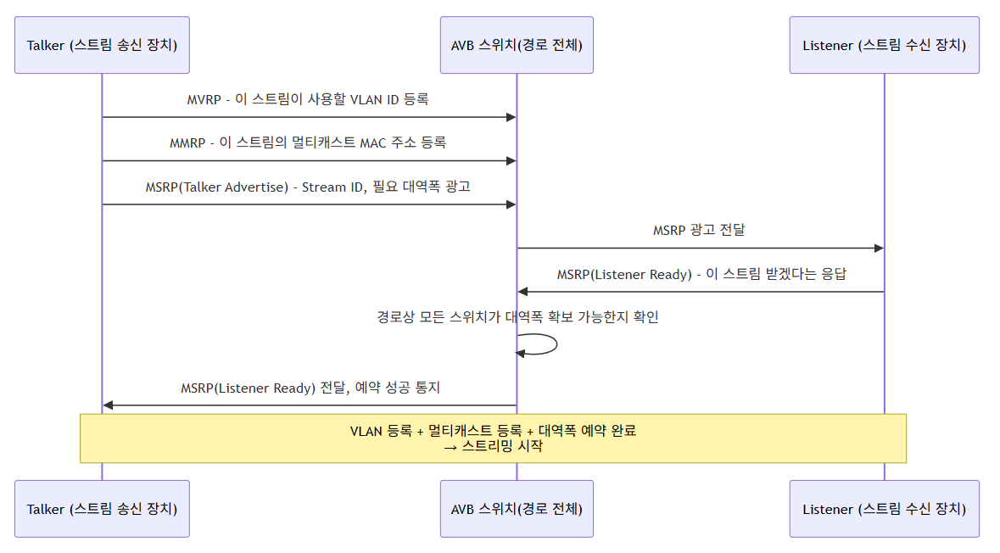
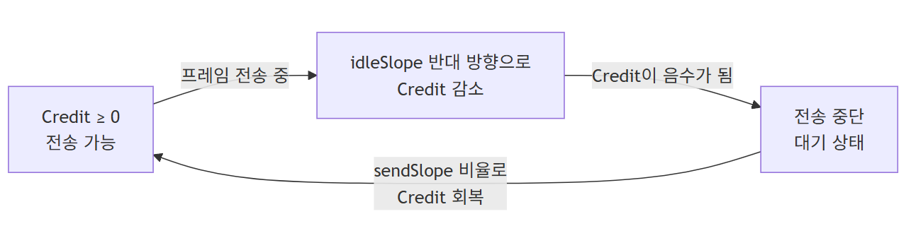
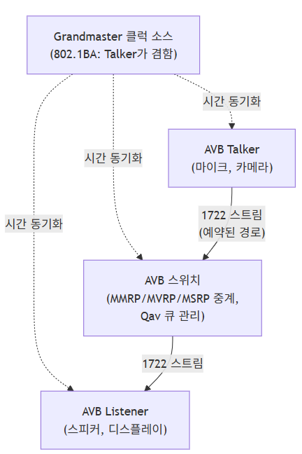

# (6) AVB

## **6. Ethernet AVB**

## **6.1 AVB(Audio Video Bridging)란?**

- **오디오, 비디오 등 멀티미디어 스트림 데이터의 품질을 보장하며 동시에 원활한 전송을 위한 기술 표준  
    
  **

### **Ethernet AVB 프로토콜**

| **표준** | **이름** | **역할** |
| --- | --- | --- |
| **IEEE 1722** | **Ethernet AVB 전송 프로토콜** | **AV 스트림 전달을 위한 Encapsulation 기능 지원** |
| **IEEE 802.1 AS** | **시간 동기화 프로토콜** | **카메라 및 오디오 데이터 동기화 지원** |
| **IEEE 802.1 Qat** | **대역폭 예약 프로토콜** | **소스 및 목적지 경로 내의 모든 노드에 필요한 대역폭 예약** |
| **IEEE 802.1 Qav** | **메시지 포워딩 및 큐 관리 기법** | **스트리밍 데이터 실시간 전송 지원** |

### **6.1.1 왜 4개의 표준이 함께 필요한가**

**AVB가 "품질을 보장하며 전송한다"고 말할 때, 이는 사실 4가지 서로 다른 문제를 각각의 표준이 나누어 해결한 결과다.**

| **해결해야 할 문제** | **담당 표준** |
| --- | --- |
| **"이 데이터가 오디오/비디오라는 것을 어떻게 표현할 것인가"** | **IEEE 1722** |
| **"모든 장치가 같은 시각을 어떻게 공유할 것인가"** | **IEEE 802.1 AS** |
| **"전송에 필요한 대역폭을 어떻게 미리 확보할 것인가"** | **IEEE 802.1 Qat** |
| **"확보된 대역폭 안에서 실제로 어떻게 전송을 통제할 것인가"** | **IEEE 802.1 Qav** |

> **CAN과 비교했을 때의 차이: CAN은 "우선순위(ID)로 순서를 정한다"는 단 하나의 메커니즘으로 신뢰성을 확보했다(CAN 기초자료 4장 참고). 반면 AVB는 이더넷이라는, 원래 실시간성을 보장하지 않던 매체 위에 "포맷 정의(1722) + 시간 동기화(AS) + 대역폭 예약(Qat) + 전송 통제(Qav)"라는 4단계 장치를 추가로 쌓아 올려야만 CAN이 원래부터 갖고 있던 수준의 실시간성을 흉내 낼 수 있다. 이 복잡성이 바로 다음 장(7. TSN)에서 표준이 더 늘어나는 이유이기도 하다.**

---

## **6.2 IEEE 1722**

- **Ethernet AVB 전송 프로토콜**
- **미디어 포맷 및 캡슐화 제공**
  - **원시(raw) & 압축된 A/V 포맷 표시**
  - **미디어 동기화 매커니즘**
  - **미디어 클럭 복원 및 동기화**
  - **Latency 최적화 및 정규화**
- **AVB Stream ID를 통한 멀티캐스트 주소 지정**

### **Ethernet AVB 패킷**

- **VLAN 태그가 추가된 표준 Ethernet 프레임**
- **EtherType: 0x88B5**

****

### **6.2.1 IEEE 1722 프레임 구조 상세**

**(4장에서 다룬 이더넷 프레임 구조 위에, AVB는 자체 헤더(AVTP, AV Transport Protocol Header)를 추가로 얹는다.**

| **필드** | **설명** |
| --- | --- |
| **Ethernet Header + VLAN Tag** | **목적지/출발지 MAC, EtherType(0x88B5)으로 AVB 스트림임을 식별, PCP(4.4.2절)로 우선순위 표시** |
| **AVTP Header** | **Stream ID, 타임스탬프, 미디어 클럭 정보 등을 포함** |
| **Media Payload** | **실제 오디오/비디오 데이터(압축 또는 무압축)** |

```

```

> **EtherType으로 프로토콜을 식별하는 방식은 4.2.1절에서 다룬 개념과 동일하다. 일반 데이터는 0x0800(IPv4)을 쓰지만, AVB 스트림은 IP 계층을 거치지 않고 이더넷 프레임에 직접(Layer 2 native) 실려 0x88B5로 식별된다. 이는 IP 라우팅에 드는 오버헤드를 없애 지연시간을 최소화하기 위한 설계다.**

### **6.2.2 Stream ID와 멀티캐스트**

- **하나의 AVB 스트림(예: 특정 카메라의 영상)은 고유한 Stream ID로 식별된다.**
- **이 Stream ID는 멀티캐스트 MAC 주소와 매핑되어, 하나의 Talker가 보낸 스트림을 여러 Listener가 동시에 수신할 수 있도록 한다.**

> **SOME/IP와의 차이: SOME/IP(8장)는 IP 기반 유니캐스트/멀티캐스트를 응용 계층에서 다뤘지만, AVB의 Stream ID 기반 멀티캐스트는 IP 계층조차 거치지 않는 순수 Layer 2(MAC 계층) 멀티캐스트라는 점에서 더 낮은 계층에서 동작한다. 오디오/비디오처럼 극도로 낮은 지연시간이 요구되는 데이터일수록, 상위 계층(IP)을 거치지 않고 곧바로 전송하는 것이 유리하기 때문이다.**

---

## **6.3 IEEE 802.1 AS**

- **AVB 네트워크의 정확한 동기화를 위한 표준**
- **Audio / Video 시간 동기화 기술**
- **IEEE 1588의 Subset**
  - **IEEE 1588은 UDP 기반의 프로토콜, 802.1 AS는 Ethernet 기반 프로토콜**
  - **일부 기능이 제거되어 간소화됨**

### **IEEE 802.1 AS 동기화 절차**

- **BMCA(Best Master Clock Algorithm) 수행하여 Grand Master 선정**
- **Grand Master의 시간 정보를 이용하여 slave가 동기화**

### **6.3.1 IEEE 1588과의 관계**

| **구분** | **IEEE 1588 (PTP)** | **IEEE 802.1 AS (gPTP)** |
| --- | --- | --- |
| **전송 계층** | **UDP/IP 기반** | **Ethernet(Layer 2) 기반** |
| **지원 범위** | **범용 산업 네트워크 전반** | **LAN 환경(AVB/TSN)에 특화, 기능 축소** |
| **목적** | **범용적인 정밀 시각 동기화** | **단순하고 예측 가능한 동기화, 임베디드 구현 부담 최소화** |

> **7.2절과의 연결: 이 문서의 (7)장에서 TSN의 시간 동기화로 다뤘던 "802.1AS, Grandmaster 선출(BMCA), Sync/Follow\_Up/Pdelay" 메커니즘이 바로 여기서 처음 등장한 것과 동일한 표준이다. 즉 TSN은 AVB의 시간 동기화 표준(802.1AS)을 그대로 재사용하며, 이 표준 하나만큼은 AVB와 TSN 사이에 변경 없이 이어진다. AVB를 먼저 이해하면 TSN의 시간 동기화 부분은 "이미 알고 있던 것의 재확인"이 된다.**

---

## **6.4 IEEE 802.1 Qat**

### **SRP (Stream Reservation Protocol)**

- **진입 제어를 구현하는 이더넷 확장판**
- **IEEE 802.1 Qat로 표준화 됨**
- **OSI 모델의 제 2계층 (데이터 링크 계층)에서 스트리밍의 개념을 정의함**

### **사용 목적**

- **Stream의 경로 등록**
- **AVB Stream에 대한 대역폭 예약**

### **IEEE 802.1 Qat의 프로토콜 종류**

| **프로토콜** | **이름** | **역할** |
| --- | --- | --- |
| **MMRP** | **Multiple MAC Registration Protocol** | **멀티캐스트 전송을 위한 Group MAC address 등록을 위한 프로토콜** |
| **MVRP** | **Multiple VLAN Registration Protocol** | **VLAN ID 등록을 위한 프로토콜. Stream별로 개별 VLAN에 할당하여 사용할 수 있음** |
| **MSRP** | **Multiple Stream Registration Protocol** | **Stream의 정보를 등록하는 프로토콜. Stream ID별 Talker에서 Listener까지의 경로 및 대역폭을 예약함** |

### **6.4.1 3개 프로토콜의 역할 분담과 등록 순서**

**MMRP, MVRP, MSRP는 각각 독립적인 역할을 갖지만, 실제로 하나의 스트림이 설정될 때는 함께 연동되어 동작한다.**

```

```

| **프로토콜** | **등록하는 것** | **(4장) 관련 개념과의 연결** |
| --- | --- | --- |
| **MVRP** | **VLAN ID** | **4.4절에서 다룬 VLAN 태그(802.1Q)의 VID 필드를 스트림별로 동적으로 등록하는 절차** |
| **MMRP** | **멀티캐스트 MAC 주소** | **4.3.1절에서 다룬 스위치의 MAC 주소 테이블에 "이 멀티캐스트 주소는 이 포트들로 전달하라"는 정보를 등록** |
| **MSRP** | **Stream ID + 경로 + 대역폭** | **실질적인 "예약"의 핵심. 경로상 모든 스위치가 요청된 대역폭을 확보할 수 있어야 예약이 성립** |

> **이 등록 절차는 8.4절(SOME/IP SD)의 OfferService/FindService/Subscribe 흐름과 구조적으로 매우 닮아 있다. 둘 다 "제공자가 알리고(Advertise/Offer), 필요한 쪽이 응답하며(Ready/Subscribe), 관계가 성립되면 실제 데이터가 흐르기 시작한다"는 패턴을 따른다. 다만 MSRP는 Layer 2(MAC/VLAN 수준)에서 대역폭 그 자체를 예약하는 반면, SOME/IP SD는 Layer 7(응용 계층)에서 서비스의 존재 여부를 확인한다는 계층상의 차이가 있다.**

---

## **6.5 IEEE 802.1 Qav**

- **Forwarding and Queuing Enhancements for Time-Sensitive Stream**
- **Traffic Shaping 기반의 Queue 관리 기법**
  - **대역폭을 균일하게 나눠서 전송하는 큐 관리 기법**
  - **과도한 네트워크 점유를 방지하여, Queue 내에서 Frame이 대기하거나 손실되는 문제 개선**
  - **네트워크의 통신량을 제어하여 패킷 지연시킴**
  - **패킷 끊김(jitter), 패킷 손실(loss), 반응 시간(low latency) 최적화**

### **802.1 Qav는 아래 두 가지 선택 기법을 함께 사용**

**① Strict Priority**

- **우선 순위가 높은 Queue부터 선택함**
- **우선 순위 높은 Queue가 비워져 있는 경우만 낮은 우선순위의 Queue에서 전송 Frame 선택**

**② CBS (Credit-Based Shaping)**

- **SR Class A/B 트래픽의 전송량을 Credit 값으로 제어하여, 지속적 대역폭 점유를 방지하고, 예측 가능한 지연과 공정한 전송을 보장하는 shaping 알고리즘**
- **class마다 Credit 값을 계산하고, 이를 이용해 과도한 전송을 억제**
- **통신 지터(jitter)와 혼잡을 줄이는 것을 목적으로 함**

### **6.5.1 Strict Priority와 CBS를 함께 쓰는 이유**

**두 기법은 서로 다른 층위에서 동작하며, 함께 사용될 때 비로소 의도한 효과를 낸다.**

| **기법** | **무엇을 결정하는가** | **한계** |
| --- | --- | --- |
| **Strict Priority** | **여러 큐 중 "어느 큐를 먼저 내보낼지" 순서** | **높은 우선순위 큐가 계속 트래픽을 쏟아내면, 낮은 우선순위 큐가 무한정 기다리는 기아(Starvation) 현상 발생 가능** |
| **CBS** | **높은 우선순위 큐라도 "얼마나 많이" 내보낼 수 있는지 상한** | **이 상한(Credit) 덕분에 Strict Priority의 기아 문제를 방지** |

> **즉 Strict Priority만 있으면 급한 스트림이 대역폭을 독점해서 다른 트래픽이 굶을 수 있고, CBS만 있으면 급한 것과 안 급한 것의 순서 구분이 없다. 두 기법을 함께 써야 "급한 걸 먼저 보내되, 예약된 만큼만 쓰게 한다"는 AVB 본래의 목표(품질 보장 + 공정한 공유)가 완성된다.**

### **6.5.2 SR Class A/B와 Credit 계산 개념**

- **AVB는 스트림을 긴급도에 따라 SR Class A(더 낮은 지연 허용치, 예: 오디오)와 SR Class B(상대적으로 여유 있는 지연 허용치, 예: 비디오)로 구분한다.**
- **각 Class 큐는 독립적인 Credit을 가지며, 동작 원리는 다음과 같다.**

```

```

- **idleSlope: 예약된 대역폭에 비례해 정해지는, 전송 중 Credit이 줄어드는 비율**
- **sendSlope: 전송을 멈추고 대기 중일 때 Credit이 회복되는 비율**
- **두 비율은 서로 반대 부호 관계를 가지며, 결과적으로 이 큐가 장기적으로 딱 예약된 대역폭만큼만 평균적으로 사용하게 만든다.**

> **비유: (7.4절에서 다룬 Qbu의 Express/Preemptable 구분이 "순서"를 정하는 문제였다면), CBS는 "이 스트림이 하루 종일 평균적으로 얼마나 먹어도 되는가"를 관리하는 예산 관리자에 가깝다. 순간적으로 몰아 쓰는 것은 막되, 예약된 총량은 확실히 보장해준다.**

---

## **6.6 IEEE 802.1 BA (AVB Systems)**

- **AVB 지원 LAN 장비를 만드는 제조사가 사용할 수 있는 기본값(default)과 프로파일(profile)을 규정하는 표준으로, 네트워킹에 익숙하지 않은 사람도 해당 컴포넌트로 별도 설정 없이 동작하는 A/V 서비스를 구축할 수 있게 하는 것이 목적**
- **시간 민감성 오디오/비디오 데이터 스트림을 전송할 수 있는 네트워크를 구축하는 데 필요한 브리지·스테이션·LAN의 기능, 옵션, 설정, 기본값, 프로토콜, 절차를 선택하는 프로파일을 정의**
- **즉, 802.1 BA는 새로운 프로토콜이 아니라, 앞서 배운 4개 표준(1722, 802.1AS, 802.1Qav, 802.1Qat)을 AVB 네트워크에서 어떻게 조합·설정해야 하는지 규정하는 프로파일/구성 표준이다.**
- **AVB Talker(스트림을 생성하는 마이크·카메라 등 종단 장치)와 AVB Listener(스트림을 수신하는 종단 장치), AVB 스위치, 그리고 Grandmaster 클럭 소스로 AVB 네트워크가 구성되며, 802.1BA 규격은 AVB Talker가 Grandmaster 역량을 갖추도록 요구한다**

### **6.6.1 802.1BA가 필요한 이유 - "프로토콜은 있는데 설정이 제각각이면?"**

- **1722, 802.1AS, Qat, Qav는 각각 "어떻게 동작해야 하는가"를 정의하지만, 세부 파라미터(타임아웃 값, 지원해야 할 기능의 범위 등)에는 여전히 구현사마다 선택의 여지가 남아있다.**
- **서로 다른 제조사의 AVB 장비가 실제로 상호운용(Interoperability)되려면, 이 세부 설정값들이 통일되어 있어야 한다.**
- **802.1BA는 이 통일된 기본값·프로파일을 제공함으로써, "AVB 인증을 받은 장비끼리는 별도 설정 없이 바로 연결해도 동작한다"는 것을 보장한다.**

### **6.6.2 AVB 네트워크 구성 요소 종합**

```

```

> **802.1BA가 "AVB Talker가 Grandmaster 역량을 갖추도록 요구"한다는 점이 흥미로운데, 이는 별도의 전용 시간 서버 장비 없이도, 스트림을 만들어내는 장치(카메라 등) 자신이 네트워크의 시간 기준 역할까지 겸할 수 있도록 하여 시스템 구성을 단순화하기 위함이다.**

---

## **6.7 AVB와 TSN의 관계 - 무엇이 이어지고 무엇이 확장되는가**

**지금까지 살펴본 AVB의 4+1개 표준이, (7)장의 TSN에서 어떻게 이어지거나 확장되는지 정리하면:**

| **AVB 표준** | **TSN에서의 대응/확장** | **변화 내용** |
| --- | --- | --- |
| **IEEE 802.1 AS** | **IEEE 802.1 AS (동일)** | **변경 없이 그대로 재사용 (6.3.1절)** |
| **IEEE 802.1 Qat (SRP)** | **유지되며, TSN 환경에서도 스트림 예약에 계속 활용** | **큰 변화 없음** |
| **IEEE 802.1 Qav (CBS + Strict Priority)** | **IEEE 802.1 Qbv (Time Aware Shaper) 로 보강** | **"대역폭 기준 정형화(CBS)"에서 "정확한 시간 슬롯 기준 게이팅(Qbv)"으로 결정성 수준이 한 단계 강화됨 (7.3절)** |
| **(신규)** | **IEEE 802.1 Qbu (프레임 선점)** | **AVB에는 없던, 프레임 단위로 끼어들 수 있는 메커니즘 추가 (7.4절)** |
| **(신규)** | **IEEE 802.1 CB (FRER)** | **AVB에는 없던, 이중 경로 전송을 통한 신뢰성(이중화) 개념 추가 (7.5절)** |
| **IEEE 802.1 BA** | **TSN 프로파일(예: IEEE 802.1CS 등 산업/자동차별 프로파일)로 확장** | **"AVB 전용"이었던 프로파일 개념이, 자동차·산업 등 다양한 도메인별 프로파일로 세분화** |

> **한 문장 요약: AVB는 "대역폭을 예약하고 그 안에서 공정하게 나눠 쓰는(Qav/CBS)" 수준의 결정성을 제공했다면, TSN은 여기에 "정확히 몇 시 몇 분에 보낼지(Qbv)"와 "급하면 끼어들 수 있는지(Qbu)", "경로가 끊겨도 살아남는지(CB/FRER)"까지 더해 가정용 미디어 스트리밍 수준을 넘어 자동차의 안전 필수 통신에도 쓸 수 있는 수준으로 끌어올린 확장판이라 할 수 있다.**

---

## **6.8 정리**

```
이더넷은 원래 스트리밍 품질을 보장하지 않았다 (Best-effort)
        ↓
AVB: 시간 동기화(AS) + 대역폭 예약(Qat) + 전송 통제(Qav) + 포맷 정의(1722)로
     오디오/비디오 스트리밍의 품질을 보장하는 방법을 제시
        ↓
802.1BA가 이 조합을 표준 프로파일로 정리해, 제조사 간 상호운용성 확보
        ↓
자동차/산업 영역은 여기서 한 걸음 더 나아가
"정확한 시간 슬롯 보장"과 "이중화"까지 필요해짐
        ↓
TSN: AVB의 뼈대(802.1AS, Qat)를 계승하면서
     Qbv(시간 슬롯), Qbu(프레임 선점), CB(FRER)를 더해 확장
```
