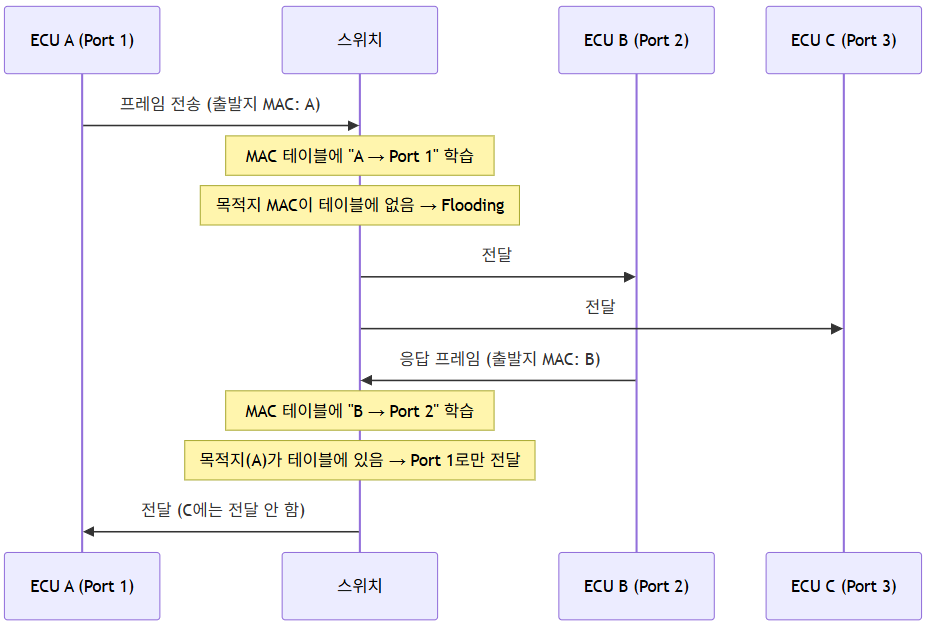

# (4) Data Link Layer

**4. Data Link Layer**

**4.1 Error 검출**

- **CRC 체크섬(Cyclic Redundancy Check): 데이터 전송이나 저장 중 발생 가능한 오류를 검출하기 위해 사용되는 코드**
- **송신측과 수신측이 동일한 CRC 코드 값을 계산·비교하며, 결과가 0이면 정상, 0이 아니면 해당 프레임을 폐기한다.**

### **4.1.1 CRC 계산 원리 (개념)**



- **송신측은 전송할 데이터를 미리 정해진 생성 다항식(Generator Polynomial)으로 나눈 나머지를 계산하여, 이 나머지 값을 프레임 끝(FCS, Frame Check Sequence)에 붙여 전송한다.**
- **수신측은 수신한 전체 프레임(데이터+FCS)을 동일한 생성 다항식으로 나누고, 나머지가 0이면 정상, 0이 아니면 오류로 판단하여 해당 프레임을 폐기(discard)한다.**
- **이더넷은 표준적으로 CRC-32(생성 다항식 0x04C11DB7)를 사용하여 FCS 필드(4Byte)를 계산한다.**

> **CAN의 CRC(15bit, 생성다항식 0xC599)와 이더넷의 CRC(32bit)는 비트 폭이 다른데, 이는 전송하는 데이터 필드 크기 차이(CAN 최대 8Byte vs 이더넷 최대 1500Byte)를 반영한 것이다. 데이터가 클수록 우연히 오류가 검출되지 않을 확률을 낮추기 위해 더 긴 체크섬이 필요하다.**

> **주의: CRC는 전송 중 발생한 무작위 오류(Random Error)를 검출하는 용도이며, 의도적인 데이터 위조(변조)를 막는 보안 기능은 아니다. 데이터 위변조 방지가 필요한 구간에는 별도의 인증/암호화(예: MACsec)가 요구된다.**

---

## **4.2 이더넷 (프레임 구조)**

| **필드** | **크기** | **설명** |
| --- | --- | --- |
| **Preamble** | **7 Byte** | **10101010 7회 반복. 송수신자 간 동기화 목적** |
| **SFD** | **1 Byte** | **10101011. 다음 바이트부터 MAC 주소 필드 시작을 알림** |
| **MAC 주소(목적지/출발지)** | **6 Byte × 2** | **LAN 내 송수신지 특정** |
| **타입/길이** | **2 Byte** | **0x05DC 이하 → 프레임 크기 / 0x0600 이상 → 프레임 타입(Ethertype)** |
| **Data** | **46~1500 Byte** | **상위 계층 PDU (네트워크 계층 데이터+헤더)** |
| **CRC 체크섬** | **4 Byte** | **프레임 오류 검출(FCS)** |

- **Preamble + SFD 합계 = 8 Byte(64bit)**
- **전체 프레임 크기: 최소 68 Byte / 최대 1522 Byte**

### **4.2.1 Ethertype 값으로 상위 프로토콜 구분**

**타입/길이 필드가 0x0600 이상일 경우, 이 값(Ethertype)으로 이 프레임의 Data 영역에 어떤 상위 계층 프로토콜이 담겨 있는지 식별한다.**

| **Ethertype** | **상위 프로토콜** |
| --- | --- |
| **0x0800** | **IPv4** |
| **0x0806** | **ARP** |
| **0x86DD** | **IPv6** |
| **0x8100** | **VLAN Tagged Frame (802.1Q)** |
| **0x88CA** | **SOME/IP-SD가 사용하는 특정 구현에서 활용되기도 하나, 통상 SOME/IP는 Ethertype 0x0800(IPv4)+UDP/TCP 위에서 동작** |

> **이더넷 프레임 하나만 봐도 "이 안에 뭐가 들었는지"를 Ethertype으로 먼저 알 수 있기 때문에, 스위치나 수신 장치는 프레임 전체를 다 열어보지 않고도 빠르게 처리 경로를 결정할 수 있다.**

### **4.2.2 최소 프레임 크기(64Byte)가 필요한 이유**

- **이더넷 초기 표준(CSMA/CD 기반 공유 매체)에서는, 프레임이 너무 짧으면 충돌(Collision)이 발생해도 송신측이 이를 감지하기 전에 프레임 전송이 끝나버리는 문제가 있었다.**
- **이를 방지하기 위해 최소 프레임 크기(64Byte)를 강제하여, 네트워크 왕복 지연시간 내에 충돌 감지가 가능하도록 설계되었다.**
- **현재 차량용 이더넷은 스위치 기반 Full Duplex(포인트-투-포인트) 통신이 기본이라 충돌 자체가 발생하지 않지만, 프레임 포맷은 하위 호환을 위해 최소 크기 규정을 그대로 유지하고 있다.**

### **4.2.3 Jumbo Frame (참고)**

- **표준 이더넷 프레임의 Data 필드는 최대 1500Byte로 제한되어 있으나, 이를 초과하는(통상 9000Byte 수준) 프레임을 Jumbo Frame이라 한다.**
- **대용량 영상 데이터(카메라, 라이다) 전송 시, 프레임을 잘게 쪼개지 않고 한 번에 더 많은 데이터를 보내 헤더 오버헤드 비율을 줄이는 데 활용될 수 있다.**
- **다만 모든 차량용 이더넷 스위치/PHY가 Jumbo Frame을 지원하는 것은 아니므로, 네트워크 설계 시 전 구간의 지원 여부를 확인해야 한다.**

---

## **4.3 연결 기기**

| **구분** | **특징** |
| --- | --- |
| **허브(Hub)** | **물리 계층 장치. MAC 주소를 저장·관리하지 않아 모든 포트로 데이터를 전달함 → 트래픽 증가, 충돌 발생, 보안 취약** |
| **스위치(Switch)** | **MAC 주소를 학습·저장하여 출발지/목적지 인식 가능 → 네트워크 효율성 향상, 충돌 감소, 보안 강화** |

### **4.3.1 스위치의 MAC 학습(Learning) 및 포워딩(Forwarding) 동작**

**스위치가 "MAC 주소를 학습한다"는 것이 실제로 어떤 절차로 이루어지는지 살펴보면:**

1. **학습(Learning): 스위치는 특정 포트로 프레임이 들어오면, 그 프레임의 출발지 MAC 주소와 수신 포트 번호를 MAC 주소 테이블(MAC Address Table)에 기록한다.**
2. **전달(Forwarding/Filtering): 프레임의 목적지 MAC 주소가 테이블에 있으면, 해당 포트로만 프레임을 전달(Forwarding)한다. 테이블에 없으면 알고 있는 포트를 제외한 모든 포트로 전달(Flooding)한다.**
3. **에이징(Aging): 일정 시간(기본값 통상 300초) 이상 갱신되지 않은 MAC 주소 항목은 테이블에서 자동 삭제된다.**

```

```

> **이 학습 과정 덕분에 스위치는 시간이 지날수록 "어느 포트에 어떤 장치가 있는지"를 파악하게 되고, 불필요한 트래픽 전달(Flooding)을 줄여나간다. 차량처럼 네트워크 구성이 설계 시점에 이미 고정되어 있는 환경에서는, 아예 MAC 테이블을 정적으로(Static) 미리 설정해두는 경우도 있다.**

### **4.3.2 스위치의 세 가지 동작 방식 (전달 방식)**

| **방식** | **동작** | **특징** |
| --- | --- | --- |
| **Store-and-Forward** | **프레임 전체를 다 받은 후 CRC 검사까지 마치고 전달** | **오류 프레임을 걸러낼 수 있으나 지연시간 존재** |
| **Cut-through** | **목적지 MAC 주소 부분만 확인되면 즉시 전달 시작** | **지연시간은 짧으나 오류 프레임도 그대로 전달될 수 있음** |
| **Fragment-free** | **최소 프레임 크기(64Byte)까지만 확인 후 전달** | **두 방식의 절충** |

> **실시간성이 중요한 ADAS 백본 등에서는 지연시간을 최소화하기 위해 Cut-through 방식이 선호되는 경우가 있으나, 데이터 무결성이 더 중요한 구간에서는 Store-and-Forward가 사용되기도 한다.**

---

## **4.4 VLAN (Virtual LAN)**

- **VLAN(Virtual LAN): 한 대의 스위치로 가상의 LAN을 구성하는 방법. MAC 기반 VLAN의 경우, 프레임 속 MAC 주소가 해당 프레임이 속할 VLAN을 결정한다.**
- **차량용 이더넷에서는 하나의 물리 포트/케이블에서 VLAN 태그로 트래픽을 논리적으로 분리함으로써 배선 및 하드웨어 비용을 절감할 수 있다.**

### **4.4.1 VLAN 태그(802.1Q) 구조**

**일반 이더넷 프레임의 타입/길이 필드 앞에 4Byte의 VLAN 태그가 추가로 삽입된다.**

| **필드** | **크기** | **설명** |
| --- | --- | --- |
| **TPID (Tag Protocol Identifier)** | **2 Byte** | **고정값 0x8100 (이 프레임이 VLAN 태그를 포함함을 알림)** |
| **PCP (Priority Code Point)** | **3 bit** | **802.1p 우선순위 값 (0~7) — 4.4.2절 참고** |
| **DEI (Drop Eligible Indicator)** | **1 bit** | **혼잡 시 우선적으로 폐기 가능한 프레임인지 표시** |
| **VID (VLAN Identifier)** | **12 bit** | **VLAN 번호 (0~4094, 총 4095개 VLAN 구성 가능)** |

```

```

### **4.4.2 PCP(802.1p) - VLAN 태그 안의 우선순위 값**

- **VLAN 태그 안의 PCP(3bit) 필드는 0~7까지 8단계의 우선순위(Priority)를 나타낼 수 있다.**
- **스위치는 이 값을 참고하여, 여러 프레임이 동시에 대기 중일 때 어떤 프레임을 먼저 내보낼지 결정하는 큐(Queue) 우선순위로 활용한다.**
- **예: 제동 관련 긴급 데이터는 PCP 7(최고 우선순위), 인포테인먼트 스트리밍은 PCP 0~2(낮은 우선순위)로 태깅하면, 네트워크가 혼잡해도 긴급 데이터가 먼저 전달되도록 설계할 수 있다.**

> **CAN과의 개념적 유사성: CAN의 ID 기반 우선순위(중재, Arbitration)가 "숫자가 낮을수록 우선"이었다면, 이더넷의 PCP는 "숫자가 높을수록 우선"이라는 차이는 있지만, 근본적으로 "급한 데이터를 먼저 보낸다"는 목표는 동일하다. 이 PCP 값은 이후 (7) TSN에서 다루는 Traffic Class 매핑, Time Aware Shaper(802.1Qbv)와 직접 연결되는 개념이다.**

### **4.4.3 VLAN의 실무적 이점**

| **이점** | **설명** |
| --- | --- |
| **배선 절감** | **물리적으로 하나의 케이블/스위치만으로 여러 논리 네트워크(도메인)를 분리 운용** |
| **트래픽 격리** | **특정 VLAN의 브로드캐스트 트래픽이 다른 VLAN으로 넘어가지 않아 불필요한 부하 방지** |
| **보안 강화** | **예: 진단 포트(DoIP) 전용 VLAN을 분리해두면, 일반 주행 중 트래픽에서 진단 포트로의 비인가 접근을 제한하기 쉬움** |
| **우선순위 관리** | **PCP 값을 통해 VLAN 단위/트래픽 단위로 QoS 정책 적용 가능** |

---

## **4.5 정리 - 이후 장과의 연결**

- **이 장에서 다룬 PCP(802.1p) 우선순위 개념은 (7) TSN의 Time Aware Shaper(802.1Qbv)가 "어떤 큐를 언제 내보낼지" 결정할 때 참조하는 핵심 입력값이다.**
- **VLAN을 통한 트래픽 분리는 Zonal Architecture에서 존별 서브넷((3.9절 참고))과 함께, 하나의 물리 백본 위에 여러 논리 네트워크를 안전하게 공존시키는 실무적 수단으로 활용된다.**
- **CRC 기반 오류 검출은 데이터의 무결성만 보장할 뿐 보안(위변조 방지)은 보장하지 않는다는 점을 기억해두면, 추후 보안 관련 논의(MACsec 등)를 이해하는 데 도움이 된다.**
