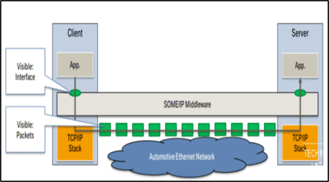
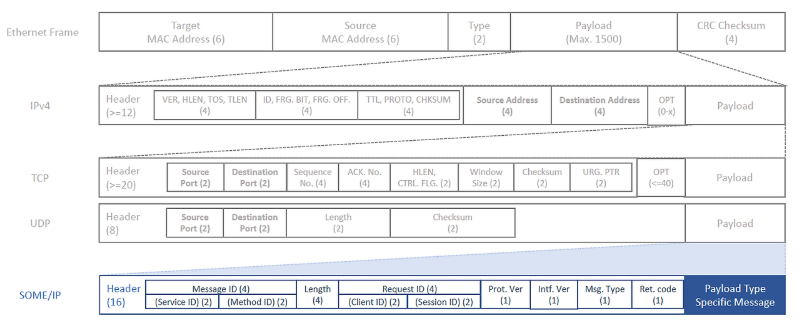
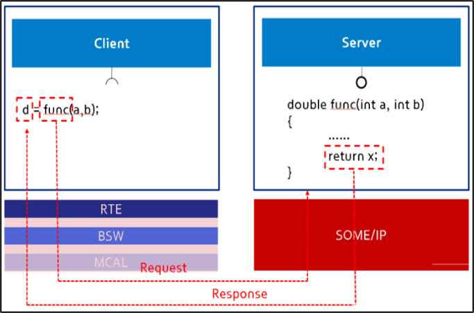
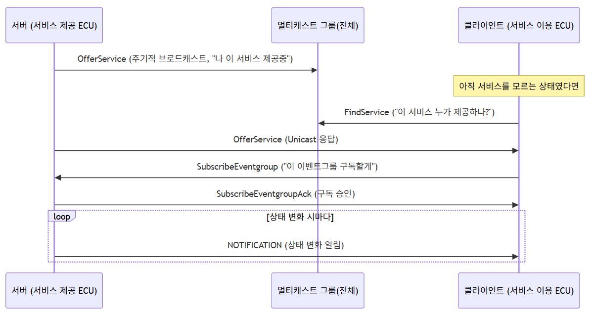
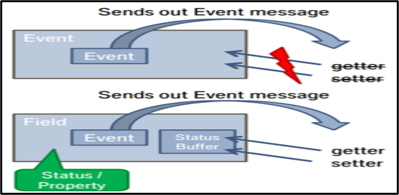
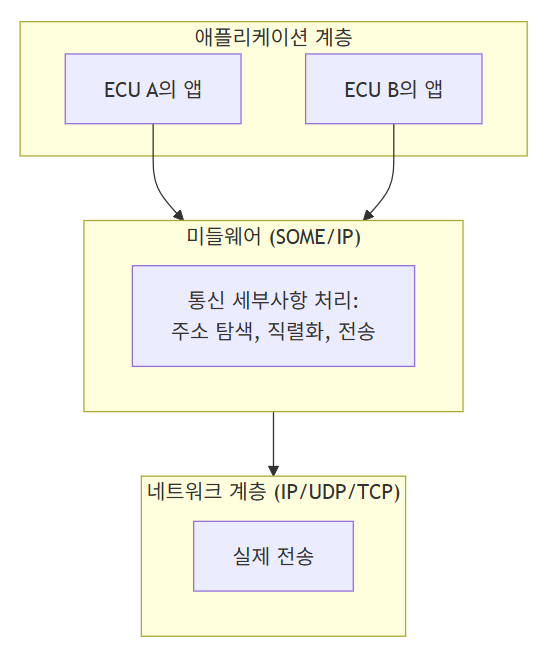

# (8) SOME/IP

**8. SOME/IP**

**8.1 Middleware**

- **Middleware: 운영체제와 애플리케이션 사이에서 서로 다른 시스템·서비스·애플리케이션 간의 통신, 데이터 교환, 자원 공유를 중개하는 계층**

### **8.1.1 미들웨어가 필요한 이유**

- **차량 안에는 서로 다른 제조사가 만든 ECU, 서로 다른 운영체제(OS), 서로 다른 프로그래밍 언어로 개발된 소프트웨어가 함께 동작한다.**
- **만약 애플리케이션이 매번 "상대방이 어떤 OS를 쓰는지, IP 주소가 무엇인지"를 직접 신경 써야 한다면 개발 복잡도가 매우 높아진다.**
- **미들웨어는 이런 세부사항을 애플리케이션으로부터 감추고(추상화), 애플리케이션은 "어떤 서비스를 어떻게 호출할지"만 신경 쓰면 되도록 만들어준다.**

```
   
```

---

## **8.2 SOME/IP**

- **SOME/IP(Scalable service-Oriented MiddlewarE over IP): 차량 내부 통신을 위한 표준 프로토콜**
- **다양한 운영체제 및 HW를 사용하는 ECU 간 데이터 통신을 위한 미들웨어 솔루션으로, AUTOSAR, GENIVI 등 다양한 환경에서 활용 가능**



### **SOME/IP 목적**

- **임베디드 시스템에 맞게 자원 사용이 적어야 함**
- **다양한 use-case 및 통신 파트너와 호환 가능해야 함**
- **AUTOSAR와 호환 가능하여, 별도의 표준 변경 없이 AUTOSAR PDU와 통신 가능해야 함**

### **8.2.1 신호 지향 통신 vs 서비스 지향 통신**

| **구분** | **신호 지향 통신(CAN)** | **서비스 지향 통신(SOME/IP)** |
| --- | --- | --- |
| **방식** | **네트워크의 모든 장치가 데이터를 수신** | **데이터를 필요로 하는 장치에만 전송하는 구독-발행 모델** |
| **장점** | **구조가 간단, 작은 데이터 패킷을 빠르게 송신** | **네트워크 로드 감소, 필요한 데이터만 정확히 전달** |
| **단점** | **불필요한 데이터로 인해 네트워크 트래픽 증가** | **네트워크 구성 변경에 동적으로 대응해야 함** |



### **8.2.2 SOME/IP 메시지 구조**

**CAN이 `ID + Data`라는 단순한 구조였다면(CAN 기초자료 6장 참고), SOME/IP는 이더넷(IP/UDP/TCP) 위에서 동작하는 만큼 더 풍부한 정보를 담는 자체 헤더 구조를 가진다.  
**

| **필드** | **크기** | **설명** |
| --- | --- | --- |
| **Message ID (Service ID + Method/Event ID)** | **4 Byte** | **어떤 서비스의 어떤 기능(메서드/이벤트)인지 식별** |
| **Length** | **4 Byte** | **이후 필드들의 길이** |
| **Request ID (Client ID + Session ID)** | **4 Byte** | **어떤 클라이언트의 몇 번째 요청인지 식별(응답 매칭용)** |
| **Protocol Version** | **1 Byte** | **SOME/IP 프로토콜 버전** |
| **Interface Version** | **1 Byte** | **서비스 인터페이스 버전** |
| **Message Type** | **1 Byte** | **REQUEST, RESPONSE, NOTIFICATION 등 메시지 종류** |
| **Return Code** | **1 Byte** | **처리 결과(정상/오류 등)** |
| **Payload** | **가변** | **실제 전달하는 데이터** |

```

```

> **CAN과의 개념 비교: CAN의 ID가 "메시지의 종류와 우선순위"를 동시에 나타냈다면, SOME/IP의 Message ID는 "어느 서비스의 어느 기능인가"를 나타내고, 우선순위는 별도로 이더넷 프레임의 PCP(4장 참고)나 TSN(7장 참고)이 담당한다. 즉 CAN에서는 한 개의 ID가 여러 역할을 겸했지만, SOME/IP는 계층별로 역할이 분리되어 있다.**

### **8.2.3 Message Type의 4가지 패턴**

| **Message Type** | **통신 패턴** | **설명** |
| --- | --- | --- |
| **REQUEST** | **요청-응답** | **클라이언트가 서버에게 특정 동작을 요청하고 응답을 기다림** |
| **REQUEST\_NO\_RETURN (Fire & Forget)** | **요청-무응답** | **응답이 필요 없는 단순 명령(예: LED 켜기)** |
| **RESPONSE** | **요청-응답** | **REQUEST에 대한 서버의 응답** |
| **NOTIFICATION** | **발행-구독(Publish/Subscribe)** | **서버가 상태 변화를 구독자들에게 일방적으로 알림(응답 없음)** |

> **이 중 NOTIFICATION이 "서비스 지향 통신"의 핵심인 발행-구독 모델을 구현하는 메시지 타입이며, 8.2.1절의 "구독-발행 모델" 설명이 실제로는 이 메시지 타입을 통해 이루어진다.**

### **8.2.4 구현 방식**

- **RTE(Runtime Environment)와 API(Application Programming Interface) 활용**
- **AUTOSAR의 RTE는 차량 내 ECU 간의 통신을 처리하는 중추 역할**
- **개발자가 RTE API 함수를 호출하면, RTE가 이를 SOME/IP 메시지로 자동 변환해 적절한 ECU로 전송**

```
   
```

> **개발자 입장에서는 "SendSignal(브레이크상태, ON)"처럼 API 함수 하나만 호출하면 되고, 이 호출이 실제로 어떤 IP 주소/포트로, 어떤 바이트 순서로 전송되는지는 RTE와 SOME/IP 스택이 알아서 처리해준다. 이것이 미들웨어가 제공하는 "추상화"의 실질적 의미다.**

---

## **8.3 SOME/IP SD (Service Discovery)**

- **서비스 인스턴스를 찾고, 해당 서비스 인스턴스가 실행 중인지 감지하고, 게시/구독 서비스를 제공함**
- **차량 내의 서비스의 위치는 일반적으로 알려져 있기 때문에, 주로 서비스 인스턴스의 상태를 알기 위해 사용됨**

### **8.3.1 SD가 필요한 이유**

- **IP 네트워크에서는 "어느 서비스가 어느 IP·포트에서 실행 중인지"를 사전에 알아야 통신을 시작할 수 있다.**
- **하지만 ECU가 재부팅되거나, 특정 서비스가 아직 초기화 중일 수 있어, 통신을 시작하기 전에 \*\*"이 서비스가 지금 실제로 살아있는가"\*\*를 확인하는 절차가 필요하다.**
- **SOME/IP SD는 이 확인 과정과, 필요한 서비스를 구독(Subscribe)하는 절차를 표준화한 것이다.**

### **8.3.2 SD 동작 시퀀스 - Offer / Find / Subscribe**

```

```

- **OfferService: 서비스를 제공하는 ECU가 주기적으로(또는 상태 변화 시) "나는 이 서비스를 제공하고 있다"고 멀티캐스트로 알린다.**
- **FindService: 서비스가 필요한 클라이언트가 아직 해당 서비스의 위치를 모를 경우, "이 서비스를 제공하는 곳이 있는가?"라고 멀티캐스트로 질문한다.**
- **SubscribeEventgroup / SubscribeEventgroupAck: 클라이언트가 특정 이벤트 그룹(상태 변화 알림 묶음)을 구독 요청하고, 서버가 이를 승인한다.**
- **이후 서버는 해당 상태가 바뀔 때마다 구독자에게 NOTIFICATION 메시지를 전송한다 (8.2.3절 참고).**

> **CAN 브로드캐스트와의 차이: CAN에서는 메시지를 버스에 실으면 관심 여부와 무관하게 모든 노드가 수신했다(CAN 기초자료 3장 참고). SOME/IP SD의 구독 절차를 거치고 나면, 이후 실제 데이터(NOTIFICATION)는 구독한 클라이언트에게만 전달되어 불필요한 트래픽을 줄인다. 다만 탐색 단계(OfferService/FindService) 자체는 멀티캐스트로 이루어져 CAN과 유사하게 "모두에게 알리는" 방식을 여전히 사용한다는 점이 흥미로운 지점이다.**

### **8.3.3 SOME/IP SD 주소**

- **모든 SOME/IP 노드는 동일한 멀티캐스트 IP에 가입해야 함**
- **Port 번호는 모든 노드가 30490을 사용함**

### **8.3.4 Transport Protocol Binding**

- **서비스 제공자(서버)는 자신이 제공하는 서비스에 대해 Port를 할당함**
- **TCP 및 UDP에서 한 번에 전송할 수 있는 데이터 이상을 SOME/IP에서 처리할 수 없음**

### **8.3.5 서비스별 TCP/UDP 선택 기준 (3장 연계)**

**(3)장에서 다룬 TCP/UDP 특성을 SOME/IP 서비스 설계에 적용하면:**

| **서비스 유형** | **권장 프로토콜** | **이유** |
| --- | --- | --- |
| **REQUEST/RESPONSE 기반 제어 명령** | **TCP** | **명령 유실 시 오동작 우려가 있어 신뢰성 있는 전달이 중요** |
| **대용량 데이터 전송(예: 지도 데이터, 로그 파일)** | **TCP** | **대용량 전송 시 순서 보장과 재전송 메커니즘 필요** |
| **주기적 상태 알림(NOTIFICATION, 센서 값 스트리밍)** | **UDP** | **다음 주기에 곧 새 값이 오므로 일부 손실 허용 가능, 지연 최소화가 더 중요** |
| **SD 자체(Offer/Find/Subscribe)** | **UDP(멀티캐스트)** | **멀티캐스트는 태생적으로 UDP 기반이며, SD는 주기적 재전송으로 신뢰성을 일부 보완** |

---

## **8.4 SOME/IP 프레임의 계층 구조 (전체 그림)**

**지금까지 다룬 (3)~(8)장의 내용을 하나로 합쳐 보면, 실제 SOME/IP 데이터 하나가 물리적으로 전송될 때 아래와 같은 캡슐화 구조를 가진다 (3.7절 Encapsulation 참고).**

| **계층** | **결정하는 것** |
| --- | --- |
| **Ethernet(2계층)** | **어느 물리적 링크로 보낼지, PCP로 우선순위(4장)를 표시** |
| **IP(3계층)** | **어느 ECU(네트워크상 목적지)로 보낼지** |
| **UDP/TCP(4계층=전송계층)** | **어느 서비스(포트)로 보낼지, 신뢰성 필요 여부(3.6절)** |
| **SOME/IP(응용계층)** | **어떤 서비스의 어떤 기능/이벤트인지** |

> **이처럼 SOME/IP 통신 하나가 이루어지려면 이 문서에서 다룬 물리 계층(5장)부터 데이터링크(4장), 네트워크/전송(3장), 그리고 필요하다면 TSN(7장)의 시간 보장까지 모든 계층이 함께 동작해야 한다. SOME/IP는 이 모든 것의 최상위에서 "서비스"라는 개념으로 애플리케이션에게 통신을 제공하는 역할을 한다.**

---

## **8.5 SOME/IP 적용 시나리오 예시**

**차량 속도 정보를 계기판 ECU와 ADAS ECU가 함께 필요로 하는 상황을 SOME/IP 관점으로 정리하면:**  
  
**[1] 속도 센서를 담당하는 ECU(서버)가 부팅되며 OfferService를 멀티캐스트로 알린다**  
**[2] 계기판 ECU와 ADAS ECU(클라이언트)가 이 서비스를 SubscribeEventgroup으로 구독한다**  
**[3] 서버는 SubscribeEventgroupAck으로 구독을 승인한다**  
**[4] 이후 속도 값이 바뀔 때마다, 서버는 NOTIFICATION 메시지를 구독자(계기판, ADAS)에게만 전송한다**  
**[5] 만약 인포테인먼트 ECU처럼 속도 정보가 필요 없는 장치라면, 애초에 구독하지 않았으므로 이 트래픽을 전혀 수신하지 않는다**

> **CAN 기초자료의 브레이크 시나리오("모든 ECU가 브로드캐스트로 수신")와 비교하면, SOME/IP는 "필요한 ECU만 골라서 받는다"는 점이 근본적으로 다르다. 이는 (2)장에서 다룬 Zonal Architecture처럼 ECU 수가 많고 트래픽이 다양해진 최신 차량 구조에서, 불필요한 트래픽을 줄이기 위한 설계 철학이 반영된 결과다.**

---

## **8.6 정리 - SOME/IP가 최종적으로 완성하는 그림**

**이 문서의 (1)~(8)장 전체를 관통하는 흐름을 SOME/IP 관점에서 요약하면:  
  
데이터가 많아져 CAN만으로 부족해짐 (1장)  
↓  
차량용 이더넷이 물리적 통신로를 제공 (2장, 5장)  
↓  
MAC/IP 주소, TCP/UDP로 "누구에게, 어떻게" 보낼지 결정 (3장)  
↓  
이더넷 프레임과 VLAN/PCP로 "우선순위"까지 표현 (4장)  
↓  
TSN이 안전 필수 데이터의 "정확한 시간 도착"까지 보장 (7장)  
↓  
이 모든 기반 위에서, SOME/IP가 "필요한 서비스만 구독"하는 효율적인 애플리케이션 통신을 완성한다 (8장)**
