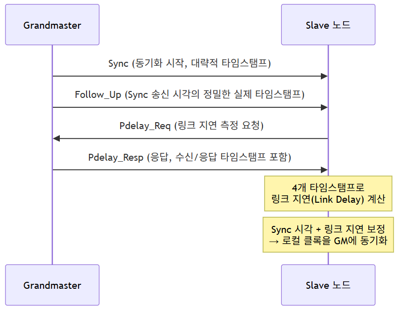
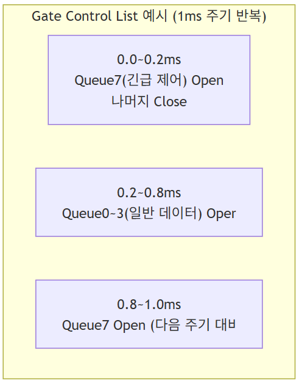

# (7) TSN

## **7. TSN**

## **7.1 TSN (Time Sensitive Networking) 개요**

- **IEEE 802 표준 기반의 시간 민감형 데이터 전송을 위한 이더넷 확장 기술**
- **기존 Ethernet AVB의 실시간 데이터 지연 문제를 개선**
- **Audio / video 데이터 및 실시간 전송 모두 전송 가능함**
- **낮은 통신 지연, 낮은 지터(jitter) 보장**
- **TSN은 보장된 대역폭 및 시결정적(deterministic) 통신을 제공함**

### **7.1.1 왜 TSN이 필요한가 - Best-effort 이더넷의 한계**

**일반 이더넷은 기본적으로 Best-effort 방식으로 동작한다. 즉, 스위치는 도착한 순서와 우선순위(PCP)에 따라 최선을 다해 프레임을 전달하지만, "정확히 언제 도착할 것이다"라는 것을 보장하지는 않는다.**

| **상황** | **Best-effort 이더넷** | **TSN 적용 이더넷** |
| --- | --- | --- |
| **네트워크가 한가할 때** | **지연 거의 없음** | **지연 거의 없음 (동일)** |
| **네트워크가 혼잡할 때(대용량 영상 트래픽과 겹침)** | **우선순위가 높아도 큐잉 지연 발생 가능, 지연시간이 상황마다 달라짐(지터 발생)** | **사전에 예약된 시간 슬롯을 통해 지연시간이 항상 일정하게 보장됨** |

> **CAN과의 개념 연결: CAN에서 우선순위 낮은 메시지가 버스 부하에 따라 지연시간이 들쭉날쭉했던 것처럼(soft real-time), 일반 이더넷의 PCP 우선순위(4장 참고)만으로는 "우선순위가 높으면 대체로 먼저 간다" 정도만 보장할 뿐, "정확히 몇 ㎲ 안에 도착한다"는 보장은 하지 못한다.**  
>  **TSN은 여기에 시간 개념을 더해 진짜 결정성(hard real-time)을 확보하는 기술이다.**

### **7.1.2 TSN을 구성하는 표준군**

**TSN은 하나의 단일 표준이 아니라, 여러 IEEE 802.1 표준의 집합(모음)이다. 핵심 표준들을 목적별로 정리하면:**

| **표준** | **목적** | **이 문서에서 다루는 절** |
| --- | --- | --- |
| **IEEE 802.1AS** | **시간 동기화(gPTP)** | **7.2** |
| **IEEE 802.1Qbv** | **트래픽 스케줄링(Time Aware Shaper)** | **7.3** |
| **IEEE 802.1Qbu / 802.3br** | **프레임 선점(Frame Preemption)** | **7.4** |
| **IEEE 802.1Qav (Credit-Based Shaper)** | **오디오/비디오 스트림의 대역폭 예약(AVB 계승)** | **7.5** |
| **IEEE 802.1CB (FRER)** | **프레임 중복 전송을 통한 신뢰성 확보** | **7.5** |

> **TSN이 "시간 민감형 네트워킹"이라는 하나의 이름으로 불리지만, 실제로는 \*\*"언제 보낼지 시간을 맞추는 표준(AS, Qbv)"\*\*과 "급한 걸 끼워 보내는 표준(Qbu)", \*\*"안정성을 높이는 표준(Qav, CB)"\*\*이 역할을 나누어 함께 동작하는 표준군이라는 점을 이해하는 것이 중요하다.**

---

## **7.2 TSN 동기화 (IEEE 802.1AS, gPTP)**

- **IEEE 802.1AS 표준을 따름 (gPTP, generalized Precision Time Protocol)**

### **7.2.1 왜 시간 동기화가 먼저 필요한가**

**Qbv(시간 슬롯 기반 스케줄링)가 동작하려면, 네트워크에 연결된 모든 노드가 정확히 같은 시각을 공유하고 있어야 한다. "몇 시 몇 분 몇 초에 이 큐를 열어라"는 스케줄이, 노드마다 시계가 다르면 아무 의미가 없기 때문이다.**

### **7.2.2 Grandmaster 선출 (BMCA)**

- **gPTP 네트워크에서는 하나의 노드가 전체 네트워크의 시간 기준이 되는 \*\*Grandmaster(GM)\*\*로 선출된다.**
- **\*\*BMCA(Best Master Clock Algorithm)\*\*를 통해, 네트워크에 연결된 노드들이 서로의 클록 품질(우선순위, 정확도 등급 등)을 비교하여 가장 신뢰도 높은 클록을 가진 노드가 자동으로 Grandmaster로 선정된다.**
- **Grandmaster가 통신 장애 등으로 사라지면, 남은 노드들 사이에서 재선출이 일어나는 이중화 구조를 갖는다.**

### **7.2.3 시간 동기화 메시지 흐름**

```

```

- **Sync / Follow\_Up: Grandmaster가 "지금이 몇 시다"라는 정보를 하위 노드에게 전달. Sync는 대략적인 타임스탬프를 담아 즉시 전송하고, Follow\_Up이 실제 정밀한 송신 시각을 뒤이어 전달한다(하드웨어 타임스탬핑 정확도를 높이기 위한 2단계 방식).**
- **Pdelay\_Req / Pdelay\_Resp: 인접한 두 노드 사이의 \*\*링크 전파 지연(Link Delay)\*\*을 측정하는 메시지. 케이블 길이, 스위치 처리 지연 등으로 발생하는 지연을 보정해야 정확한 시간 동기화가 가능하다.**
- **이 과정을 통해 네트워크 전체 노드가 Grandmaster 기준 수백 나노초(ns) 이내의 오차로 시각을 맞출 수 있다.**

> **차량 적용 관점: 차량 내 gPTP Grandmaster는 통상 중앙 HPC 또는 특정 게이트웨이가 담당하도록 설계 시점에 우선순위를 고정해두는 경우가 많다. 이는 네트워크 부팅 시마다 Grandmaster가 예측 불가능하게 바뀌는 것을 방지하여, 시스템 동작의 일관성과 검증 가능성을 높이기 위함이다.**

---

## **7.3 Time Traffic - 트래픽 스케줄링 (IEEE 802.1Qbv)**

- **IEEE 802.1 Qbv 표준을 따름**
- **Time Aware Shaper: 특정 시간에 특정 Port만 송신 가능하도록 하는 기법**
- **네트워크에 연결된 모든 노드가 실시간 데이터만 전송할 수 있는 시간을 사전에 설정함**
- **노드 및 스위치는 특정 시간에 설정된 우선순위의 Queue만 전송되도록 Gate를 제어함**

### **7.3.1 Gate Control List(GCL) 동작 개념**

- **스위치의 각 출력 포트에는 우선순위별로 여러 개의 큐(Queue)가 있으며(4장의 PCP 값에 따라 프레임이 어느 큐에 들어갈지 결정됨), 각 큐 앞에는 열고 닫을 수 있는 \*\*게이트(Gate)\*\*가 있다고 생각하면 된다.**
- **\*\*Gate Control List(GCL)\*\*는 "몇 시부터 몇 시까지 어느 큐의 게이트를 열지"를 미리 정의해둔 시간표이다.**
- **gPTP로 전체 네트워크가 동일한 시각을 공유하고 있기 때문에, 모든 스위치와 노드가 동일한 GCL 스케줄을 정확히 같은 시점에 실행할 수 있다.**

```
    
```

> **비유: GCL은 마치 철도의 배차 시간표와 같다. "이 시간대에는 급행열차(긴급 제어 데이터)만 선로를 쓸 수 있고, 나머지 시간에는 일반 열차(영상/일반 데이터)가 선로를 쓸 수 있다"는 규칙을 모든 역(스위치)이 똑같은 시계를 보며 정확히 지키는 것이다.**

### **7.3.2 Guard Band**

- **게이트가 닫히기 직전, 이미 전송을 시작한 저우선순위 프레임이 게이트가 닫히는 시점까지 전송을 끝내지 못하면 고우선순위 프레임의 전송 슬롯을 침범할 수 있다.**
- **이를 방지하기 위해, 게이트가 닫히기 일정 시간 전부터는 새로운 저우선순위 프레임의 전송을 아예 시작하지 못하게 막는 구간을 Guard Band라 한다.**
- **Guard Band는 링크상 최대 프레임 크기(MTU, 1522Byte 등)를 기준으로 설정되며, 이 구간만큼은 대역폭이 낭비된다는 트레이드오프가 있다. (→ 7.4절의 프레임 선점(Qbu)이 이 낭비를 줄이는 보완 기술이다)**

---

## **7.4 프레임 preemption (IEEE 802.1Qbu / 802.3br)**

- **프레임 preemption은 IEEE 802.1Qbu(Frame Preemption)와 IEEE 802.3br(Interspersing Express Traffic, IET) 두 표준이 함께 정의**
- **IEEE 802.1Qbu는 긴급하고 시간 임계적인 데이터 프레임을 더 작은 조각(fragment)으로 분할해, 동일 물리 링크상에서 전송 중인 비긴급 프레임(non-critical frame)을 선점(preempt)할 수 있도록 허용**
- **물리 계층(PHY)은 preemption을 인식하지 못하며, MAC Merge 서브계층과 그 하위 MAC들이 802.1Qbu에 정의된 프레임 preemption을 지원**
- **동작 방식: Express 프레임이 Preemptable 프레임의 전송을 중단시키며, 이는 링크 로컬(hop 단위)로 동작**
- **최소 mPacket 크기(64octet) 미만이거나 남은 조각이 123 byte 미만인 패킷은 preempt할 수 없다는 제약이 있음**
- **802.1Qbv(Time traffic, Time Aware Shaper)와 함께 쓰이면, Guard Band 크기를 최대 전송단위(MTU) 1522byte에서 127byte 수준으로 줄일 수 있어 대역폭 효율이 향상됨**

### **7.4.1 두 종류의 트래픽 - Express vs Preemptable**

| **구분** | **설명** |
| --- | --- |
| **Express 트래픽** | **긴급/시간 임계적 데이터. 전송 중인 다른 프레임을 끊고 즉시 끼어들 수 있음** |
| **Preemptable 트래픽** | **일반 데이터. Express 트래픽이 도착하면 전송이 일시 중단(fragment)되고, Express 전송이 끝난 후 나머지가 이어서 전송됨** |

```

```

> **Qbv와 Qbu의 관계 요약: Qbv가 "시간표대로 큐를 열고 닫는" 거시적(ms 단위) 스케줄링이라면, Qbu는 그 시간표 안에서도 "이미 전송 중인 프레임이 있어도 더 급한 게 오면 끼어들게 해주는" 미시적(프레임 단위) 보완 기술이다. 두 기술을 함께 쓰면 Guard Band로 낭비되던 대역폭(최대 1522Byte 분량)을 훨씬 작은 값(127Byte)까지 줄일 수 있어, 결정성과 대역폭 효율을 동시에 확보할 수 있다.**

---

## **7.5 그 외 TSN 보완 표준 (참고)**

| **표준** | **목적** | **개념** |
| --- | --- | --- |
| **IEEE 802.1Qav (Credit-Based Shaper, CBS)** | **스트리밍(오디오/영상) 트래픽에 일정한 대역폭을 사전 예약** | **각 스트림에 "크레딧"을 부여해, 크레딧이 있을 때만 전송을 허용함으로써 특정 스트림이 대역폭을 독점하지 않도록 제한** |
| **IEEE 802.1CB (FRER, Frame Replication and Elimination for Reliability)** | **통신 신뢰성(이중화) 확보** | **동일한 프레임을 서로 다른 경로로 복제 전송하고, 수신측에서 먼저 도착한 프레임만 채택하고 중복을 제거 → 한 경로 장애 시에도 통신 유지** |

> **FRER은 (1) 통신 요약 비교에서 다뤘던 "FlexRay의 채널 이중화" 개념을 이더넷 환경에서 구현한 것으로 이해할 수 있다. 즉 TSN은 시간 결정성뿐 아니라, 안전 필수 영역에 요구되는 이중화(Fail-operational) 요구까지 충족시키기 위한 방향으로 계속 확장되고 있다.**

---

## **7.6 TSN 적용 시나리오 예시**

**브레이크 제어 데이터와 카메라 영상 데이터가 같은 이더넷 백본을 공유하는 상황을 가정한 흐름:**  
  
**[1] gPTP로 백본상의 모든 스위치·ECU가 동일 시각에 동기화되어 있다**  
**[2] 브레이크 제어 데이터는 PCP 값(802.1p)이 높게 태깅되어 전송된다**  
**[3] Qbv GCL에 따라, 매 주기의 특정 시간 구간은 브레이크 제어용 큐만 열리도록 예약되어 있다**  
**[4] 마침 그 구간 직전에 카메라 영상 프레임이 전송 중이었다면,**  
**→ Qbu(프레임 선점)가 영상 프레임을 즉시 중단시키고 브레이크 데이터를 먼저 내보낸다**  
**[5] 브레이크 데이터 전송이 끝나면, 중단됐던 영상 프레임의 나머지가 이어서 전송된다**  
**[6] 결과적으로 브레이크 데이터는 네트워크 혼잡 여부와 무관하게 항상 일정한 지연시간 내에 도착한다**

> **이 시나리오는 CAN 기초자료에서 다뤘던 "브레이크 메시지가 중재를 통해 우선 전송된다"는 개념과 목적은 동일하지만, TSN에서는 "우선순위"뿐 아니라 "정확한 시각"까지 활용해 지연시간 자체를 보장한다는 점에서 한 단계 더 정교한 메커니즘이라 할 수 있다.**

---

## **7.7 정리 - TSN이 해결하는 것과 남은 과제**

| **항목** | **내용** |
| --- | --- |
| **TSN이 해결하는 것** | **이더넷의 Best-effort 특성을 보완하여, 안전 필수 데이터의 지연시간을 예측 가능한 수준으로 보장** |
| **전제 조건** | **전체 네트워크(스위치, ECU)가 TSN 관련 표준(AS, Qbv, Qbu 등)을 동일하게 지원해야 함 → 레거시 장비와의 혼용 시 결정성 보장이 깨질 수 있음** |
| **설계 부담** | **GCL 스케줄은 네트워크 설계 시점에 모든 트래픽 패턴을 고려해 사전에 계산·검증해야 하며, 이후 트래픽 패턴이 바뀌면 재설계가 필요할 수 있음** |
| **향후 방향** | **(2.6절에서 다룬) 안전 필수 영역으로 이더넷이 확대 적용되기 위한 핵심 기반 기술로, TSN 지원 여부가 향후 차량용 스위치/PHY 선정의 주요 기준이 되어가고 있음** |
