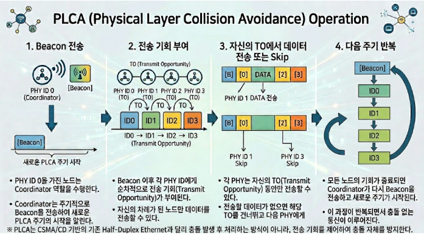
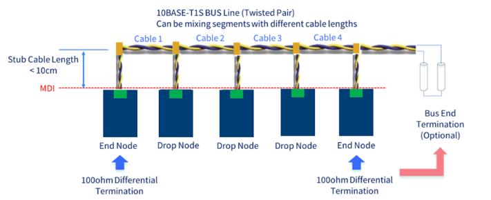

# (5) 차량용 이더넷 Physical Layer

# **5. 차량용 이더넷 Physical Layer**

## **5.1 디지털-디지털 변환**

**물리 계층은 0, 1을 어떻게 물리적으로 표현할지 정의한다.**

| **통신 방식** | **0/1 표현 방법** | **전송 매체** |
| --- | --- | --- |
| **광통신** | **빛의 세기로 1, 0을 표현** | **광섬유 케이블** |
| **CAN 통신** | **CAN\_H, CAN\_L의 전압차로 1, 0을 표현** | **2가닥 꼬임 구리선** |
| **유선 LAN(이더넷)** | **전압 레벨** | **트위스트 페어 케이블(구리선)** |

### **5.1.1 100BASE-T1의 신호 인코딩 - PAM3**

- **100BASE-T1은 1쌍(2가닥)의 선으로 100Mbps를 구현해야 하므로, 단순히 0/1 두 단계 전압(NRZ 방식)만으로는 필요한 대역폭을 확보하기 어렵다.**
- **이를 위해 PAM3(Pulse Amplitude Modulation, 3-level) 방식을 사용한다: 한 번의 심볼(Symbol) 전송으로 3가지 전압 레벨(-1, 0, +1에 대응하는 값)을 구분하여, 심볼 하나당 log₂(3) ≈ 1.58bit에 해당하는 정보를 실어 나른다.**
- **여기에 3B2T(3 Binary to 2 Ternary) 코딩을 결합하여, 3비트의 이진 데이터를 2개의 3진 심볼로 변환해 전송 효율을 높인다.**

| **방식** | **심볼당 표현 가능한 값** | **비고** |
| --- | --- | --- |
| **NRZ (CAN 등에서 사용)** | **2단계(0, 1)** | **구현이 단순하나 대역폭 효율이 낮음** |
| **PAM3 (100BASE-T1)** | **3단계** | **100Mbps를 1쌍의 선으로 구현 가능** |
| **PAM4 (일부 고속 이더넷/차세대 규격)** | **4단계** | **더 높은 대역폭 효율, 신호 대 잡음비(SNR) 요구는 더 엄격** |

> **정성적 이해: 같은 두 가닥의 선이라도, "전압을 몇 단계로 세밀하게 구분해서 읽어내는가"에 따라 한 번에 실어 나를 수 있는 정보량이 달라진다. PAM3는 2단계(NRZ) 대신 3단계를 사용해, 선의 개수를 늘리지 않고도 더 많은 데이터를 보낼 수 있게 해주는 핵심 기술이다.**

### **5.1.2 차량용 이더넷 Physical Layer 표준: 100BASE-T1**

****

- **일반 이더넷(100BASE-TX)은 4가닥 선이 필요해 차량엔 무겁고 비쌈**
- **차량용 이더넷(100BASE-T1)은 2가닥(1쌍) 선으로 해결 → 차량 최적화**

### **5.1.3 통신 방식 - Full Duplex(전이중 통신)**

- **정의: 2가닥으로 송신·수신을 동시에 수행하는 방식**
- **원리: 내가 보낸 신호는 이미 알고 있으므로, 섞인 전압에서 내 신호를 빼면 상대방 신호만 남음 (이 원리를 \*\*에코 캔슬레이션(Echo Cancellation)\*\*이라 한다)**
- **조건: 두 노드가 심볼 시작 시점을 정확히 동기화해야 함 → 마스터/슬레이브 구조 필요**
  - **마스터: 심볼 타이밍 기준 제공**
  - **슬레이브: 마스터에 동기화**

```
 전이중 통신 방식: 컴퓨터(ECU)와 컴퓨터(ECU)를 직접 연결. 동시에 전송해도 충돌 없음
```

```
 반이중 통신 방식: 컴퓨터와(ECU)와 컴퓨터(ECU)가 허브에 연결된 구조. 동시에 전송하면 충돌 발생
```

> **에코 캔슬레이션 상세: 하나의 선에 내가 보낸 신호와 상대가 보낸 신호가 동시에 실려 전압이 섞인 상태로 도달한다. 수신 회로는 "내가 원래 무엇을 보냈는지"를 이미 알고 있으므로, 수신된 혼합 전압에서 자신이 보낸 신호 성분을 디지털 신호처리(DSP)로 제거(차감)하면 상대방이 보낸 순수한 신호만 남게 된다. 이 과정이 정밀하게 이루어지려면 두 노드의 심볼 타이밍이 정확히 일치해야 하므로 마스터/슬레이브 구조가 필요하다.**

---

## **5.2 케이블 및 커넥터**

**물리 계층을 온전히 이해하려면 실제 케이블·커넥터 규격도 함께 알아야 한다.**

| **항목** | **규격/특징** |
| --- | --- |
| **케이블 종류** | **UTP(Unshielded) 또는 STP/SFTP(Shielded) — 차량은 노이즈 환경이 가혹하여 Shielded 케이블이 선호되는 경우가 많음** |
| **특성 임피던스** | **100Ω (트위스트 페어 기준)** |
| **최대 링크 길이** | **100BASE-T1 기준 약 15m(비차폐) ~ 40m(차폐, 커넥터 품질에 따라 상이) — 일반 사무용 이더넷(최대 100m)보다 짧음** |
| **커넥터** | **표준화된 RJ45 대신, 진동·방수·내열을 고려한 차량 전용 커넥터(예: TE Connectivity, Rosenberger 등에서 제공하는 자동차용 커넥터) 사용** |

> **차량용 이더넷의 최대 링크 길이가 일반 이더넷보다 짧은 이유는, 1쌍의 선으로 신호를 실어 나르는 특성상 감쇠(Attenuation)와 누화(Crosstalk)에 더 민감하기 때문이다. 따라서 차량 내 배선 설계 시 스위치/ECU의 물리적 배치와 케이블 경로 길이가 통신 안정성에 직접 영향을 준다.**

---

## **5.3 EMC**

- **\*\*EMC (Electro Magnetic Compatibility)\*\*는 전자파 적합성 혹은 전자기 적합성으로 불림**
- **전자파 적합성이란? 모든 전자기기는 전자 노이즈로 인해 다른 기기에 영향을 주면 안 되고, 영향도 받지 않아야 한다고 규정됨. 이에 따라 모든 전자기기는 전자파 적합성(EMC) 규격을 만족해야 함.**

### **5.3.1 왜 물리 계층에서 EMC 대응이 필요한가**

- **차량용 이더넷의 물리 계층(PHY)은 100BASE-T1/1000BASE-T1처럼 1쌍의 트위스트 페어로 신호를 전송하는데, 이 신호선은 커넥터를 통해 차량 외부(하네스)와 직접 연결됨.**
- **따라서 정전기(ESD), 서지(Surge), RF 노이즈가 신호선을 타고 트랜시버(PHY IC)까지 유입될 수 있으며, 이를 막기 위해 물리 계층 회로 자체에 보호 구조가 추가되어야 함.**
- **즉, 차량용 이더넷의 물리 계층은 "신호를 전기적으로 표현하는 방식"뿐 아니라, "보호 회로 토폴로지"까지 포함해서 설계된다는 점이 일반 이더넷과의 중요한 차이임**

### **5.3.2 물리 계층 보호 구조 (OPEN Alliance 권장 회로)**

| **구성요소** | **역할** |
| --- | --- |
| **ESD Device (TVS 다이오드)** | **정전기·서지 에너지를 GND로 우회(shunt)** |
| **DC Block (커패시터, 100nF)** | **신호선과 트랜시버 사이 DC 성분 차단** |
| **CMC (Common Mode Choke)** | **공통모드 노이즈 억제** |
| **CM Termination (저항+커패시터)** | **공통모드 신호 종단** |

### **5.3.3 노이즈 유형별 대응 메커니즘**

**각 보호 소자가 구체적으로 어떤 종류의 노이즈에 대응하는지 정리하면:**

| **노이즈 유형** | **발생 원인(예시)** | **주로 대응하는 소자** |
| --- | --- | --- |
| **ESD (정전기 방전)** | **커넥터 조립/분리 시 정전기, 사람 접촉** | **ESD Device(TVS 다이오드)** |
| **Surge (서지)** | **릴레이 스위칭, 배터리 점프 스타트 등 순간 고전압** | **ESD Device, DC Block** |
| **Common Mode Noise (공통모드 노이즈)** | **인접 배선(모터, 인젝터 등)에서 유도되는 노이즈, 두 신호선에 동일하게 유입** | **CMC, CM Termination** |
| **Differential Mode Noise (차동모드 노이즈)** | **신호선 간 불균형에서 발생** | **트위스트 페어 자체의 대칭 구조로 상당 부분 상쇄** |

> **공통모드 vs 차동모드 노이즈 구분이 중요한 이유: 이더넷 신호 자체가 두 선의 전압 "차이"(차동, Differential)로 정보를 전달하기 때문에, 두 선에 동일한 크기로 실리는 노이즈(공통모드)는 신호 판별에 영향을 주지 않지만, CMC 없이는 이 공통모드 노이즈가 방사(EMI) 형태로 다른 기기에 영향을 줄 수 있다. 반대로 두 선에 다른 크기로 실리는 노이즈(차동모드)는 신호 자체를 왜곡시키므로 트위스트 페어의 물리적 대칭 구조로 최대한 상쇄시킨다.**

### **5.3.4 물리 계층 개선 여부를 검증하는 4가지 시험**

**물리 계층(PHY + 보호회로)이 실제로 EMC 요구사항을 충족하는지는 아래 4가지 시험으로 검증한다.**

| **시험** | **확인하는 물리 계층 특성** | **대략적 시험 조건(참고)** |
| --- | --- | --- |
| **Mixed Mode S-parameter 측정** | **보호 소자가 붙어도 신호 반사손실(RL)·삽입손실(IL)이 기준 이내인지 → "보호 회로가 신호 품질을 훼손하지 않는가"** | **주파수 스윕(예: 1MHz~수백MHz 대역)에서 RL/IL 측정** |
| **ESD Damage test** | **±8kV~±15kV 방전 후에도 신호 특성(S-parameter)이 변하지 않는지 → "물리 계층이 실제 ESD에 견디는가"** | **IEC 61000-4-2 등 관련 표준 기반 방전 시험** |
| **RF Clamping test** | **RF 노이즈 주입 시 보호 소자가 정상 신호까지 과도하게 차단(클램핑)하지 않는지 → "보호 회로가 정상 통신을 방해하지 않는가"** | **Bulk Current Injection(BCI) 등 방식으로 RF 주입** |
| **ESD Discharge Current 측정** | **ESD 인가 시 트랜시버 PHY로 흘러드는 잔류 전류가 한계값 이하인지 → "보호 회로가 실제로 트랜시버를 지켜내는가"** | **트랜시버 데이터시트상 최대 허용 전류와 비교** |

> **이 4가지 시험은 OPEN Alliance의 관련 권고 문서(TC8 등)에서 참조하는 시험 항목들과 유사한 맥락을 가지며, 실제 양산 적용 전에는 부품 협력사가 이 시험 결과를 근거 자료로 제출하는 경우가 일반적이다.**

---

## **5.4 10Base-T1S 개요**

- **S는 Short Reach를 의미하며 짧은 거리, 멀티 드롭을 지원함**
- **2020년 기준 차량의 90% 이상은 10Mbps 보다 훨씬 더 적은 속도를 사용함**
- **Ethernet을 10Mbps 속도로 낮추고 가격을 100Base-T1 대비 50% 이하로 개발하여, 기존 CAN (FD), FlexRay를 대체하는 것을 목표로 함**

### **10Base-T1S 장점**

- **멀티 드랍 방식을 사용 (배선 및 PHY 개수 ↓)**
- **PHY 디자인 복잡도 낮춰 PHY 가격 저렴**
  - **상대적으로 느린 10Mbps 통신 속도 및 Half Duplex만 지원**
  - **MII 등 통신 방식 대신 적은 PIN을 사용**
- **PLCA(Physical Layer Collision Avoidance)를 활용한 충돌 방지**
- **별도의 Gateway 없이 스위치 기반 Ethernet 메시지 전달 가능**
- **10Mbps 전송 속도로 인한 전력 소모 낮음**

### **5.4.1 PLCA(Physical Layer Collision Avoidance) 동작 방식**

**멀티 드랍(하나의 선에 여러 노드가 직접 연결)은 CAN처럼 여러 노드가 매체를 공유하는 구조이므로, 충돌 회피를 위한 별도 메커니즘이 필요하다.**

- **네트워크의 한 노드가 코디네이터(Coordinator) 역할을 맡아, 각 노드에게 순서대로 전송 기회(TO, Transmit Opportunity)를 부여하는 라운드 로빈(Round-robin) 방식으로 동작한다.**
- **코디네이터가 `BEACON` 신호로 라운드 시작을 알리면, 각 노드는 자신에게 할당된 순서(ID)가 될 때까지 대기했다가, 자기 차례에만 전송을 시도한다.**
- **이 방식은 CAN의 "우선순위 기반 중재(ID가 낮을수록 우선)"와는 다르게, 순서를 미리 정해놓고 돌아가며 전송 기회를 준다는 점에서 CAN보다는 토큰 패싱 방식에 가깝다.**

```

```

> **CAN과의 비교 관점: 10BASE-T1S + PLCA는 "CAN처럼 배선을 간단히 하면서도(멀티 드랍), 이더넷 프레임 포맷을 그대로 쓸 수 있게" 만든 절충안으로 이해할 수 있다. 이 때문에 10BASE-T1S는 "CAN을 대체하기 위한 이더넷"이라는 표현이 자주 쓰이며, Body 도메인처럼 상대적으로 저속·저비용이 중요한 영역에서 CAN/CAN FD의 대안으로 검토되고 있다.**

### **5.4.2 Wake-up / Sleep 메커니즘 (참고)**

- **차량은 시동이 꺼진 상태에서도 일부 통신이 필요한 경우(예: 도난방지, 원격시동)가 있어, 이더넷 PHY도 저전력 Sleep 상태와 통신 가능한 Wake 상태를 전환할 수 있어야 한다.**
- **OPEN Alliance TC10 스펙에서 이 Wake-up/Sleep 절차(Wake-Up Signal 전송, Sleep 진입 조건 등)를 표준화하고 있으며, 실무에서는 이 스펙을 기준으로 PHY 검증을 수행한다.**

---

## **5.5 속도 등급별 물리 계층 비교 종합**

| **항목** | **10BASE-T1S** | **100BASE-T1** | **1000BASE-T1** |
| --- | --- | --- | --- |
| **속도** | **10 Mbps** | **100 Mbps** | **1 Gbps** |
| **듀플렉스** | **Half Duplex** | **Full Duplex** | **Full Duplex** |
| **토폴로지** | **멀티 드랍 지원** | **포인트-투-포인트** | **포인트-투-포인트** |
| **충돌 회피** | **PLCA** | **해당 없음(P2P라 충돌 자체 없음)** | **해당 없음** |
| **인코딩** | **Manchester 유사 방식** | **PAM3** | **PAM4 계열** |
| **주 용도** | **Body 등 CAN 대체 후보** | **IVI, 카메라, 센서** | **ADAS, 백본** |

---

## **5.6 정리 - 이후 장과의 연결**

- **이 장의 PAM3 인코딩, Full Duplex/에코 캔슬레이션은 물리 계층이 어떻게 "적은 배선으로 높은 대역폭"을 구현하는지에 대한 답이다.**
- **EMC 보호 구조는 실제 양산 부품 검증 단계에서 반드시 확인해야 하는 항목으로, 협력사 부품 승인 시 근거 자료로 요구되는 경우가 많다.**
- **10BASE-T1S + PLCA는 (1) 통신 요약 비교에서 다룬 "CAN vs 이더넷" 구도에서, 저속·저비용 영역까지 이더넷이 침투하고 있는 최신 흐름을 보여주는 사례다.**
