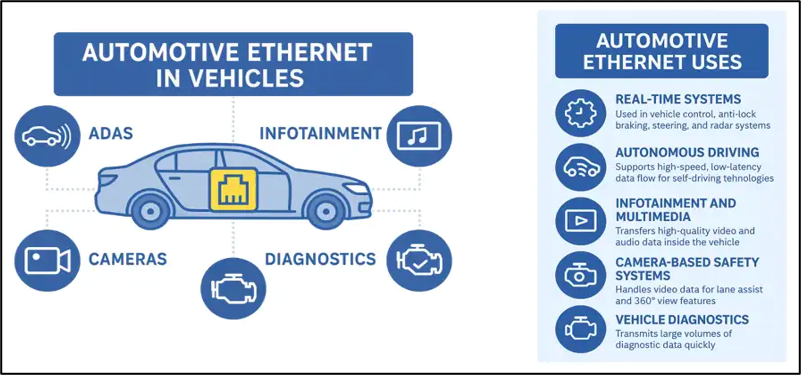

# (2) 차량용 이더넷 개요

**2. 차량용 이더넷 개요**

1. **필요성**
2. **E/E 아키텍처의 전환과 이더넷의 역할**
3. **실제 응용 예**
4. **표준 체계 (IEEE 802.3 자동차용 규격군)**
5. **일반 이더넷과의 차이**
6. **도입 로드맵과 한계**

---

**2.1 필요성**

**차량 내 도메인별로 처리해야 하는 데이터의 종류와 용량이 다르며, 대용량·저지연 통신이 필요한 도메인이 늘어나면서 기존 CAN 대역폭으로는 처리가 어려운 영역이 발생한다.  
  
**

| **도메인** | **요구 사항** | **대략적 데이터 규모** |
| --- | --- | --- |
| **인포테인먼트(IVI)** | **고화질 영상·음악 스트리밍, 내비게이션 지도 데이터 등 대용량 멀티미디어 처리 필요** | **수십 Mbps~** |
| **ADAS** | **카메라·레이더·라이다 데이터를 융합해 즉각적인 판단을 내려야 해서 대용량·저지연 통신 필요** | **카메라 1대당 수백 Mbps~1Gbps** |
| **CAMERAS** | **서라운드 뷰·후방 카메라 등에서 나오는 고해상도 영상 데이터 처리 필요** | **해상도·프레임레이트에 비례** |
| **DIAGNOSTICS** | **진단 데이터(로그, 결함코드, 소프트웨어 업데이트)를 빠르게 주고받아야 해서 기존 UDS(CAN 기반)보다 넓은 대역폭이 필요** | **OTA 패키지 기준 수백 MB~수 GB** |

> **정량적 비교: 자율주행 카메라 한 대(예: 200만 화소, 30fps, 비압축)는 초당 약 1.5Gbps 수준의 데이터를 생성할 수 있다. CAN High Speed(1Mbps)로는 이 데이터의 0.1%도 실시간 전송이 불가능하며, 이것이 이더넷 도입의 가장 직접적인 동인이다.**

---

## **2.2 E/E 아키텍처의 전환과 이더넷의 역할**

**차량용 이더넷의 확산은 단순한 "빠른 통신선의 추가"가 아니라, 차량 전기·전자(E/E) 아키텍처 자체의 구조 전환과 맞물려 있다.**

### **2.2.1 Domain Architecture (기존)**

- **기능(도메인) 단위로 ECU를 묶고, 각 도메인을 대표하는 도메인 컨트롤러(Domain Controller)가 하위 ECU를 관리**
- **예: Powertrain Domain, Chassis Domain, Body Domain, Infotainment Domain 각각이 별도 게이트웨이로 연결**
- **도메인 내부는 CAN/LIN, 도메인 간 연결은 중앙 게이트웨이 경유**

### **2.2.2 Zonal Architecture (전환 중)**

- **기능이 아니라 물리적 위치(존, Zone) 기준으로 ECU를 묶음 (예: 전방 존, 후방 존, 좌측 존)**
- **각 존에는 Zone Controller(Zone ECU)가 배치되어 해당 구역의 센서/액추에이터를 로컬로 처리**
- **존과 존 사이, 존과 중앙 연산 유닛(HPC, High Performance Computer) 사이는 고속 이더넷 백본으로 연결**

```

```

| **구분** | **Domain Architecture** | **Zonal Architecture** |
| --- | --- | --- |
| **묶음 기준** | **기능(Powertrain, Body 등)** | **물리적 위치(Zone)** |
| **배선** | **기능별로 차량 전체에 걸쳐 배선 → 배선 길이/중량 증가** | **존 내부는 근거리 배선, 존 간은 백본 하나로 통합 → 배선 절감** |
| **연산 구조** | **도메인별 분산 연산** | **중앙 HPC 집중 연산 + 존은 신호 중계/전처리 위주** |
| **통신 요구** | **도메인 내부는 CAN 위주** | **존-백본 구간은 고대역폭 이더넷 필수** |
| **SW 업데이트** | **도메인 컨트롤러 단위 개별 업데이트** | **중앙 HPC 중심 OTA로 관리 단순화** |

> **Zonal Architecture로의 전환이 이더넷 도입과 함께 논의되는 이유는, 배선 절감과 중앙 집중 연산이라는 목표를 달성하려면 존과 존 사이에 대용량 데이터를 실어 나를 백본이 필요하기 때문이다. CAN으로는 이 백본 역할을 감당할 수 없다.**

### **2.2.3 신호 게이트웨이의 역할 변화**

- **기존: 도메인 간 CAN 신호를 그대로 중계(라우팅)하는 역할이 중심**
- **전환 후: CAN 신호(Signal 단위)를 이더넷 프레임(Service/PDU 단위)으로 변환하는 PDU Router / Signal-to-Service 게이트웨이 역할이 추가됨**
- **이 변환 로직은 AUTOSAR의 PduR(PDU Router) 모듈이 대표적으로 담당**

---

## **2.3 실제 응용 예**

**차량용 이더넷은 요구되는 속도 등급에 따라 아래와 같이 구분되어 적용된다.**

| **표준** | **속도** | **응용 영역** |
| --- | --- | --- |
| **100BASE-T1** | **100 Mbps** | **IVI, 카메라(단일), 센서** |
| **1000BASE-T1** | **1000 Mbps (1 Gbps)** | **ADAS 센서 융합, 고속 데이터 처리, 존-백본 연결** |
| **10GBASE-T1** | **10 Gbps** | **자율주행(다중 카메라/라이다 융합), V2X, 중앙 HPC-존 간 백본** |
| **2.5GBASE-T1 / 5GBASE-T1** | **2.5 / 5 Gbps** | **100M~1G와 10G 사이의 중간 대역폭 요구 구간(중간 단계 카메라 융합 등)에 적용 확대 중** |

> **전송 속도 표기 규칙: 앞자리 숫자가 속도(10/100/1000/10G), "BASE"는 기저대역 전송 방식을 의미하며, 뒤의 접미사(T1, CX 등)는 매체·핀 수 등 추가 특성을 나타낸다. 예를 들어 "T1"은 1쌍의 트위스티드 페어(Twisted Pair)를 사용한다는 의미다.**

---

## **2.4 표준 체계 (IEEE 802.3 자동차용 규격군)**

| **표준** | **속도** | **별칭/비고** |
| --- | --- | --- |
| **IEEE 802.3bw** | **100 Mbps** | **100BASE-T1** |
| **IEEE 802.3bp** | **1 Gbps** | **1000BASE-T1** |
| **IEEE 802.3ch** | **2.5/5/10 Gbps** | **Multi-Gig BASE-T1** |
| **IEEE 802.3cy** | **10 Gbps (Multidrop)** | **10BASE-T1S 계열과는 별개로 고속 멀티드랍 논의 진행** |
| **IEEE 802.3cg** | **10 Mbps (Multidrop/Point-to-point)** | **10BASE-T1S / 10BASE-T1L** |

> **위 표준들은 물리 계층(PHY) 스펙을 정의하며, 실제 차량 적용을 위한 EMC, 커넥터, 케이블 스펙은 OPEN Alliance(자동차 이더넷 생태계 표준화 협의체)에서 별도로 권고안(TC1, TC8, TC10 등)을 제공한다. 즉 "IEEE가 통신 규격을, OPEN Alliance가 차량 적용을 위한 실무 스펙을 보완"하는 구조로 이해하면 된다.**

---

## **2.5 일반 이더넷과의 차이**

| **항목** | **일반 이더넷(사무/가정용)** | **차량용 이더넷** |
| --- | --- | --- |
| **케이블** | **4쌍(8가닥), UTP/STP** | **1쌍(2가닥)** |
| **커넥터** | **RJ45** | **차량용 전용 커넥터(진동/방수/내열 고려)** |
| **동작 온도** | **상온 위주(0~40℃)** | **-40~125℃ 등 차량 등급(Automotive Grade) 요구** |
| **EMC 요구** | **상대적으로 낮음** | **매우 엄격(ESD, 서지, RF 노이즈 내성 필수)** |
| **통신 방식** | **Full Duplex(4쌍 중 일부는 송신·일부는 수신에 할당되는 방식도 존재)** | **Full Duplex(1쌍으로 동시 송수신, Echo Cancellation 방식)** |
| **결정성 요구** | **일반적으로 Best-effort** | **안전 관련 데이터는 TSN 등으로 결정성 보장 필요** |
| **케이블 비용/중량** | **상대적으로 저렴/무거움 허용** | **경량화·저비용이 설계 핵심 목표** |

> **차량용 이더넷이 굳이 "새로운 표준"으로 별도 개발된 이유는 결국 차량이라는 환경 제약(무게, 온도, 진동, 전자파, 비용) 때문이다. 통신 원리 자체는 일반 이더넷과 동일하지만, 물리 계층과 신뢰성 요구가 완전히 다른 환경에 맞춰 재설계되었다고 보는 것이 정확하다.**

---

## **2.6 도입 로드맵과 한계**

### **2.6.1 단계적 도입 흐름**

1. **1단계 - 인포테인먼트 국한 적용: 초기에는 카메라, 내비게이션 등 안전 비필수 영역에만 100BASE-T1 도입**
2. **2단계 - ADAS 확산: 카메라·레이더 융합이 늘며 1000BASE-T1이 ADAS 도메인에 본격 적용**
3. **3단계 - 백본화: Zonal Architecture 전환과 함께 이더넷이 존 간 백본으로 확대, 진단(DoIP)도 이더넷 기반으로 전환**
4. **4단계(진행 중) - 안전 필수 영역 확대: TSN 등 결정성 보장 기술을 통해 일부 안전 관련(Safety-relevant) 통신까지 이더넷으로 이전 검토**

### **2.6.2 현재 시점의 한계**

- **비용: 스위치, 다중 PHY 등으로 인해 순수 통신 비용은 아직 CAN 대비 높은 편 → 대량 양산 저가 차종에는 여전히 CAN/LIN이 유리**
- **결정성 검증 부담: TSN 등을 적용하더라도, 안전 필수(ASIL D 등급) 영역으로의 완전한 대체는 검증·인증 부담이 커서 신중하게 진행 중**
- **레거시 호환: 기존 CAN 기반 ECU와의 공존을 위한 게이트웨이 변환 로직(Signal-to-Service 등)이 추가 설계 부담으로 작용**
- **생태계 성숙도: FlexRay만큼 오랜 기간 검증된 것은 아니어서, X-by-wire 같은 최상위 안전 영역은 당분간 FlexRay 또는 이더넷+TSN의 병행 검토가 이어질 전망**

> **결론적으로 차량용 이더넷은 "CAN을 대체하는 기술"이라기보다, 데이터량이 폭증하는 영역(카메라, 자율주행, 진단, OTA)을 중심으로 침투하며, 장기적으로는 Zonal Architecture의 백본으로 자리잡아가는 기술로 이해하는 것이 현재 업계 흐름에 가깝다.**
