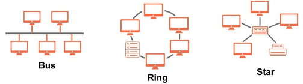
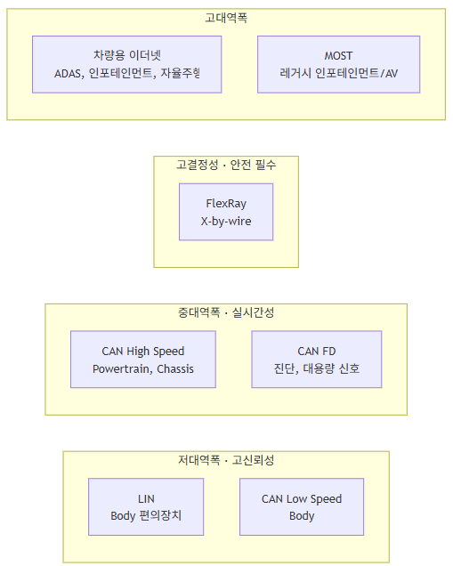

# (1) 차량용 통신 요약 비교

**1. 차량용 통신 요약 비교 (CAN, CAN-FD, LIN, FlexRay, 차량용 이더넷)**

**1.1 최대 전송률**

| **버스** | **최대 전송률** |
| --- | --- |
| **LIN** | **20 kBit/s** |
| **CAN (Low Speed)** | **125 kBit/s** |
| **CAN (High Speed)** | **1 Mbit/s** |
| **CAN FD (High Speed)** | **8 Mbit/s (Arbitration 500kbps 기준 Data 구간)** |
| **FlexRay** | **10 Mbit/s (채널당, Dual channel 시 최대 20Mbit/s)** |
| **차량용 이더넷 (100BASE-T1)** | **100 Mbit/s** |
| **차량용 이더넷 (1000BASE-T1)** | **1 Gbit/s** |
| **차량용 이더넷 (10GBASE-T1)** | **10 Gbit/s** |
| **MOST** | **150 Mbit/s (MOST150 기준)** |

- **CAN(Powertrain & Chassis), CAN Low Speed(Body), LIN(Sensor/Actuator)은 상대적으로 대역폭은 낮지만 신뢰성이 요구되는 영역에 사용된다.**
- **FlexRay/Ethernet/MOST 등은 대역폭이 큰 인포테인먼트, X-by-wire 영역에 사용된다.**

---

## **1.2 버스 접근 방식(Access Method) 비교**

| **방식** | **사용 예** | **특징** |
| --- | --- | --- |
| **이벤트 기반(Event-driven)** | **CAN, CAN FD** | **어느 노드든 버스 사용 가능 시점에 접근 가능. ID 기반 우선순위로 트래픽 제어. 송신자에 동기화(CSMA/CA)** |
| **마스터-슬레이브** | **LIN** | **마스터가 전송 제어, 슬레이브는 요청에만 응답. 마스터에 동기화** |
| **시간 동기 방식(TDMA)** | **FlexRay** | **주기적 타임윈도우 방식. 글로벌 클록에 동기화. Static Segment(고정 슬롯) + Dynamic Segment(우선순위 기반) 혼합 운용** |
| **토큰 패싱** | **OSEK NM** | **송신 권한(Token)을 순차적으로 전달** |
| **CSMA/CD + Switching** | **차량용 이더넷** | **스위치 기반 포인트-투-포인트 연결로 사실상 충돌 없음(Full Duplex). 필요 시 TSN(802.1Qbv)으로 결정성 보장** |

> **결정성(Determinism) 관점: CAN/CAN FD는 우선순위가 낮은 메시지의 지연시간이 버스 부하에 따라 변동될 수 있는 반면(soft real-time), FlexRay와 TSN 적용 이더넷은 특정 시간 슬롯을 사전에 할당하여 지연시간을 보장한다(hard real-time). X-by-wire(Steer-by-wire, Brake-by-wire)처럼 지연시간 자체가 안전 요구사항인 영역은 FlexRay 또는 TSN 이더넷이 요구된다.**

---

## **1.3 토폴로지(Topology) 비교**

| **프로토콜** | **지원 토폴로지** | **비고** |
| --- | --- | --- |
| **LIN** | **Bus(단일 마스터, 다중 슬레이브)** | **단순 구조, 배선 최소화** |
| **CAN / CAN FD** | **Bus** | **종단저항 120Ω × 2, 배선 분기(Stub) 길이 제약 존재** |
| **FlexRay** | **Bus, Star, Hybrid(Bus+Star)** | **Active Star를 통한 신호 재생 가능, 이중화(Dual channel) 구성 용이** |
| **차량용 이더넷** | **Star(스위치 기반), Daisy-chain** | **Zonal Architecture에서는 스위치가 존(Zone)마다 배치되는 계층적 스타 구조가 일반적** |
| **MOST** | **Ring** | **링 구조 특성상 한 노드 장애 시 전체 네트워크 영향 가능(Ring Break 대응 로직 필요)** |

```

```

---

## **1.4 노드 수 / 배선 특성**

| **프로토콜** | **이론상 최대 노드 수** | **배선 형태** | **비고** |
| --- | --- | --- | --- |
| **LIN** | **16개 (마스터 1 + 슬레이브 최대 15)** | **단선(Single wire)** | **GND 공유** |
| **CAN** | **규격상 명시적 상한 없음 (실무상 전기적 부하로 32~110개 수준 권장)** | **2가닥 꼬임선(Twisted pair)** | **버스 길이와 노드 수가 트레이드오프** |
| **CAN FD** | **CAN과 동일** | **2가닥 꼬임선** | **고속 구간에서 버스 길이 제약이 더 엄격** |
| **FlexRay** | **채널당 최대 22~64개 수준(클러스터 설계에 따라 상이)** | **2가닥 꼬임선(Shielded 권장)** | **Active Star 사용 시 확장 용이** |
| **차량용 이더넷** | **스위치 포트 수에 따라 사실상 무제한 확장 가능** | **2가닥 꼬임선(100BASE-T1 기준)** | **스위치 계층 구조로 확장, Zonal Architecture와 궁합이 좋음** |

---

## **1.5 이중화(Redundancy) 및 안전성**

| **프로토콜** | **이중화 지원** | **대표 활용** |
| --- | --- | --- |
| **LIN** | **없음** | **편의장치(시트, 윈도우 등 – 안전 필수도 낮음)** |
| **CAN** | **없음 (단, CAN FD도 동일)** | **Powertrain, Chassis, Body** |
| **FlexRay** | **채널 이중화(Channel A/B) 지원 → 한 채널 장애 시 다른 채널로 지속 통신** | **Steer-by-wire, Brake-by-wire 등 Fail-operational 요구 영역** |
| **차량용 이더넷** | **프로토콜 자체 이중화는 없으나, 이중 스위치/이중 링크 구성(PRP, HSR 등)으로 이중화 구현 가능** | **자율주행(ADAS) 백본망 등 고신뢰 영역에서 아키텍처 레벨로 이중화 설계** |

> **FlexRay가 X-by-wire 영역에서 여전히 language 우위를 갖는 이유는 프로토콜 자체에 내장된 이중 채널 구조 때문이다. 다만 이더넷도 아키텍처 설계(이중 스위치, 이중 경로)로 유사한 안전 수준을 구현할 수 있어, 최근에는 이더넷이 FlexRay의 역할을 일부 대체하는 추세다.**

---

## **1.6 비용 및 확장성**

| **프로토콜** | **노드당 비용** | **확장성** | **비고** |
| --- | --- | --- | --- |
| **LIN** | **매우 낮음** | **낮음** | **컨트롤러가 매우 저렴, 별도 트랜시버 최소화** |
| **CAN** | **낮음** | **중간** | **가장 성숙한 생태계, 검증된 저비용 컨트롤러 다수** |
| **CAN FD** | **낮음~중간** | **중간** | **기존 CAN 대비 컨트롤러 비용 소폭 상승, 배선은 재사용 가능** |
| **FlexRay** | **높음** | **낮음** | **컨트롤러/트랜시버 비용이 높고, 클러스터 설정(스케줄링 테이블)이 복잡해 개발 비용도 높음** |
| **차량용 이더넷** | **중간~높음(속도 등급에 따라 상이)** | **매우 높음** | **스위치 비용이 있으나, 대역폭 대비 확장성이 뛰어나 장기적으로는 원가 우위 논의가 활발** |

---

## **1.7 도메인별 적용 종합**

```

```

| **도메인** | **대표 신호/데이터** | **우선 고려 프로토콜** | **선정 근거** |
| --- | --- | --- | --- |
| **Body(편의장치)** | **도어락, 윈도우, 시트** | **LIN, CAN Low Speed** | **저비용, 저대역폭으로 충분** |
| **Powertrain/Chassis** | **엔진 제어, 제동, 조향 상태 정보** | **CAN, CAN FD** | **검증된 신뢰성, 실시간성과 비용의 균형** |
| **X-by-wire** | **Steer-by-wire, Brake-by-wire 제어 명령** | **FlexRay (또는 TSN 이더넷)** | **결정성 + 이중화 필수** |
| **ADAS** | **카메라·레이더·라이다 융합 데이터** | **차량용 이더넷(1000BASE-T1 이상)** | **대용량 + 저지연** |
| **인포테인먼트** | **영상, 음악 스트리밍, 내비게이션** | **차량용 이더넷(100BASE-T1), MOST(레거시)** | **대용량 멀티미디어 처리** |
| **진단** | **DTC, 로그, 소프트웨어 업데이트** | **CAN FD, DoIP(이더넷 기반)** | **데이터량에 따라 선택, 최신 차량은 DoIP로 이전 중** |

---

## **1.8 정리 - 프로토콜 선정 체크리스트**

**실무에서 통신 프로토콜을 선정할 때 확인하는 대표적인 질문들:**

1. **데이터량: 신호 몇 바이트 수준인가, 영상/파일 수준인가?**
2. **주기성: 주기적으로 흐르는 데이터인가, 이벤트성 데이터인가?**
3. **지연 허용치: 수 ms 지연이 안전에 영향을 주는가? (X-by-wire라면 FlexRay/TSN 검토)**
4. **이중화 필요 여부: 단일 채널 장애가 치명적인가?**
5. **원가 목표: 대량 양산 차종인가, 프리미엄 차종인가?**
6. **미래 확장성: 향후 소프트웨어 업데이트로 대역폭 요구가 늘어날 가능성이 있는가? (OTA, 자율주행 고도화 등)**

> **최근 E/E 아키텍처가 Domain 구조에서 Zonal 구조로 전환되면서, CAN/LIN은 각 존(Zone) 내부의 단거리 저대역폭 통신을, 이더넷은 존과 존 사이의 백본 통신을 담당하는 계층적 혼합 구조가 사실상 표준이 되어가고 있다. 즉 "CAN이냐 이더넷이냐"의 이분법보다는, "어느 계층에 무엇을 쓸 것인가"의 아키텍처 설계 문제로 이동하고 있다.**
