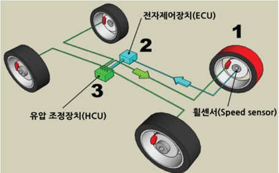
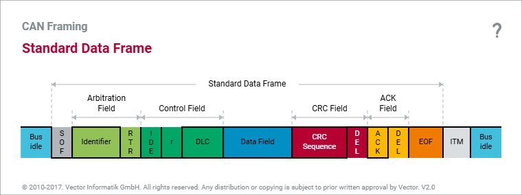
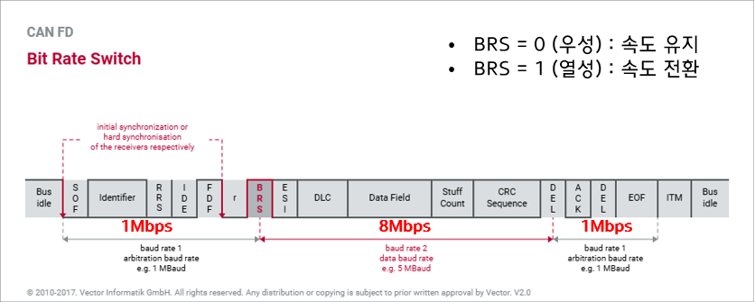
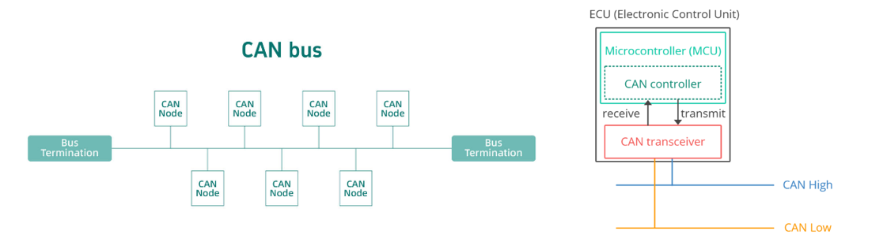
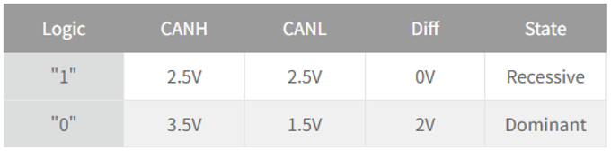
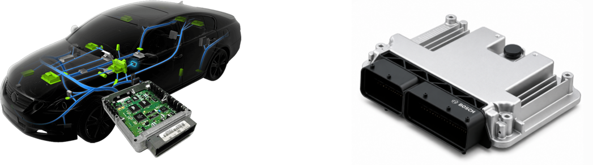
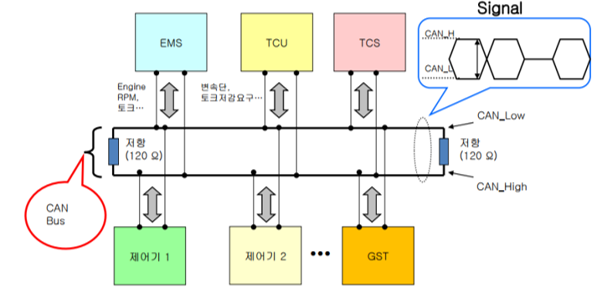
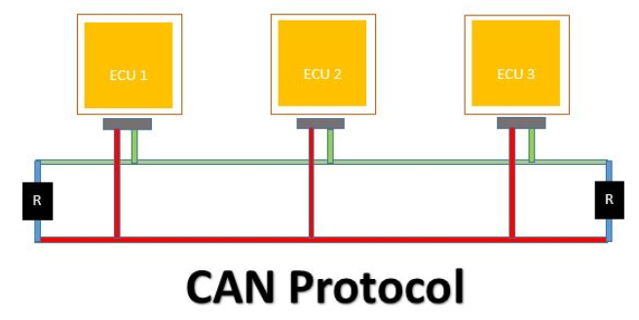
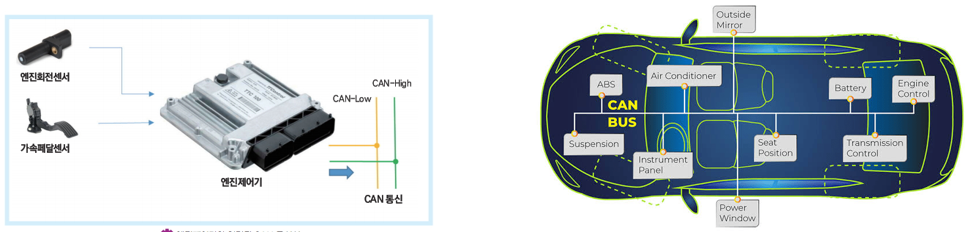

# [1] CAN 통신 (심화)

# CAN 통신 교육자료

> 출처: 사내 세미나 PPT(김세현 연구원) / 보완: Vector CANoe Workshop - CAN Fundamentals(PDF)

---

### 목차

1. ### ECU 소개
2. ### CAN 통신 소개
3. ### CAN 통신 원리
4. ### CAN 프레임
5. ### CAN 물리 계층
6. ### CAN FD (Flexible Data-Rate)
7. ### [부록] CAN 데이터베이스(DBC)와 CANdb++ Editor

---

## 1. ECU 소개

### 1.1 ECU란?

- **ECU(Electronic Control Unit, 전자 제어 장치)**: 차량의 엔진을 비롯한 다양한 전자 시스템을 제어하는 장치
- ECU는 **센서**에서 정보를 받아 미리 설계된 기준으로 판단하고, **액추에이터**로 명령을 전송한다.  
    
  - 흐름: `센서 입력 → ECU 처리(판단) → 액추에이터 응답  
      
    `

> **왜 ECU가 이렇게 많아졌나?**    
> 1980년대 후반부터 차량 내 전자 기능이 폭발적으로 늘면서 초기에는 각 기능이 독립적(isolated)으로 구현되었다. 1990년대 들어 전자장치들을 통합하는 개념이 등장했고, 전자 시스템은 "문제"가 아니라 신차의 트렌드를 이끄는 핵심 경쟁력으로 인식이 바뀌었다. 초기 차량에는 ECU 3개 수준의 버스 시스템만 있었지만, 현재는 차량 한 대에 **70개 이상의 ECU**가 탑재된다.

### 1.2 예시 - ABS (Anti-Lock Brake System)

- 브레이크 페달을 밟았을 때 **바퀴 잠김을 방지**하기 위해 브레이크 캘리퍼 압력을 제어하는 시스템
- ECU 역할: **휠 속도 센서**로 바퀴 회전 속도를 전달받아 잠김 여부를 판단 → **유압장치** 제어
  - 흐름: `휠 센서 → ECU → 유압장치`

### 1.3 ECU 간 연결 방식의 진화 (PDF)

차량 내 여러 ECU를 서로 연결하는 방법에는 두 가지 큰 흐름이 있다.

| 방식 | 설명 | 문제점/장점 |
| --- | --- | --- |
| **Point-to-Point (구 방식)** | 신호 하나마다 전용 배선(dedicated wire) 사용 | 배선 뭉치(harness)가 크고 무거워짐, 커넥터 비용 증가, 네트워크 확장이 복잡함 |
| **Bus Networking (현재 방식)** | 여러 ECU가 하나의 공용 버스(bus)를 공유(time-share) | 배선이 가볍고 관리 용이, 에러 진단 가능, 네트워크 확장 용이. Latin어 "omnibus(모두를 위한)"에서 유래 |

**차량 내 물리적 토폴로지 종류**

- Ring(링): MOST
- Bus(버스): **CAN**, LIN, FlexRay
- Star(스타): FlexRay
- Arbitrary(임의 구조/메시): Ethernet

> 차량 네트워크는 통신 네트워크에 비해 규모가 작아 메시(mesh) 구조를 쓸 필요가 없다. 즉, 프레임 안에 라우팅을 위한 프로토콜 제어 정보가 필요 없다.

### 1.4 ISO-OSI 참조 모델과 CAN의 위치 (PDF)

| Layer | 이름 | 역할 |
| --- | --- | --- |
| 7 | Application | 응용 서비스 |
| 4 | Transport | 세그멘테이션/조립, 흐름 제어 |
| 3 | Network | 라우팅, 확장 주소 할당 |
| **2** | **Data Link** | **프레이밍, 주소 지정, 버스 접근, 동기화, 데이터 보호** |
| **1** | **Physical** | **전송 매체, 신호 전달, 토폴로지** |

- **CAN은 OSI 1계층(Physical)과 2계층(Data Link)만 정의**한다.
- Bosch가 발표한 CAN 사양서는 이 2개 계층을 다시 3개 레이어로 세분화한다.

| Layer | 이름 | 담당 기능 |
| --- | --- | --- |
| 3 | **Object Layer** | 메시지 필터링(Message Filtering), 메시지/상태 처리 |
| 2 | **Transfer Layer** | Fault Confinement, 에러 검출/신호화, 메시지 검증, 응답(ACK), 중재(Arbitration), 프레이밍, 전송률/타이밍 |
| 1 | **Physical Layer** | 신호 레벨/비트 표현, 전송 매체 |

**ISO 표준 및 실제 구현**

| ISO OSI | 서브레이어 | ISO 표준 | 구현체 |
| --- | --- | --- | --- |
| Data Link(2) | LLC, MAC | ISO 11898-1 (CAN Protocol, CAN/CAN FD) | CAN-Controller / CAN-FD-Controller |
| Physical(1) | PCS, PMA, MDI | ISO 11898-2 (High Speed, ~1Mbit/s 이상 CAN FD) / ISO 11898-3 (Low Speed, ~125kbit/s) | CAN-Transceiver |

- **LLC**(Logical Link Control): 전송 신뢰성을 보장하는 기능
- **MAC**(Medium Access Control): 버스 접근을 담당하는 기능
- **PCS**(Physical Coding Sublayer): 비트 인코딩/디코딩, 비트 타이밍, 동기화
- **PMA**(Physical Medium Attachment): 트랜시버 특성
- **MDI**(Medium Dependent Interface): 전송 매체, 커넥터

**대표 트랜시버**

- CAN High-Speed(최대 1Mbit/s): PCA82C250, TJA1050, TJA1040/1041
- CAN Low-Speed(최대 125kbit/s): TJA1054
- Single-Wire-CAN(SAE J2411, 최대 33/41.6 kBit/s): AU5790

### 1.5 차량 내 버스 시스템 분류 (PDF)

| Class | 버스 | 최대 전송률 |
| --- | --- | --- |
| Class A | LIN | 20 kBit/s |
| Class B | CAN (Low Speed) | 125 kBit/s |
| Class C | CAN (High Speed) | 1 MBit/s |
| 미정의 | CAN FD (High Speed) | 정의되지 않음(더 높음) |
| Class C+ | FlexRay | 10 MBit/s |
| Infotainment | MOST / Ethernet | 150 / 400 MBit/s |

- CAN(Powertrain & Chassis), CAN Low Speed(Body), LIN(Sensor/Actuator) 등은 상대적으로 대역폭은 낮지만 신뢰성이 요구되는 영역에 사용된다.
- FlexRay/Ethernet/MOST 등은 대역폭이 큰 인포테인먼트, X-by-wire 영역에 사용된다.

---

## 2. CAN 통신 소개

### 2.1 CAN이란?

- **CAN(Controller Area Network)**: ECU들이 서로 통신하기 위해 설계된 **표준 통신 규격**

### 2.2 CAN 노드 구성 (노드 = ECU)

| 구성요소 | 역할 |
| --- | --- |
| **MCU (마이크로컨트롤러)** | ECU의 두뇌. 수신 CAN 신호를 해석하고 어떤 신호를 전송할지 결정 (Application software) |
| **CAN 컨트롤러** | CAN 프로토콜이 요구하는 통신 기능 수행. 송신 메시지 완성, 수신 메시지 체크, 버스 접근/비트타이밍 제어 |
| **CAN 트랜시버** | 컨트롤러와 CAN BUS 사이 인터페이스. 송신 시 비트→전압 변환, 수신 시 전압 샘플링 후 컨트롤러로 전달 |

> **Controller vs Transceiver 역할 구분**
>
> - **Controller**: CAN 버스를 통해 디지털 데이터를 송수신하기 위한 작업 수행 (Data Link Layer, MAC, **디지털 비트** 영역 담당 → "Digital Domain")
> - **Transceiver**: CAN 버스에 물리적 신호(전압)를 인가하거나 읽음 (Physical Layer, PHY, **아날로그 전압** 영역 담당 → "Analog Domain")
>
> 트랜시버가 인가하는 전압 레벨은 초당 최대 100만 번까지 바뀔 수 있어 반사(reflection)가 발생할 수 있으며, 이를 억제하기 위해 버스 양 끝단에 **120Ω 종단저항**을 사용하는 것이 효과적인 방법이다.

### 2.3 CAN Data 예시 (DBC 정의)

| ID | 메시지 이름 | Byte | 신호 이름 | 단위 |
| --- | --- | --- | --- | --- |
| 0x0C8 | Engine\_Status | 0,1 | Engine\_RPM | RPM |
|  |  | 2,3 | Vehicle\_Speed | km/h |
|  |  | 4 | Coolant\_Temp | °C |
|  |  | 5 | Throttle\_Position | % |
| 0x1A0 | ABS\_Status | 0,1 | Wheel\_Speed\_FL | km/h |
|  |  | 2,3 | Wheel\_Speed\_FR | km/h |
|  |  | 4 | ABS\_Active | 0=비활성/1=활성 |
| 0x2B0 | BCM\_Status | 0 | Door\_Lock | 0=잠금/1=열림 |
|  |  | 1 | Headlight | 0=OFF/1=ON |
|  |  | 2 | Wiper | 0=OFF/1=ON |

※ 위 데이터는 교육용 가상 예시이며 실제 차량 데이터와 다를 수 있습니다.

> **신호 해석 예시 - 로그 데이터 변환 (PDF)** 실제 로그: `CAN0 0x0C8 8 09 C4 3C 00 6E 32 00 00`
>
> - `Engine_RPM` = 09 C4(hex) → 0x09C4 = (9×256)+(12×16)+4 = 2304+192+4 = **2500 RPM**
> - `Vehicle_Speed` = 3C 00 → **60 km/h**
> - `Coolant_Temp` = 6E → **110 °C**
> - `Throttle_Position` = 32 → **50 %**
> - `Door_Lock` = 00 → **잠금**, `Headlight` = 01 → **ON**
>
> 이처럼 CAN 프로토콜 자체는 "신뢰성 있는 전송"만 보장할 뿐 **데이터의 의미는 정의하지 않는다**. 송신측과 수신측이 같은 의미로 해석하려면 별도의 **데이터베이스(DBC, K-Matrix, 통신 매트릭스)**가 필요하다. (자세한 내용은 7장 참고)

---

## 3. CAN 통신 원리

### 3.1 멀티마스터 프로토콜

- 버스가 사용되지 않을 때(idle)는 **어느 노드든** 데이터를 네트워크에 송신 가능

### 3.2 이벤트 기반

- ECU에서 특정 이벤트가 발생했을 때만 메시지를 전송

> **차량 내 버스 접근 방식 비교 (PDF)** 버스 접근 방식은 크게 4가지로 분류된다.
>
> | 방식 | 사용 예 | 특징 |
> | --- | --- | --- |
> | **이벤트 기반(Event-driven)** | **CAN** | 어느 ECU든 버스 사용 가능 시점에 접근 가능. 우선순위로 트래픽 제어. 송신자에 동기화 |
> | 마스터-슬레이브 | LIN | 마스터가 전송 제어, 슬레이브는 요청에만 응답. 마스터에 동기화 |
> | 시간 동기 방식 | FlexRay | 주기적 타임윈도우 방식(TDMA), 글로벌 클록에 동기화 |
> | 토큰 패싱 | OSEK NM | 송신 권한(Token)을 순차적으로 전달 |
>
> 이벤트 기반 방식 중 대표적으로 **CSMA/CD**(Ethernet, 충돌 감지)와 **CSMA/CA**(CAN, 충돌 회피)가 있다.

### 3.3 CSMA / CSMA-CA

- **CS**(Carrier Sense): 버스 상태를 먼저 감지
- **MA**(Multiple Access): 여러 ECU가 하나의 버스를 사용
- **CA**(Collision Avoidance): 충돌 회피 — 충돌 상황 해결을 위해 **우선순위를 정할 수 있는 ID** 부여

### 3.4 버스 접근 규칙 (Bus Access Rules)

- 각 네트워크 노드는 **버스가 idle일 때 언제든 전송을 시작**할 수 있다.
- 버스는 정의상 **11개의 recessive(열성) 비트**가 연속으로 관측되면 idle 상태로 간주된다.
- 두 개 이상의 전송 요청이 동시에 발생하면, 모든 노드가 동시에 첫 identifier 비트부터 송신을 시작하고 **비트 단위 중재(bit-synchronous arbitration)**가 일어난다.
- 만약 전송 요청 시점이 다르면, 나중에 요청한 노드는 우선순위와 상관없이 버스가 idle이 될 때까지 기다려야 한다(즉 "먼저 시작한 프레임이 이긴다").

### 3.5 동시 전송(Simultaneous Transmission) 예시

Node A: 0x1A Data  
Node B: 0x2B1 (중재 패배) → 재시도 → 0x2B1 Data  
Node C: 0x3FF (중재 패배) → 재시도 → (중재 패배) → 0x3FF Data

Bus: 0x1A Data | 0x2B1 Data | 0x3FF Data

- 세 노드가 동시에 버스 접근을 시도할 때, 식별자(ID)를 전송하는 구간을 **중재 구간(Arbitration Phase)**이라 한다.
- 식별자의 **숫자 값이 낮을수록 우선순위가 높다**. (Node A가 가장 낮은 값 → 승리)
- 우선순위가 낮은 노드(B, C)는 전송 요청을 취소하지 않고, 버스가 다시 idle이 되면 재시도한다.

### 3.6 비트 단위 중재 로직 (Arbitration Bit-by-Bit)

중재 중인 모든 노드는 자신이 보낸 비트값과 버스에서 읽은 값을 비교한다.

**Arbitration Logic (송신자 관점)**

| Sender(보낸 값) | Bus(읽은 값) | 의미 |
| --- | --- | --- |
| 0 | 0 | 계속 진행(Continue) |
| 0 | 1 | 전송 오류(Transmission Error) |
| 1 | 0 | **중단하고 수신 모드로 전환** (중재 패배) |
| 1 | 1 | 계속 진행(Continue) |

**Bus Logic (AND 결선 방식)**

| Sender A | Sender B | Bus |
| --- | --- | --- |
| 0 | 0 | 0 |
| 0 | 1 | 0 |
| 1 | 0 | 0 |
| 1 | 1 | 1 |

> 즉, 1(recessive, 열성)을 보냈는데 버스에서 0(dominant, 우성)이 읽히면 → **다른 노드가 우성 비트를 보내고 있다는 뜻** → 해당 노드는 즉시 송신을 멈추고 수신 모드로 전환한다. 이 메커니즘 덕분에 **중재에서 이긴 노드는 지연 없이(collision 없이) 전송을 이어갈 수 있다.**

### 3.7 우선순위(Priority)

- 버스 접근은 **메시지 우선순위**로 제어된다.
- ID 값의 **역수 관계**가 우선순위를 나타낸다.
  - 최고 우선순위: ID = 0 (0x0)
  - 최저 우선순위: ID = 2047 (0x7FF, 11bit 표준 포맷 기준)

---

## 4. CAN 프레임

### 4.1 프레임 구조 (ID / DLC / Data)

| 필드 | 설명 |
| --- | --- |
| **ID** | 메시지 식별자 및 우선순위 (표준 CAN: 11bit / 확장 CAN: 29bit) |
| **DLC** | 데이터 길이 (0~8) |
| **Data** | 제어정보, 상태정보, 센서데이터, 명령어 등 실제 전송 데이터 |

- **송신**: 우선순위가 가장 낮은 데이터부터가 아니라, 우선순위와 무관하게 **버스에 연결된 모든 제어기에 브로드캐스트**된다.
- **수신**: CAN 컨트롤러가 특정 ID를 가진 메시지만 수신하도록 **ID 필터링** 수행

### 4.2 CAN Data Frame 구조 (Standard Format, 11bit)

| 약어 | 의미 |
| --- | --- |
| SOF | Start Of Frame |
| RTR | Remote Transmission Request |
| IDE | Identifier Extension |
| r | Reserve Bit |
| DLC | Data Length Code |
| CRC | Cyclic Redundancy Check |
| DEL | Delimiter |
| ACK | Acknowledgement |
| EOF | End Of Frame |
| ITM | Intermission |

### 4.3 Start of Frame (SOF)

- Bus idle(1) → 0으로 상태가 바뀌는 것에 해당
- 메시지의 시작을 알림
- 수신자가 송신자와 **동기화(synchronize)**할 수 있는 수단 제공
- 최소 **11개의 논리 1(recessive)**이 관측된 후에만 SOF(논리 0)를 보낼 수 있음
- 모든 ECU는 baud rate 설정에 따라 비트 지속시간을 미리 알고 있음 (예: 500kBaud → 1bit = 2µs)
- 1(recessive)→0(dominant) 에지가 감지되는 순간, 모든 노드는 비트 타이밍 타이머를 시작한다.

### 4.4 Identifier

- **송신 시**: 중재를 위한 메시지 우선순위 역할
- **수신 시**: 메시지의 Data Field 내용을 나타냄(어떤 신호인지 식별)
- 11bit → 0x0 ~ 0x7FF (0~2047, decimal)
- msb(최상위 비트)부터 lsb(최하위 비트) 순서로 전송

### 4.5 Remote Transmission Request (RTR)

- **RTR = Dominant(0)** → Data Frame
- **RTR = Recessive(1)** → Remote Frame

> **Remote Frame**: 특정 ID의 데이터를 요청하는 프레임. Data Field가 없지만, 요청하려는 데이터 크기만큼 DLC는 설정된다. Remote Frame의 ID와 대응하는 Data Frame의 ID가 같을 경우, 중재 시 **RTR 비트도 중재 대상에 포함**되며 Data Frame(RTR=0, dominant)이 항상 승리한다.
>
> - 주로 건물 자동화(Building Services), 자동화 엔지니어링(Automation Engineering) 등 버스 길이가 매우 길어 주기적 전송 방식이 어려운 영역에서 사용된다.

### 4.6 Identifier Extension (IDE) - 확장 포맷

- **IDE = Dominant(0)** → Standard Format(11bit)
- **IDE = Recessive(1)** → Extended Format(29bit)

**Extended Format 구조**

- 확장 포맷은 최대 약 **5억 3천 6백만 개**의 식별자를 제공하며, SAE J1939(상용차용), NMEA 2000(선박), ISO 11783(농기계) 등의 기반 규격이다.
- **J1939 ID 구조**: `Priority(3bit) + EDP(1bit) + DP(1bit) + PDU Format(8bit) + PDU Specific(8bit) + Source Address(8bit)`
- 표준 포맷과 확장 포맷은 **같은 버스에 공존 가능**하며, 중재는 비트 단위로 이루어진다(동일한 앞부분 ID를 가질 경우 Extended Format이 우선순위에서 밀림 - SRR 비트가 recessive이므로).

### 4.7 Data Length Code(DLC)와 Data Field

- DLC 값 0~8: Data Field의 바이트 수
- DLC 값 9~15: 모두 **8바이트**로 처리됨 (Classic CAN 기준)

### 4.8 Cyclic Redundancy Check (CRC)

- 수신자를 위한 **에러 검출 기능** 제공
- 송신자는 생성 다항식(Generator-polynomial)을 이용해 CRC 계산 → 메시지에 포함(CRC\_Tx)
- 수신자는 동일 알고리즘으로 CRC 계산(CRC\_Rx) 후 비교
  - 동일 → 정상(Correct) / 다름 → 에러(Error)
- Classical CAN: 15bit CRC, 생성 다항식 0xC599(1100 0101 1001 1001)
- CAN-CRC로 프레임 내 **최대 5비트 에러**까지 검출 가능

### 4.9 Acknowledgement (ACK)

- 송신자는 ACK 슬롯에 **recessive(1)** 비트를 보내며, 모든 수신자로부터 **dominant** 응답을 기대한다.
- CRC 검사를 통과한 수신자는 **dominant ACK(0)** 전송 → 최소 1개 이상의 수신자가 정상 수신했음을 의미
- 모든 수신자가 에러를 검출했거나 수신자가 없으면 ACK 비트는 **recessive로 유지** → 송신 실패로 간주, 이후 비트에서 에러 플래그 발생

### 4.10 End of Frame (EOF) & Intermission (ITM)

- EOF(7bit): 프레임의 끝을 나타냄
- Intermission(3bit) 이후 → 버스 idle
- 11개의 연속된 1(recessive)이 관측되면 버스가 idle로 간주되며 자유롭게 접근 가능
- ITM은 **IFS(Inter Frame Space)**라고도 불림

### 4.11 Bit Stuffing (비트 스터핑)

- **동일한 값의 비트가 5개 연속**되면 송신자는 **반전된 비트(stuff bit)**를 삽입
- 수신자는 5개 연속 비트 이후 나오는 반전 비트를 **제거(discard)**
- 6번째 같은 값의 비트가 나오면 **에러**로 처리
- 적용 구간: SOF ~ CRC Field까지 (ACK/EOF/ITM 구간은 제외)

**비트 스터핑의 목적 (PDF)**

1. 스터핑이 없으면 Data Field 등에서 우연히 11개의 recessive 비트가 연속되어 **bus idle로 오인**될 수 있음
2. 긴 동일값 비트열을 끊어줌으로써, 최소 10비트마다 **하강 에지(falling edge)**가 발생하도록 보장 → 수신자의 재동기화(re-synchronization)에 필요
3. 노드가 로컬에서 검출한 에러를 알리기 위해 **의도적으로 스터핑 규칙을 위반**할 수도 있음(→ 에러 플래그) → 버스 전체의 데이터 일관성 보장

---

## 5. CAN 물리 계층

### 5.1 물리계층 개요

- **신호 변환**: 전압 차이의 유무로 0과 1을 구분
- **차동 신호(Differential Signal)**: CAN\_High, CAN\_Low 두 선의 전압 차이로 비트 판별

### 5.2 비트 → 전압 변환 (송신, Tx)

- 논리값: **0 = dominant(우성)**, **1 = recessive(열성)**
- High Speed CAN(ISO 11898-2) 기준 전압:
  - Recessive: CAN\_H = CAN\_L ≈ 2.5V (전압차 0V)
  - Dominant: CAN\_H ≈ 3.5V, CAN\_L ≈ 1.5V (전압차 2V)

### 5.3 차동전압 → 비트 해석 (수신, Rx)

| 차동전압(Vdiff = CAN\_H - CAN\_L) | 해석 |
| --- | --- |
| -1.0V ~ 0.5V | 1 (Recessive) |
| 0.9V ~ 5.0V | 0 (Dominant) |
| 그 외 | 에러 |

> 비트가 시작된 후, 수신자는 설정된 시간(샘플 포인트)만큼 기다린 뒤 비트 값을 판단한다. 전송 시점과 수신 시점 사이에는 항상 시간 지연이 존재하며, 송신자 본인도 자신이 보낸 비트를 지연을 두고서만 읽을 수 있다. 수신 ECU가 송신자로부터 멀수록 지연은 커진다.

### 5.4 CAN 메시지를 보는 세 가지 관점

| 관점 | 내용 |
| --- | --- |
| Structure | Header | Data | Tail |
| Series of Bits | 논리 비트열(0/1 나열) |
| Voltages | 오실로스코프 상의 CAN\_H/CAN\_L 전압 파형 |

- 수신 노드는 전압 레벨을 비트로 변환 → CAN 컨트롤러가 이를 CAN 표준에 따라 해석(Header/Tail) → 마이크로컨트롤러의 애플리케이션이 Data Field를 해석

### 5.5 물리적 에러 유형 (High-Speed CAN 예시) - PDF

| No. | 라인 | 에러 설명 |
| --- | --- | --- |
| 1 | CAN\_H | 단선(Circuit break) |
| 2 | CAN\_L | 단선 |
| 3 | CAN\_H | 배터리 전압(U\_bat)과 단락 |
| 4 | CAN\_L | GND와 단락 |
| 5 | CAN\_H | GND와 단락 |
| 6 | CAN\_L | 배터리 전압(U\_bat)과 단락 |
| 7 | CAN\_H & CAN\_L | 두 선 간 단락 |
| 8 | CAN\_H & CAN\_L | 두 선 모두 단선 |
| 9 | CAN\_H & CAN\_L | 종단저항 누락(Missing Termination) |

### 5.6 꼬임선(Twisted Pair)과 종단저항

- 데이터 전송 시 케이블 주위에 자기장 발생 → 노이즈 영향 → **꼬임선(twisted pair)**은 신호 잡음/간섭을 줄이는 데 도움
- **우성/열성 + AND 논리**: 우성(0)이 논리 우세, 여러 노드가 동시 송신 시 AND 결과는 0(우성)이 유리하게 작용
- **종단 저항(Termination Resistor)**: 신호 반사(reflection) 방지가 목적. 종단저항이 없으면 신호 반사로 인해 통신 오류 발생

### 5.7 차동 전송(Differential Transmission)의 원리

- EMC(전자파 적합성) 개선을 위해 전압 레벨을 1~2V로 낮추면, 작은 외란(disturbance)에도 신호가 왜곡될 수 있다는 단점이 있다.
- 이를 해결하기 위해 신호를 **한 선이 아닌 두 선**으로 전송하되, **서로 반전된 신호**를 각각 전달한다.
- 수신 측은 절대 전압이 아니라 **상대적 차동 전압**을 측정 → 두 선에 동일하게(대칭으로) 걸리는 외란은 뺄셈 과정에서 상쇄됨
- 대표 전압 스텝: CAN High Speed 약 1V, CAN Low Speed 약 2.5V, FlexRay 약 2V

### 5.8 데이터 전송 방지를 위한 물리적 대책 (Preventing Bit Errors)

| 대책 | 설명 |
| --- | --- |
| Fiber Optics / Shielding | 광케이블 또는 차폐 (비용이 비쌈) |
| Twisted Pair | 꼬임선 사용 |
| Ground Connection | 접지 |
| 대칭 차동 신호 | Differential Signal |
| 완만한 에지(Less steep edges) | 급격한 전압 변화 억제 |
| Synchronization | 동기화 |
| Lower Baud Rate | 낮은 통신 속도 |
| 짧은 버스 길이 | Shorter bus length |
| 반사 저감 | Reduction of reflections |

> 실제로는 광통신 등 비용이 비싼 방법은 예외적으로만 사용되며, 재정적 이유나 필요 대역폭 부족 등으로 일부 대책만 선택적으로 적용된다.

### 5.9 동기화(Synchronization) 원리

**왜 필요한가?**

- 수신 노드는 프레임을 올바르게 수신하려면 프레임의 시작 시점과 비트 지속 시간을 알아야 한다.
- Baud rate는 모든 노드에 동일하게 설정되어 있으므로 이론적으로 비트 지속시간은 알려져 있다.
- 다만 **클록 오차(clock inaccuracy)**로 인해 송신 노드와 수신 노드의 타이밍이 점차 어긋난다(drift). → **재동기화(Re-synchronization)** 필요

**Bit-Time-Interval 구조**

- 하나의 비트 구간(Bit-Time-Interval)은 **SYNC, TSEG\_1, TSEG\_2** 세 구간으로 나뉜다.
  - **SYNC**: 이 구간 내에 신호 에지(1→0 전환)가 들어오면 수신자가 송신자와 동기화된 상태
  - **TSEG\_1**(Time Segment 1): 버스 길이가 길수록 길게 설정. 수신자 클록이 너무 빠를 경우 이 구간을 늘려 보정
  - **TSEG\_2**(Time Segment 2): 재동기화용. 수신자 클록이 느릴 경우 이 구간을 줄이거나 생략하여 보정
- 비트 값을 0/1로 판단하는 **샘플 포인트(Sample Point)**는 TSEG\_1과 TSEG\_2 사이의 경계에서 이루어진다.

**동기화 검사**

- 에지가 SYNC 구간 안에 들어오면 → 동기 상태 정상
- 에지가 너무 이르거나 늦게 들어오면 → **재동기화 필요**
  - 에지가 예상보다 일찍 도착(수신자 클록이 느림) → TSEG\_2를 줄여서 보정
  - 에지가 예상보다 늦게 도착(수신자 클록이 빠름) → TSEG\_1을 늘려서 보정
- 보정 가능한 최대 위상 오차는 **SJW(Synchronization Jump Width)**로 제한된다.

**데이터 전송률과 버스 길이의 관계**

- 다중 송신자가 관여하는 중재(Arbitration)/ACK 구간에서는 비트 타이밍이 **모든 지연 시간의 2배**를 보상해야 한다.
- 지연 = 전자 장치의 응답 시간 + 버스 전파 지연(구리선 기준 약 5ns/m)
- 예: **1Mbit/s(High Speed CAN)** 데이터레이트에서 최대 버스 길이는 약 **40m**로 제한된다. (버스가 길수록 최대 데이터레이트는 감소)

---

## 6. CAN with Flexible Datarate (CAN FD)

### 6.1 등장 배경

1. 차량 ECU 증가로 인한 통신량 증가
2. 한정된 시간에 전송해야 할 데이터 증가

### 6.2 데이터 구간 속도 증가 (BRS)

- **BRS(Bit Rate Switch)**: 구간별 속도 전환 기능
  - **BRS = 0 (dominant)**: 속도 유지
  - **BRS = 1 (recessive)**: 데이터 구간 속도로 전환

### 6.3 CAN vs CAN FD 전송 시간 비교

- 64바이트 전송 시:
  - **CAN**: 1Mbps 기준, 8바이트씩 8개 프레임 필요 → 총 약 0.000848초
  - **CAN FD**: 8Mbps 기준, 1개 프레임으로 64바이트 전송 가능 → 총 약 0.000099초
- 결론: **CAN FD는 같은 페이로드를 훨씬 적은 프레임/시간으로 전송 가능**

> **CAN FD 도입의 이점과 대가**
>
> - 전송률 향상 → 버스 부하 감소, 여러 버스를 하나로 통합 가능
> - Data Field 확장(최대 64바이트) → 데이터 대비 프로토콜 오버헤드 비율 개선, 패킷 분할/멀티플렉싱 감소
> - **새로운 CAN 컨트롤러 필요** (가격은 기존 CAN과 유사한 수준), 기존 하이스피드 트랜시버도 사용 가능하나 더 높은 성능을 위해선 신형 트랜시버 권장
> - CAN 및 상위 프로토콜(AUTOSAR, CANopen, J1939 등)에도 확장된 Data Field에 맞춘 소규모 프로토콜 변경 필요

### 6.4 6가지 프레임 유형 (Classic CAN + CAN FD)

| 구분 | Standard(11bit) | Extended(29bit) |
| --- | --- | --- |
| CAN Remote Frame | Data Field 없음 | Data Field 없음 |
| CAN Data Frame | 0~8 Byte | 0~8 Byte |
| **CAN FD Data Frame** | **0~64 Byte** | **0~64 Byte** |

- 구분 기준 3가지: (1) ID 길이(11/29bit) (2) Data Field 유무(Data/Remote) (3) Data Field 길이(0~8B / 0~64B)
- **CAN FD에는 Remote Frame이 존재하지 않는다** (Data Field가 없으면 bit rate switch도 필요 없기 때문)

### 6.5 CAN FD Data Frame 구조 (Standard Format)

| 신규/변경 필드 | 의미 |
| --- | --- |
| **RRS**(Remote Request Substitution) | 기존 RTR 자리를 대체. CAN FD에는 Remote Frame이 없으므로 항상 dominant |
| **FDF**(FD Format) | 기존 reserve bit 자리 사용. **Recessive**이면 CAN FD 프레임임을 표시 |
| **BRS**(Bit Rate Switch) | Data 구간 전송속도 전환 여부 |
| **ESI**(Error State Indicator) | 송신 노드의 에러 상태를 알림 |

### 6.6 Bit Rate Switch (BRS) 상세

- **Dominant**: 단일 bit-rate 유지
- **Recessive**: 설정된 2번째(더 높은) bit-rate로 임시 전환
- 중재가 끝난 후에는 송신자가 하나뿐이므로 더 높은 속도로 전환 가능
  - **Baud Rate 1**(Arbitration, 예: 500kBaud): SOF ~ BRS, CRC Delimiter 이후 ~ EOF
  - **Baud Rate 2**(Data, 예: 4MBaud): BRS 샘플 포인트 이후 ~ CRC Delimiter 직전까지
- 모든 CAN FD 노드는 **두 개의 baud rate**를 설정해 둔다.
- 트랜시버 성능이 상위 baud rate의 제한 요인이 되며, 기존 CAN High Speed 트랜시버도 사용 가능하지만 최신 트랜시버일수록 더 높은 속도 달성 가능

### 6.7 Error State Indicator (ESI)

- Classic CAN에는 송신 노드가 자신의 에러 상태를 알릴 방법이 없었음
- CAN FD의 ESI 비트로 모든 노드가 현재 송신자의 에러 상태를 인지 가능
  - **Recessive**: 송신 노드가 **Error Passive** 상태
  - **Dominant**: 송신 노드가 **Error Active** 상태

### 6.8 DLC와 Data Field 크기 (CAN FD)

| DLC | CAN(Byte) | CAN FD(Byte) |
| --- | --- | --- |
| 0~8 | 0~8 | 0~8 (동일) |
| 9 | 8 | 12 |
| 10 | 8 | 16 |
| 11 | 8 | 20 |
| 12 | 8 | 24 |
| 13 | 8 | 32 |
| 14 | 8 | 48 |
| 15 | 8 | 64 |

### 6.9 CAN FD의 2단계 Bit Stuffing과 CRC

- CAN FD도 Data Field 끝까지는 **Classic CAN과 동일한 방식**으로 비트 스터핑 적용
- CAN FD에서는 **CRC Field 자체에도 별도의 스터핑 규칙**이 적용됨(CRC Bit Stuffing)
  - CRC 앞에 스터핑된 비트 개수(Stuff Bit Counter)를 **Gray Code + Parity Bit**로 인코딩하여 삽입
  - CRC Field 크기는 Data Field 크기에 따라 결정:
    - Data Field ≤ 16 Byte → **17bit CRC**, 6개 stuff bit 삽입
    - Data Field > 16 Byte → **21bit CRC**, 7개 stuff bit 삽입
  - CRC Field는 고정된 비트 위치(첫 CRC 비트 앞, 이후 4비트마다)에서 스터핑되며, 스터핑 비트 값은 바로 앞 비트의 반전값
  - 생성 다항식: CRC17 = 0x3685B, CRC21 = 0x302899
- **수신자 관점**: 어떤 CRC 버전(15/17/21bit)이 맞는지 미리 알 수 없으므로 3가지 CRC 계산을 **병렬로 동시에 시작**하고, EDL(FDF) 비트 값으로 CRC15 vs (17/21) 여부를 결정, CAN FD인 경우 DLC로 CRC17/CRC21 중 최종 선택
- **주의**: CAN FD 프레임이 전송되는 동안에는 기존 Classic CAN 노드가 버스에 활성 상태이면 안 됨. Classic CAN 노드는 CAN FD 프레임을 규칙 위반으로 오인해 에러 플래그로 중단시킬 수 있다(하위 호환은 되지만 상위 호환은 안 됨). 이를 위한 대안으로 ISO 11898-6 "Selective Wake-up Transceivers" 표준이 있다.

---

## 7. 데이터 보호(Data Protection) 및 Fault Confinement 상세

> PPT에는 없지만, CAN 통신의 신뢰성을 이해하는 데 중요한 내용이므로 부록으로 정리합니다.

### 7.1 데이터 보호의 3단계

1. **Bit Error 예방**: 물리적 수단 (5장 참고 - 꼬임선, 종단저항 등)
2. **남은 Bit Error 처리**: 프로토콜 내 논리적 수단 (에러 검출/신호화/재전송)
3. **Fault Confinement**: Tx/Rx 에러 카운터를 이용한 결함 노드 격리

### 7.2 에러 검출 메커니즘 (5가지)

| 메커니즘 | 설명 |
| --- | --- |
| **Bit Monitoring** | 송신자가 보낸 값과 버스에서 읽은 값 비교 (중재/ACK 구간은 예외) |
| **Acknowledgement Check** | ACK 비트 슬롯에서 dominant 값을 기대 |
| **Stuff Check** | 5개 동일 비트 이후 반전 비트가 있어야 함 |
| **CRC Check** | 수신 CRC와 송신 CRC 값 비교 |
| **Form Check** | 특정 필드(예: EOF 등)는 모두 recessive(1)이어야 함 |

### 7.3 에러 신호화(Error Signaling)

- 에러 검출 시 **Error Frame**(6bit Error Flag + 8bit Error Delimiter)을 전송하여 해당 프레임을 무효화
- Error Flag는 6개의 dominant 비트로, 스터핑 규칙 등 프로토콜 규칙을 고의로 위반하여 모든 노드가 프레임 무효를 인지하게 함
- CRC 에러의 경우 Error Flag 대신 **Negative Acknowledgement**로 시작됨

### 7.4 Fault Confinement (결함 격리)

각 노드는 **TEC**(Transmission Error Counter)와 **REC**(Receive Error Counter) 두 개의 8bit 레지스터를 관리한다.

| 이벤트 | TEC | REC |
| --- | --- | --- |
| Error Flag 전송(송신자) | +8 | - |
| Error Flag 전송(수신자) | - | +1 (또는 primary 에러 시 +8) |
| 성공적 송신 | -1 | - |
| 성공적 수신 | - | -1 |

**노드 상태 전이**

**Error Active (TEC≤127, REC≤127)  
↓ REC>127 또는 TEC>127 ↑ REC<128 & TEC<128  
Error Passive (Error Flag는 항상 recessive 6bit)  
↓ TEC>255  
Bus Off (버스 접근 완전 차단, Software-Reset 및 128×11 recessive bit 필요)**

- **Error Active**: 정상 노드. Error Flag는 6개의 dominant bit
- **Error Passive**: Error Flag가 6개의 **recessive bit**로 전송됨(다른 노드에 영향 최소화). 또한 SOF 전송 권한이 Intermission 직후가 아니라 **8bit 지연(Suspend Transmission)**된 후에만 허용됨
- **Bus Off**: 버스 접근 권한 완전 상실. 소프트웨어 리셋 및 128×11 recessive bit 관측 후 Error Active로 복귀 가능

---

## 8. CAN 데이터베이스(DBC)와 CANdb++ Editor

> PPT에는 없는 내용이지만, 2절(CAN Data 예시)의 이해를 돕기 위해 Vector PDF의 실무 자료를 정리합니다.

### 8.1 메시지와 신호(Signal)

- CAN 프로토콜 자체는 데이터의 **의미를 정의하지 않는다**.
- **메시지(Message)**: Identifier + DLC + Data Field(최대 8byte, CAN FD는 최대 64byte)로 구성되는 통신 객체
- **신호(Signal)**: 메시지의 Data Field 내 특정 구간(1~64bit)이 나타내는 실제 의미 있는 정보
  - 신호 설명 요소: 이름(symbolic name), 단위(unit), 변환식(conversion formula), 심볼릭 값(symbolic value)
  - 물리값 변환식: `물리값 = Raw값 × Factor + Offset`

### 8.2 Intel vs Motorola 포맷 (Byte Order)

| 포맷 | 방향 |
| --- | --- |
| **Motorola** | MSB(최상위 바이트)가 앞쪽(낮은 byte 번호) |
| **Intel** | LSB(최하위 바이트)가 앞쪽(낮은 byte 번호) |

- 바이트 내부의 비트 유의성(significance)은 두 포맷에서 동일함 (bit7=msb, bit0=lsb)
- 신호 길이가 8bit 이하인 경우 포맷 차이는 의미 없음

### 8.3 CAN Database(DBC)의 역할

- 모든 통신 정의(메시지, 신호, 노드, 관계)를 담는 **데이터베이스**로, Vector 도구 전반(CANoe, CANalyzer, CANape 등)에서 공통으로 사용
- 트레이스 창(Trace Window)에서 원시 hex 값을 → 메시지명/신호명/물리값/심볼릭값으로 해석해서 보여주는 역할
- 활용 분야: 분석(Analysis), 시뮬레이션(Simulation), 테스트(Test), 임베디드 SW(코드 생성)

### 8.4 CANdb++ Editor

- CAN 네트워크 서술에 사용되는 **dbc 파일**을 다루는 Vector 전용 편집기
- 주요 기능: 새 데이터베이스 생성, 기존 DB 열람/편집, Value Table을 이용한 신호 상세 설명, Attribute를 이용한 고급 설정
- CANalyzer/CANoe/CANape에 기본 포함되어 있으며 해당 툴 내에서 바로 실행 가능

**데이터베이스 생성 순서**

1. 데이터베이스 생성 (템플릿 선택)
2. 신호(Signal) 정의 (이름, bit 수, Intel/Motorola, factor & offset, 단위)
3. 네트워크 노드(Node) 정의 (이름)
4. 메시지(Message) 정의 (이름, DLC, Standard/Extended, ID, 송신 노드)
5. 메시지에 신호 할당
6. 신호 위치(Start bit, Layout) 확인/수정
7. 수신 신호 매핑(Mapped Rx Signals)
8. 데이터베이스 저장

**Value Table**: 특정 신호 값에 심볼릭(문자) 설명을 부여 (예: 기어 표시 0x0=Idle, 0x1=Gear\_1, ...)

**Attribute**: 메시지/신호/노드의 상세 정보(예: 송신 주기 GenMsgCycleTime, 송신 방식 GenSigSendType 등)를 정의. CANoe에서 Interaction Layer DLL로 노드를 시뮬레이션할 때 이 속성값을 참조한다.

---

## 참고 자료

- 사내 세미나 자료: "CAN 통신 교육자료" (사양가이드팀 김세현 연구원, 2026.06.10)
- Vector Informatik GmbH, *CANoe Workshop – CAN Fundamentals*, V5.0.04 (2016-08-01)
- Vector Informatik GmbH, *CANoe/CANalyzer Fundamentals Workshop – CAN Network Description*, V9.0.01 (2016-05-31)
